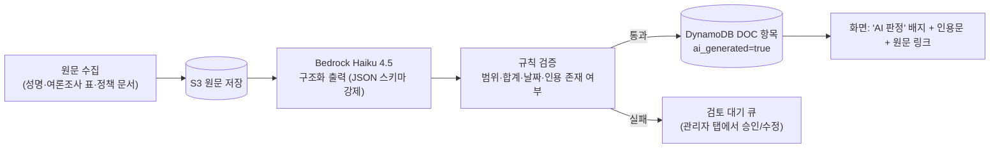
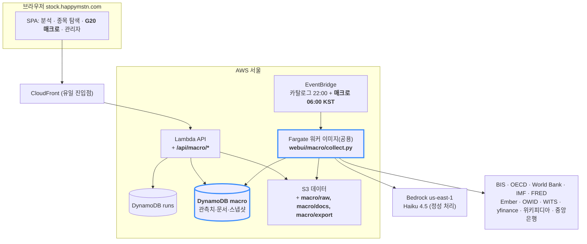

# G20 매크로·정치 대시보드 — 구축 방안 및 화면 설계 제안

> 작성일 2026-09-20 · 대상 시스템: **stock.happymstn.com** (TradingAgents 웹 UI)
> 함께 보기: 화면 목업 [`mockups/g20-macro-mockup.html`](mockups/g20-macro-mockup.html) — 브라우저로 열면 동작하는 화면(샘플 데이터)을 볼 수 있습니다.
> 기존 구조는 [아키텍처.md](아키텍처.md), 운영 비용은 [README.md](README.md) 참고.

---

## 0. 한 페이지 요약

| 항목 | 제안 |
|---|---|
| **무엇을** | G20(19개국 + 유로존)의 ① 정당 지지율 ② 금리·중앙은행 기조·통화량·달러 환율 ③ 경제구조(산업·기업·수출·에너지) ④ GDP·GNI·예산·국방비 ⑤ PPI·CPI·집값을 **매일 수집·누적**하고, **월/분기/년 시계열**과 **관측치 1건 단위의 출처·수집시각·개정이력**까지 볼 수 있는 화면 |
| **어디에** | 기존 대시보드에 **"G20 매크로" 탭 1개 추가** (분석 · 종목 탐색 · **G20 매크로** · 관리자). 로그인·도메인·배포 스크립트 그대로 |
| **어떻게** | 기존 인프라를 그대로 확장: 카탈로그 배치와 같은 **Fargate 스케줄 태스크**가 수집 → **DynamoDB**(관측치·문서) + **S3**(원본 응답·요약 전문·Parquet) → 기존 **Lambda API**에 `/api/macro/*` 추가 → 기존 **SPA**(순수 JS)에 탭·인라인 SVG 차트 추가 |
| **AI 역할** | 숫자는 **공식 통계 API에서만** 가져오고, LLM(Bedrock Haiku 4.5)은 *숫자로 안 나오는 것*에만 씁니다: 중앙은행 기조(매파/비둘기파) 판정, 여론조사 표 추출, 에너지 정책 요약, 주간 G20 브리프. 모든 AI 산출물은 **인용 근거 + 원문 링크 + "AI 생성" 표시**와 함께 저장 |
| **비용** | 고정비 월 $1 미만 + LLM 월 $5 내외 (8장) |
| **일정** | 4단계. **Phase 0(약 1주)** 에 개요 히트맵 + 지표 비교 화면을 실데이터로 확인 가능 (6장) |
| **시너지** | 쌓인 매크로 데이터를 TradingAgents **뉴스 분석가의 컨텍스트**로 주입 → 종목 분석의 거시 근거가 구조화된 실제 수치가 됨 (4.8절) |

---

## 1. 현황 진단 — 이미 갖고 있는 것

새로 만들 것보다 **재사용할 것**이 더 많습니다. 2026-07-31 이후 구축된 자산을 그대로 씁니다.

| 자산 | 위치 | 이번 프로젝트에서의 역할 |
|---|---|---|
| CloudFront 단일 진입 + Cognito 가족 계정 | `webui/infra/template.yaml` | 그대로. 인증·도메인 작업 0 |
| Lambda API (boto3만, zip 1장) | `webui/backend/api_handler.py` | `/api/macro/*` 라우트 추가 |
| Fargate 워커 이미지 + EventBridge 스케줄 (카탈로그 배치) | `CatalogScheduleRule`, `webui/catalog/build_catalog.py` | **동일 패턴**으로 `webui/macro/collect.py` 실행 규칙 1개 추가. pandas·requests 이미 포함 |
| 순수 JS SPA (해시 라우팅, 다크 테마, 표 컴포넌트) | `webui/frontend/` | 탭·뷰·차트 추가. 빌드 도구 없음 유지 |
| Bedrock(us-east-1) 호출 코드 | `tradingagents/llm_clients/bedrock_client.py` | 정성 데이터 LLM 처리 |
| **FRED 거시지표 모듈** (금리·CPI·M2·달러지수 별칭 30여 개) | `tradingagents/dataflows/fred.py` | 미국 데이터 수집기로 재사용 |
| 종목 카탈로그 (한·일·미·중 전 종목, 시총·업종) | S3 `catalog/*.json.gz` | **"주요 기업" 항목**의 4개국 데이터 소스 (추가 수집 불필요) |
| 배포 스크립트·비용 태그 `Project=stock` | `webui/infra/deploy.sh` | 그대로 |
| (다른 프로젝트) ECOS 한국은행 수집 Lambda | `rtms-data-platform` (rtms-collector) | 한국 통화량·PPI 수집 코드 참고/이식 |
| (다른 프로젝트) Yahoo 환율 수집기 | `fx-split/apps/server/src/sources/yahoo.ts` | 일별 환율 수집 로직 참고 (Python 이식) |

---

## 2. 요구사항 → 지표 매핑

사용자 요구 6개 묶음을 **수집 가능한 지표**로 번역한 표입니다. "빈도"는 원천 빈도, 화면에서는 모두 월/분기/년으로 집계해 보여줍니다(집계 규칙은 4.3절).

| # | 요구사항 | 지표(화면 표기) | 원천 빈도 | 1차 소스 | 커버리지 | 수집 방식 |
|---|---|---|---|---|---|---|
| 1 | 정당 순위·민심·지지율 | 정당별 지지율(여론조사 평균), 정부/대통령 지지율, 집권당·다음 선거일 | 주~월 | 위키피디아 "Opinion polling for the next … election" 표 + 국가별 조사기관(한국: 갤럽·NBS·리얼미터) | 17개국 (중국·사우디는 경쟁 정당 없음 → 정부 신뢰 지표로 대체 표기) | **LLM 표 추출** + 규칙 검증 |
| 2-a | 금리 | 정책금리 | 일/회의 | **BIS** `WS_CBPOL` | G20 전체 | API |
| 2-b | 중앙은행 기조 | 매파↔비둘기파 지수(−2~+2), 최근 결정·포워드가이던스 요약 | 회의 단위 | 각 중앙은행 결정문/성명 (20개 URL·RSS) | G20 전체 | **LLM 구조화 판정** |
| 2-c | 통화량 | 광의통화(M2/M3) 잔액·전년비 | 월 | **IMF** 통화금융통계(MFS, SDMX 3.0) → 폴백 FRED(M2SL)·ECB·한국은행 ECOS | G20 전체 | API |
| 2-d | 달러 대비 환율 | 환율(현지통화/USD) 일·월, **통화가치 지수**(기준일=100) | 일/월 | **BIS** `WS_XRU`(월) + Yahoo Finance(일, 비공식) | 19통화 | API |
| 3-a | 경제구조 | 농업/제조/기타산업/서비스 부가가치 비중 | 년 | **World Bank** `NV.*.ZS` | G20 전체 | API |
| 3-b | 주요 산업·기업 | 시총 상위 10개 기업(업종 포함) | 분기 | 기존 **카탈로그**(한·일·미·중) + yfinance 대표지수 구성종목(나머지) | G20 전체 | 배치 |
| 3-c | 수출 비율·구성 | 수출/GDP, 상위 수출 품목(HS2) 비중 | 년 | World Bank `NE.EXP.GNFS.ZS` + **WITS**(무료) | G20 전체 | API |
| 3-d | 에너지 구조 | 발전 믹스(석탄·가스·원자력·재생 등), 1차에너지 화석 비중 | 월(전력)/년 | **Ember API**(무료 키) + **OWID 에너지 CSV** | G20 전체 | API/CSV |
| 3-e | 에너지 해외의존도 | 순에너지수입/사용량, 연료별(원유·가스·석탄) 의존도 추정 = 1 − 생산/소비 | 년 | World Bank `EG.IMP.CONS.ZS` + OWID 생산·소비량 | G20 전체 | API + 파생계산 |
| 3-f | 에너지 정책 | 정책 요약 카드(목표·최근 변화·출처) | 분기 | IEA 국가 페이지·정부 발표 | G20 전체 | **LLM 요약** |
| 4-a | GDP·GNI | 명목 GDP(USD), 실질성장률, GNI, 1인당 GNI | 년(+분기 GDP 옵션) | World Bank `NY.GDP.*`, `NY.GNP.*`; IMF WEO(전망) | G20 전체 | API |
| 4-b | 연간 예산 | 일반정부 지출·수입/GDP, 정부부채/GDP | 년 | IMF Fiscal Monitor / World Bank `GC.XPN.TOTL.GD.ZS` | G20 전체 | API |
| 4-c | 국방비 비율 | 국방비/GDP, **국방비/정부지출**, 국방비(USD) | 년 | World Bank `MS.MIL.XPND.ZS`·`.GD.ZS` (원자료 SIPRI) | G20 전체 | API |
| 5 | 달러 대비 통화가치 변화 | 2-d의 지수화 뷰(1·3·5·10년 기준) | 일/월 | 2-d와 동일 | 19통화 | 파생계산 |
| 6-a | 생산자지수 | PPI 지수·전년비 | 월 | **OECD** SDMX(회원국+BRIICS) → 폴백 FRED(미), Eurostat(EU), ECOS(한) | G20 전체(소스 분산) | API |
| 6-b | 소비자지수 | CPI 지수·전년비, 근원 CPI | 월 | **OECD** `DSD_PRICES@DF_PRICES_ALL` → 폴백 World Bank(연) | G20 전체 | API |
| 6-c | 집값 | 주택가격지수(실질/명목)·전년비 | 분기 | **BIS** `WS_SPP` (전 G20 분기) + OECD 분석지표(가격/소득, 가격/임대료) | G20 전체 | API |

> 유로존 3국(독일·프랑스·이탈리아)의 정책금리·통화량은 **ECB 단일값**입니다. 화면에는 "유로존 공통" 배지를 붙이고, 국가 프로필에서는 유로존 값을 참조 표시합니다.

---

## 3. 데이터 소스 전략

### 3.1 원칙

1. **공식 통계 우선순위**: BIS → OECD → World Bank → IMF → FRED → Ember/OWID → 국가 통계(ECOS 등) → Yahoo(비공식, 일별 보조용). 같은 지표가 여러 소스에 있으면 상위 소스를 `primary`, 나머지를 `fallback`으로 등록해 **소스 장애 시 자동 대체**.
2. **원본 보존**: 모든 API 응답 원문을 S3에 gzip으로 저장(재처리·감사용). 화면의 모든 숫자는 이 원본까지 추적 가능해야 함.
3. **LLM은 추출·요약·판정만**, 수치 계산은 항상 서버 코드(가계부 프로젝트의 "AI 수치는 서버 계산" 원칙과 동일).
4. **개정치(vintage) 보존**: GDP·CPI처럼 소급 개정되는 지표는 덮어쓰지 않고 `revision` 이력을 남김.

### 3.2 소스별 상세

| 소스 | 인증 | 형식 | 제약·주의 |
|---|---|---|---|
| **BIS Data Portal** `https://stats.bis.org/api/v2/data/dataflow/BIS/{FLOW}/1.0/{KEY}?format=csv` | 없음 | SDMX-CSV | 출처 표기 의무(CC BY 유사). 정책금리 `WS_CBPOL`, 달러환율 `WS_XRU`, 주택가격 `WS_SPP`, 실효환율 `WS_EER` |
| **OECD Data Explorer** `https://sdmx.oecd.org/public/rest/data/{agency},{dataflow},/{key}?format=csvfilewithlabels` | 없음 | SDMX-CSV | **요청 속도 제한** 있음 → 일 1회, 국가 묶음 요청. PPI 데이터플로 ID는 Data Explorer "Developer API" 버튼으로 확정 필요 |
| **World Bank Indicators API v2** `https://api.worldbank.org/v2/country/{ISO}/indicator/{ID}?format=json&per_page=100` | 없음 | JSON | 연간. 최신 연도가 1~2년 지연 → 화면에 "기준연도" 명시 |
| **IMF Data (SDMX 3.0)** `https://data.imf.org` API | 없음 | SDMX-CSV | 2025-11 구 포털 폐지. 통화량은 MFS 데이터플로, `IFS_Flag` 제약으로 구 IFS 시리즈 선별 |
| **FRED** | 무료 키(`FRED_API_KEY`) | JSON | 기존 `fred.py` 재사용. 미국 + 일부 국가 미러 시리즈 |
| **Ember** `https://api.ember-energy.org/v1/electricity-generation/{yearly|monthly}` | 무료 키(`X-API-Key`) | JSON | CC BY 4.0. 월간 88개국·연간 215개국 |
| **OWID 에너지** `https://owid-public.owid.io/data/energy/owid-energy-data.csv` | 없음 | CSV(9MB) | 연간. 연료별 생산·소비 → 의존도 파생 |
| **WITS(World Bank 무역)** | 없음 | SDMX/JSON | HS2 수출 상위 품목, 연간 |
| **yfinance** | 없음 | Python | 비공식·SLA 없음. 실패는 조용히 건너뛰고 다음 날 재시도 |
| **위키피디아 여론조사 표** | 없음 | HTML 표 | 국가별 표 구조 상이 → LLM 추출 + 규칙 검증(합계 ≤ 100, 날짜 단조, 기관명 화이트리스트) |
| **중앙은행 성명** (Fed·ECB·BoJ·BoE·한국은행·PBoC·RBI·BCB 등 20곳) | 없음 | HTML/RSS/PDF | 결정 회의 후 24시간 내 수집. 원문 저장 + 인용 |

### 3.3 정성 데이터의 LLM 파이프라인 (Phase 2)



- **중앙은행 기조 스키마(예)**: `{stance_score: -2..2, direction: "hike|hold|cut", forward_guidance: "tightening|neutral|easing", key_quotes: [..원문 인용 2~3개..], summary_ko: "...", confidence: 0..1, source_url, statement_date}` — 점수만 저장하지 않고 **인용문을 반드시 함께** 저장해 사람이 검증 가능하게 합니다.
- **여론조사 스키마**: `{pollster, fieldwork_end, sample_size, results: {party: pct}, source_url}` → 서버가 30일 가중 이동평균(poll-of-polls)을 계산.
- LLM 호출은 **변경 감지 시에만**(원문 해시 비교) 실행해 비용을 억제합니다.

### 3.4 라이선스·표기

BIS·OECD·World Bank·IMF·Ember(CC BY 4.0)·OWID(CC BY)는 출처 표기 조건으로 재이용 가능. 화면 하단 고정 출처 표기 + 관측치 상세에 시리즈 ID/URL을 노출합니다. Yahoo는 비공식 소스이므로 "참고용" 표기.

---

## 4. 아키텍처

### 4.1 구성도 — 추가되는 것은 굵은 테두리



- 워커 **이미지는 공용**(분석 워커 = 카탈로그 배치 = 매크로 수집기). `containerOverrides.command`만 다릅니다. 이미지 재빌드 없이 코드만 추가되면 CodeBuild 1회.
- 수집기는 **소스별 실패 격리**(카탈로그 배치와 동일): 한 소스가 죽어도 나머지는 진행, `INGEST` 로그에 기록.

### 4.2 데이터 모델

**DynamoDB `tradingagents-webui-macro`** (온디맨드, 단일 테이블)

| PK | SK | 내용 | 용도 |
|---|---|---|---|
| `SERIES#<indicator>` | `META` | 지표명(ko/en), 단위, 원천 빈도, 집계규칙, primary/fallback 소스, 설명 | 지표 사전(레지스트리) |
| `OBS#<indicator>#<iso>` | `<freq>#<period>` 예: `M#2026-08`, `Q#2026-Q2`, `Y#2025` | `value, unit, source, series_id, source_url, retrieved_at, vintage, method, flags[], revisions[{value, vintage}]` | **시계열 조회** (Query 1회로 기간 범위) |
| `LATEST#<indicator>` | `<iso>` | 최신값, 기간, 전기 대비 변화, G20 내 순위 | **개요 히트맵** (지표당 Query 1회) |
| `SNAPSHOT#<iso>` | `PROFILE` | 국가 프로필용 최신값 묶음 + 문서 포인터 (배치가 재생성) | **국가 화면 1회 Get** |
| `DOC#<type>#<iso>` | `<date>#<id>` | `cb_stance`, `energy_policy`, `poll`, `election`, `top_companies`, `top_exports` 등 JSON 문서 + `ai_generated, confidence, review_status, quotes[], source_url, s3_key` | 정성 데이터·목록 |
| `INGEST#<source>` | `<run_ts>` | 성공/실패, 건수, 소요, 오류 메시지 | 관리자 탭 수집 현황 |

- 규모: 20개국 × 약 45지표 × 3빈도 × 최대 30년 ≈ **50만 항목 미만, 수백 MB** → 프리티어 범위.
- M/Q/Y는 **쓰기 시점에 3개 빈도로 모두 저장**(읽기 단순화). 재집계는 배치가 담당.

**S3 `tradingagents-webui-data-*`**

```
macro/raw/<source>/<yyyy-mm-dd>/<indicator>_<iso>.json.gz   ← API 원본 응답 (감사·재처리)
macro/docs/<type>/<iso>/<date>.md                          ← LLM 요약 전문 + 인용 + 원문 링크
macro/export/observations_<yyyy-mm>.parquet                ← 월 1회 내보내기 (Athena/pandas, rtms와 동일 패턴)
macro/registry.yaml                                        ← 지표 레지스트리 원본 (코드와 함께 버전관리)
```

### 4.3 월/분기/년 집계 규칙 (지표 성격별로 고정)

| 지표 성격 | 예 | M→Q, Q→Y | 전년비(YoY) |
|---|---|---|---|
| **수준·잔액(stock)** | 정책금리, 환율, M2 잔액, 지수(CPI·PPI·집값) | **기말값**(end of period). 환율은 "기간평균" 토글 제공 | 지수 수준을 같은 빈도로 맞춘 뒤 계산 (월별 YoY의 평균 ✗) |
| **흐름(flow)** | GDP, 예산, 국방비, 수출액 | 원천이 연간이면 월/분기 화면에 "연간만 제공" 표시. 분기 GDP는 합산 | 동기 대비 |
| **비율·점수** | 지지율, 기조 지수, 비중 | 지지율: 기간 평균 · 기조: 기말값 + 회의 횟수 · 비중: 연간 원천 | — |
| **이벤트** | 금리 결정, 선거 | 집계하지 않고 목록 + 타임라인 | — |

집계 방식은 관측치 상세의 `method` 필드에 그대로 노출됩니다(예: "분기값 = 6월 말 월값").

### 4.4 "개별 데이터 세부내용" — 관측치 상세 필드

화면에서 셀·점·표 행을 누르면 열리는 상세 패널의 내용입니다.

| 필드 | 예 |
|---|---|
| 지표 · 국가 · 기간 · 빈도 | 정책금리 · 한국 · 2026-08 · 월 |
| 값 · 단위 | 2.50 · % |
| 집계 방법 | 월말 기준값 (원천: 일별) |
| 출처 기관 · 시리즈 ID · URL | BIS · `WS_CBPOL/1.0/D.KR` · 링크 |
| 수집 시각 · 데이터 vintage | 2026-09-20 06:03 KST · 2026-09-19 |
| 개정 이력 | 2.50 (2026-09-19) ← 2.50 (2026-09-12) |
| 관련 문서 | 한국은행 8월 통화정책방향 요약(AI 판정, 신뢰도 0.86) → 원문 |
| 플래그 | `euro_area_shared`, `estimated`, `ai_generated`, `needs_review` |
| 원본 응답 | S3 키 (관리자만 다운로드) |

### 4.5 API (기존 `api_handler.py`에 추가, 모두 Cognito 토큰 필수)

| 메서드 · 경로 | 설명 | 주 쿼리 |
|---|---|---|
| `GET /api/macro/meta` | 지표 레지스트리 + 소스 + 마지막 수집 시각 | SERIES#*, INGEST#* |
| `GET /api/macro/overview?freq=M&group=G20&asof=2026-08` | 히트맵 셀 (국가×지표 최신값·변화·순위) | LATEST#* |
| `GET /api/macro/countries/{iso}?freq=Q` | 국가 프로필 스냅샷 + 최근 문서 | SNAPSHOT, DOC |
| `GET /api/macro/series?indicator=policy_rate&countries=KR,US,JP&freq=M&from=2016-01&transform=level\|yoy\|index100&base=2020-01` | 시계열 비교 (지수화·전년비 변환은 서버 계산) | OBS 범위 Query × 국가 수 |
| `GET /api/macro/observations?indicator=&iso=&freq=&period=` | 관측치 상세 (4.4) | OBS 1건 + DOC |
| `GET /api/macro/docs?type=cb_stance&iso=KR&limit=12` | 정성 문서 목록 | DOC |
| `GET /api/macro/politics/{iso}?from=` | 정당 목록·여론조사·poll-of-polls·선거 일정 | DOC#poll, DOC#election |
| `GET /api/macro/fx?base=2025-01-01&freq=M` | 19통화 통화가치 지수 | OBS(fx) |
| `POST /api/admin/macro/refresh {sources:[...]}` | 수동 재수집(RunTask, 기존 카탈로그와 동일) | — |
| `POST /api/admin/macro/review {doc_key, action}` | AI 문서 승인/반려/수정 | DOC |

응답에는 항상 `period_available` (M/Q/Y 중 제공 빈도)와 `source` 요약이 포함되어 화면이 "연간만 제공" 등을 자동 표시합니다.

### 4.6 수집 스케줄 (EventBridge → Fargate, 매일 06:00 KST 1회 기동 후 내부에서 케이던스 판단)

| 소스 | 케이던스 | 근거 |
|---|---|---|
| Yahoo 환율 | 매일 | 일별 시세 |
| BIS 정책금리·환율 | 매일(변경 감지) | 결정 다음 날 반영 |
| 중앙은행 성명 → LLM | 매일 확인, 신규 문서 있을 때만 LLM | 회의 월 1~8회 |
| OECD CPI/PPI, IMF 통화량 | 주 1회 | 월간 통계 발표 주기 |
| BIS 집값, Ember 월간 전력 | 월 1회 | 분기·월간 |
| World Bank·WITS·OWID·SIPRI | 월 1회 (신규 연도 감지) | 연간 통계 |
| 여론조사 표 → LLM | 주 1회 | 주간 발표 |
| 주요 기업(카탈로그·yfinance) | 분기 1회 | 시총 순위 변동 |
| 스냅샷·LATEST 재생성, Parquet 내보내기 | 매일 / 월 1회 | 화면 성능 |

예상 1회 실행 시간 5~15분 (LLM 포함 시 최대 30분).

### 4.7 기존 코드에 추가되는 파일

```
webui/
  macro/
    collect.py            ← 진입점 (카탈로그 배치와 동일 구조, 소스별 실패 격리)
    registry.yaml         ← 지표 사전 (코드·단위·소스·집계규칙)
    sources/
      bis.py  oecd.py  worldbank.py  imf.py  fred.py(기존 모듈 래핑)
      ember.py  owid.py  wits.py  yahoo_fx.py  companies.py
      cb_statements.py  polls_wiki.py  energy_policy.py   ← LLM 계층
    aggregate.py          ← M/Q/Y 집계·YoY·지수화 (순수 함수, 단위 테스트)
    store.py              ← DynamoDB/S3 쓰기 (배치 upsert, revision 처리)
  backend/api_handler.py  ← /api/macro/* 라우트 추가 (~300줄)
  frontend/
    index.html            ← 탭 <a href="#/macro">G20 매크로</a> + 뷰 섹션
    app.js                ← parseHash에 /^#\/macro/ 추가 → macro.js 위임
    macro.js              ← 뷰 5개 + 상세 드로어 + 필터 상태
    charts.js             ← 인라인 SVG 차트 (라인·소형다중·가로막대·누적막대·히트맵·미터·스파크라인)
  infra/template.yaml     ← MacroTable, MacroScheduleRule, IAM 권한 3곳
tests/test_macro_aggregate.py, test_macro_registry.py, test_macro_api.py
```

### 4.8 TradingAgents와의 연동 시너지 (AI 관점에서 가장 큰 가치)

지금 뉴스 분석가는 FRED(미국)만 수치 근거로 씁니다. 매크로 테이블이 쌓이면:

1. 분석 대상 티커의 **상장국 스냅샷**(정책금리·기조·CPI·환율 추세·정치 리스크)을 뉴스 분석가 프롬프트에 **구조화된 표로 주입** → 한국·일본·중국 종목 분석의 거시 근거가 실제 수치가 됨.
2. 백테스트 시 **룩어헤드 차단**과 동일하게 `vintage ≤ 분석일` 조건으로 과거 시점 스냅샷을 제공(개정치 보존 덕분에 가능).
3. 주간 "G20 브리프"(LLM)는 대시보드 첫 화면과 분석 보고서 서두에 동시에 사용.

---

## 5. 화면 설계

### 5.1 정보 구조

```
G20 매크로 (탭)
├─ 개요        국가×지표 히트맵 + 이번 주 이벤트 + 주간 브리프
├─ 국가 프로필  [국가 선택] 정치 · 통화정책 · 재정/규모 · 경제구조 · 에너지 · 시장경제 (6카드)
├─ 지표 비교    [지표 선택] 다국가 시계열, 강조 모드, 지수화, 표 보기, CSV
├─ 통화가치     19통화 소형 다중 패널(기준일=100) + 기간 변화율 발산 막대
└─ 정치        정당 지지율 소형 다중 + 20개국 집권당/지지율/선거 표
   └─ (공통) 관측치 상세 드로어: 값·출처·수집시각·개정이력·관련 문서
필터 행(공통, 차트 위 한 줄): 기간 단위 [월|분기|년] · 범위 [1·3·5·10년·전체] · 국가군 [G20|G7|BRICS|아시아] · 기준 시점
```

### 5.2 디자인 시스템 — 기존 다크 테마 그대로, 데이터 색만 규칙 추가

기존 CSS 변수(`--bg #0d1117`, `--bg-elevated #161b22`, `--accent #388bfd`, `--border #2d333b`)를 그대로 쓰고, **데이터 색은 역할별로 고정**합니다.

| 역할 | 규칙 | 값 (다크 표면 `#161b22` 기준 검증 통과) |
|---|---|---|
| **국가 식별(카테고리)** | 국가마다 **고정 색**. 필터로 국가가 빠져도 색이 바뀌지 않음. 8개 초과 시 회색 "기타" 또는 소형 다중 패널 (색 추가 생성 금지) | KR `#3987e5` · US `#d95926` · JP `#199e70` · CN `#c98500` · 유로존/DE `#d55181` · GB `#008300` · IN `#9085e9` · BR `#e66767` · 그 외 `#8b949e` |
| **강조 모드** | 한 국가만 색, 나머지 회색 — "지표 비교"의 기본값 (한국 강조) | 강조색 = 그 국가의 고정색 |
| **크기(순차)** | 한 색조 파랑, 밝을수록 큼 | `#1c5cab → #3987e5 → #86b6ef` (표면 대비 2:1 이상, 단계 간 밝기차 검증 통과) |
| **양/음, 매파/비둘기(발산)** | 파랑(음·비둘기) ↔ 주황(양·매파), 중립은 회색. **좋다/나쁘다 판단 색 아님** — 매크로 지표는 방향의 선악이 지표마다 달라 상승=빨강 관례를 쓰지 않음 | 파랑 팔 `#1c5cab · #3987e5 · #86b6ef` · 중립 `#2d333b` · 주황 팔 `#a3401c · #d95926 · #f0a070` |
| **상태색** | 수집 성공/경고/실패, 검토 필요에만 사용. 데이터 시리즈 색으로 재사용 금지 | 기존 `--green/--yellow/--red` |
| **텍스트** | 값·라벨·범례는 항상 텍스트 색. 색은 옆의 마크(선·점·사각)만 | `--text`, `--text-muted` |

검증: `validate_palette.js` — 카테고리 8색 인접쌍 CVD ΔE 8.4(기준 ≥8) 통과, 정상시 ΔE 19.3(≥15) 통과, 표면 대비 전부 3:1 이상. 정당 3색(파랑·주황·초록) 전쌍 검증 통과.

차트 공통 규격: 선 2px, 격자 1px 실선(점선 금지), 막대 두께 ≤ 24px·끝 4px 라운드, 누적 구간 사이 2px 표면색 간격, **이중 축 금지**(규모가 다른 두 지표는 두 차트 또는 지수화), 2개 이상 시리즈면 범례 필수, 모든 차트에 **표 보기 토글**, 라인 차트에는 십자선+전 시리즈 툴팁, 막대·셀은 개별 툴팁.

### 5.3 화면별 와이어프레임

목업 파일에서 실제로 동작하는 화면을 볼 수 있습니다(필터·툴팁·표 보기·상세 드로어 동작). 아래는 구조 요약이며, 렌더링 결과는 `mockups/screenshots/`에 있습니다.

| 개요 | 국가 프로필 | 지표 비교 |
|---|---|---|
| [](mockups/screenshots/overview.png) | [](mockups/screenshots/country.png) | [](mockups/screenshots/indicator.png) |

| 통화가치 | 정치 | 관측치 상세 드로어 |
|---|---|---|
| [](mockups/screenshots/fx.png) | [](mockups/screenshots/politics.png) | [](mockups/screenshots/drawer.png) |

> 드로어는 목업 URL에 `#overview?drawer=KR,rate`처럼 붙여 바로 열 수 있습니다.

**① 개요** — "지금 G20이 어디에 있는가"를 30초에 읽는 화면
```
┌ 필터: [월|분기|년] [1년|3년|5년|10년] [G20|G7|BRICS|아시아]  기준 2026-08  [표 보기] ┐
┌───────────────────────────────────────────────┐ ┌──────────────────────┐
│ 국가 │정책금리│CPI│PPI│집값│통화가치│M2│GDP│국방비│집권당│ │ 이번 주 이벤트          │
│ 🇰🇷한국│ 2.50 │2.1│1.5│3.2│ -1.8  │6.0│1.9│ 9.2 │ 44  │ │ 9/18 Fed 25bp 인하     │
│ 🇺🇸미국│ 3.75 │2.8│2.2│2.5│   —   │4.0│2.1│13.0 │ 41  │ │ 9/17 BoE 동결          │
│ ...  20행, 셀 색 = G20 중앙값 대비 발산(파랑↔주황)  │ │ 9/14 독일 지방선거      │
│ 셀 클릭 → 관측치 상세 드로어                      │ │ ...                   │
└───────────────────────────────────────────────┘ └──────────────────────┘
┌ 주간 G20 브리프 (AI 생성 · 원문 근거 12건) ───────────────────────────────┐
```
형태 선택: 20×9 격자 비교 = **히트맵**(순차/발산). 막대 20개 × 9지표는 읽히지 않음.

**② 국가 프로필** — 한 나라를 6장의 카드로
```
┌ 🇰🇷 한국 · 집권: 더불어민주당 · 정부 지지율 45% · 다음 선거 2028-04 총선 (D-570) ┐
┌ 정치 ─────────────────┐ ┌ 통화정책 ─────────────────────────┐
│ 정당 지지율 3선 라인      │ │ 정책금리 라인 + 기조 미터 [비둘기 ◀●─── 매파] │
│ 최근 여론조사 표(기관·날짜)│ │ M2 YoY · 통화가치(지수) 스탯타일+스파크라인   │
└──────────────────────┘ └───────────────────────────────────┘
┌ 재정·규모 ─────────────┐ ┌ 경제구조 ─────────────────────────┐
│ GDP·GNI·예산·국방비 4타일 │ │ 산업 비중 누적막대 · 상위 수출 가로막대        │
│ 국방비/지출 10년 막대     │ │ 시총 상위 10 기업 표(카탈로그)               │
└──────────────────────┘ └───────────────────────────────────┘
┌ 에너지 ────────────────┐ ┌ 시장경제 ─────────────────────────┐
│ 발전 믹스 누적막대        │ │ PPI YoY · CPI YoY · 집값 YoY  소형 다중 3패널 │
│ 연료별 해외의존도 가로막대  │ │ (같은 축 척도, 0선 표시)                    │
│ 정책 요약 카드(AI·출처)   │ │                                       │
└──────────────────────┘ └───────────────────────────────────┘
```

**③ 지표 비교** — 한 지표, 여러 나라
```
┌ 지표 [정책금리 ▾]  국가 [KR US JP CN EU +]  변환 [수준|전년비|지수화(기준 2020-01)] [표 보기] ┐
│  ── 한국(강조, 파랑 2px)  ── 나머지 회색 1.5px  · 끝점 라벨 · 십자선 툴팁(전 국가 값)   │
│  범례(항상)                                                                   │
```
기본은 **강조 모드**(한국만 색). 국가를 8개 넘게 고르면 자동으로 소형 다중 패널로 전환.

**④ 통화가치** — 달러 대비 통화가치 변화
```
┌ 기준일 [1년 전|3년|5년|10년|직접]  단위 [일|월]  정렬 [변화율|알파벳]  ┐
│ 4×5 소형 다중: 통화별 지수(기준=100) 라인 + 10% 면 채움, 100 기준선(실선 회색)     │
│   각 패널 우상단: 현재 지수·변화율(텍스트 색), 100 아래 = 달러 대비 약세             │
│ 하단: 기간 변화율 정렬 발산 막대 (음=파랑 왼쪽, 양=주황 오른쪽), 달러지수 DXY는 별도 차트 │
```
지수 정의: 통화가치 지수 = (기준일 환율 ÷ 현재 환율) × 100 (환율 = 현지통화/USD). 값이 내려가면 통화 약세 — 화면에 정의를 상시 표기.

**⑤ 정치**
```
┌ 20개국 표: 국가 · 집권당(성향) · 1위 정당·지지율(막대) · 2위 · 정부 지지율 · 다음 선거 · 신뢰도 ┐
│ 중국·사우디: "경쟁 정당 없음 — 정부 신뢰 지표로 대체" 배지                              │
│ 선택 국가 정당 지지율 라인(최대 4당, 나머지 '기타') + 여론조사 원자료 표(기관·표본·기간·출처)   │
```

**⑥ 관측치 상세 드로어(공통)** — 4.4절 필드를 오른쪽 패널로. 관련 문서(중앙은행 요약)는 인용문 펼치기 + 원문 링크.

### 5.4 인터랙션 규칙

- 필터 행은 **한 줄, 차트 위**, 아래 모든 카드에 동시에 적용. 재조회 중에는 이전 차트를 흐리게 유지(스켈레톤 깜빡임 없음).
- 히트맵 셀·막대·점: 호버 시 살짝 밝아지고 툴팁(국가·값·기간·G20 중앙값), 클릭 시 상세 드로어. 라인 차트는 십자선이 X를 잡고 전 시리즈 값을 한 툴팁에.
- 모든 차트 카드에 "표 보기" 토글과 CSV 다운로드. 키보드 포커스에서도 툴팁 동일.
- 모바일(가계부처럼 폰에서 볼 가능성): 카드 1열 스택, 히트맵은 가로 스크롤 + 첫 열 고정(기존 `catalog-table` 패턴).

---

## 6. 구현 로드맵

| 단계 | 기간(안) | 산출물 | 확인 방법 |
|---|---|---|---|
| **Phase 0 — 뼈대 + 첫 화면** | 약 1주 | `registry.yaml`(45지표), `MacroTable`·스케줄 CFN, `collect.py` + 소스 3종(BIS 정책금리·환율, World Bank 연간 12지표, Yahoo 일별 환율), 집계 함수 + 테스트, API 4개(meta/overview/series/observations), 프론트 탭 + **개요 히트맵 + 지표 비교 + 상세 드로어** | 실데이터로 히트맵이 채워지고 셀→상세가 BIS 시리즈 ID까지 추적됨 |
| **Phase 1 — 정량 완성** | 1~2주 | OECD CPI/PPI, BIS 집값, IMF 통화량(+ECOS·FRED 폴백), Ember/OWID 에너지(+의존도 파생), WITS 수출, 주요 기업(카탈로그+yfinance), SIPRI/WB 국방비; **국가 프로필·통화가치 화면**, 표 보기·CSV | 20개국 프로필 6카드 전부 실데이터. 폴백 전환 로그 확인 |
| **Phase 2 — 정성·AI** | 1~2주 | 중앙은행 성명 수집 + 기조 판정, 여론조사 추출 파이프라인(17개국) + poll-of-polls, 에너지 정책 요약, 주간 G20 브리프; **정치 화면**, 관리자 탭 "검토 대기" | 인용문 없는 AI 문서는 저장 거부되는지 테스트. 검토 승인 흐름 |
| **Phase 3 — 운영 고도화** | 이후 | Parquet 월 내보내기 + Athena, 개정치 비교 뷰, 이벤트 알림(금리 결정·선거 D-7), **TradingAgents 뉴스 분석가에 국가 스냅샷 주입**(4.8) | 백테스트에서 vintage 조건이 룩어헤드를 막는지 테스트 |

각 단계는 기존 규약대로 feature 브랜치 → PR → `변경이력.md`에 "요청→변경→이유" 기록.

---

## 7. 비용 추정 (서울 리전, 2026-08 요금 기준 대략치)

| 항목 | 월 비용 | 근거 |
|---|---|---|
| Fargate 매크로 배치 | ~$0.5 | 매일 1회 × 평균 12분 × (1 vCPU + 4 GB) |
| DynamoDB 온디맨드 | ~$0.2 | 쓰기 월 10만 건 미만, 저장 < 1 GB |
| S3 (원본·Parquet) | < $0.1 | 연 수 GB 누적 |
| Lambda·CloudFront·EventBridge | ~$0 | 가족 트래픽, 프리티어 |
| **Bedrock Haiku 4.5** (기조·여론조사·정책 요약) | **$3~6** | 주 1회 20개국 × 3종 × ~1만 토큰 ≈ 월 260만 입력 토큰 + 출력. 변경 감지로 절반 이하 가능 |
| Bedrock Sonnet (주간 브리프 1건) | ~$1 | 주 1회 |
| **합계** | **약 $5~8/월** | 고정비 < $1, 나머지는 LLM 사용량에 비례 |

---

## 8. 리스크와 전문가 유의사항

**데이터 해석**
- **정당 지지율은 국가 간 직접 비교 불가**: 조사 방식·질문·기관 편향(house effect)이 다릅니다. 화면은 "국가 내 추세"를 보여주고, 국가 간 비교는 순위·집권당 우위 폭 정도로 제한합니다. 러시아·튀르키예 등은 조사 신뢰도 배지(낮음)를 붙입니다. 중국·사우디는 경쟁 정당이 없어 "해당 없음"으로 정직하게 표기합니다.
- **중앙은행 기조는 본질적으로 해석**입니다. AI 점수는 반드시 인용문과 함께 표시하고, 객관 지표(최근 결정 방향·실질금리·인플레 갭)를 옆에 병기해 사용자가 판단하도록 합니다.
- **개정치**: GDP·CPI·M2는 소급 개정됩니다. 최신값과 발표 당시 값이 다를 수 있음을 상세 패널에 명시하고, 백테스트 용도는 vintage 기준으로 제공합니다.
- **환율 방향 표기**: "환율 상승"과 "통화가치 하락"이 같은 뜻이라 혼동이 잦습니다. 통화가치 화면은 지수 정의를 상시 노출하고, 원 환율 화면과 분리합니다.
- **국방비 정의**: SIPRI(연구기관 기준)와 정부 발표(예산 기준)는 다릅니다. 기본은 SIPRI 계열(World Bank 재배포)로 통일하고 출처를 표기합니다.
- **에너지 해외의존도**: IEA 세부 데이터는 유료라 OWID 생산·소비량으로 **추정**합니다(재수출·재고 미반영). `estimated` 플래그와 함께 표시합니다.
- **유로존**: 정책금리·M3는 ECB 단일값. 독일/프랑스/이탈리아 프로필에는 "유로존 공통" 배지.
- **PPI 소스 분산**: 20개국을 한 소스로 못 덮습니다(OECD 회원국 + BRIICS 일부, 나머지는 국가 통계). 소스가 다른 국가 간 비교 시 정의 차이(국내 공급자물가 vs 산출물가) 배지를 붙입니다.

**기술**
- OECD API 속도 제한, IMF 신 포털(SDMX 3.0) 데이터플로 ID 확정, Yahoo 비공식 API 불안정 → 소스별 폴백과 실패 격리로 대응.
- 위키피디아 표 구조는 예고 없이 바뀝니다 → 규칙 검증 실패 시 검토 큐로 보내고, 성공률을 관리자 탭에서 모니터링.
- LLM 비용 상한: 일일 토큰 예산 환경변수(`MACRO_LLM_DAILY_TOKEN_BUDGET`)로 초과 시 정성 수집만 중단.

---

## 9. 결정이 필요한 사항

1. **정치 데이터 범위**: 17개국 전부 vs 우선 8개국(한·미·일·영·독·프·캐·호)부터. 여론조사 추출은 국가별 보정 작업이 가장 큰 항목입니다. → 제안: **8개국 우선, 나머지는 Phase 2 후반**.
2. **저장소**: 제안대로 DynamoDB 주 저장 + S3 Parquet 보조 vs rtms처럼 S3 Parquet + Athena 주 저장. → 제안: **DynamoDB**(현재 Lambda API가 boto3만 쓰고, 조회가 키 기반이며, Athena 지연 없이 즉시 응답).
3. **배치 위치**: 기존 스택에 추가(제안) vs 별도 CloudFormation 스택. → 제안: **기존 스택**(공용 워커 이미지·권한 재사용, 배포 1회).
4. **AI 판정 표시 정책**: 검토 승인 전에도 화면에 "검토 전" 배지로 노출 vs 승인 후에만 노출. → 제안: **노출 + 배지**(가족용 도구, 속도 우선).
5. **기준 통화·언어**: 금액은 USD 통일(원화 병기는 한국만) 제안.

---

## 부록 A. 지표 레지스트리 초안 (코드 참조)

| indicator | 소스 · 시리즈 | 빈도 | 집계 |
|---|---|---|---|
| `policy_rate` | BIS `WS_CBPOL` `D.{ISO}` (유로존 `XM`) | D | 기말 |
| `fx_usd` | BIS `WS_XRU` `M.{ISO}.USD.A` / Yahoo `{CCY}=X` | M / D | 기말·평균 토글 |
| `fx_value_index` | 파생: base/fx_usd × 100 | D/M | — |
| `m2_level`, `m2_yoy` | IMF MFS(광의통화) / FRED `M2SL` / ECB `BSI.M.U2…M30` / ECOS | M | 기말, YoY 재계산 |
| `cpi_index`, `cpi_yoy`, `core_cpi_yoy` | OECD `OECD.SDD.TPS,DSD_PRICES@DF_PRICES_ALL` `{ISO}.M.N.CPI._T…` | M | 기말 |
| `ppi_yoy` | OECD PPI 데이터플로(확정 필요) / FRED `PPIACO` / Eurostat `sts_inppd_m` / ECOS | M | 기말 |
| `house_price_index`, `house_price_yoy` | BIS `WS_SPP` `Q.{ISO}.N.628` (명목) `R.628`(실질) | Q | 기말 |
| `gdp_usd`, `gdp_growth`, `gni_usd`, `gni_pc` | WB `NY.GDP.MKTP.CD`, `NY.GDP.MKTP.KD.ZG`, `NY.GNP.MKTP.CD`, `NY.GNP.PCAP.CD` | Y | — |
| `gov_expense_gdp`, `gov_revenue_gdp`, `gov_debt_gdp` | WB `GC.XPN.TOTL.GD.ZS`, `GC.REV.XGRT.GD.ZS`, `GC.DOD.TOTL.GD.ZS` / IMF FM | Y | — |
| `mil_gdp`, `mil_expenditure_share`, `mil_usd` | WB `MS.MIL.XPND.GD.ZS`, `MS.MIL.XPND.ZS`, `MS.MIL.XPND.CD` (SIPRI) | Y | — |
| `va_agri`, `va_industry`, `va_manuf`, `va_services` | WB `NV.AGR.TOTL.ZS`, `NV.IND.TOTL.ZS`, `NV.IND.MANF.ZS`, `NV.SRV.TOTL.ZS` | Y | — |
| `exports_gdp`, `exports_top_hs2` | WB `NE.EXP.GNFS.ZS`, WITS tradestats | Y | — |
| `elec_mix_*` | Ember `electricity-generation` (Coal/Gas/Nuclear/Hydro/Wind/Solar/Bioenergy/Other) | M/Y | 합산 |
| `energy_import_dep`, `fuel_dep_{oil,gas,coal}` | WB `EG.IMP.CONS.ZS`, OWID `*_production` vs `*_consumption` | Y | 파생·estimated |
| `party_support`, `gov_approval` | DOC#poll → poll-of-polls | W | 기간 평균 |
| `cb_stance` | DOC#cb_stance (LLM) | 회의 | 기말 |

## 부록 B. 소스 URL

- BIS Data Portal / API 문서: https://data.bis.org · https://stats.bis.org/api-doc/v2/ · 정책금리 https://data.bis.org/topics/CBPOL/data
- OECD Data Explorer API: https://www.oecd.org/en/data/insights/data-explainers/2024/09/api.html · 주택가격 `DSD_RHPI@DF_RHPI_ALL`, 분석지표 `OECD.ECO.MPD,DSD_AN_HOUSE_PRICES@DF_HOUSE_PRICES`, 물가 `OECD.SDD.TPS,DSD_PRICES@DF_PRICES_ALL`
- World Bank Indicators API: https://api.worldbank.org/v2/ · WITS: https://wits.worldbank.org/
- IMF Data (SDMX 3.0, 구 포털 2025-11 폐지): https://data.imf.org · IFS 안내 https://data.imf.org/ifs
- FRED: https://fred.stlouisfed.org/docs/api/
- Ember API: https://ember-energy.org/data/api/ · 연간 CSV https://ember-energy.org/data/yearly-electricity-data/
- OWID 에너지: https://github.com/owid/energy-data · https://owid-public.owid.io/data/energy/owid-energy-data.csv
- SIPRI 군사비: https://www.sipri.org/databases/milex
- 위키피디아 여론조사 문서: 국가별 "Opinion polling for the next … election" (예: 한국 `Opinion polling for the 2028 South Korean legislative election`)
