# G20 매크로 대시보드 — 구조와 작업 내역

> **작성일 2026-09-20.** 이 문서는 "무엇을 어떻게 만들었는가"를 그림 중심으로 남긴 **종합 문서**입니다.
> 표의 수치·파일명·줄 수·커버리지는 모두 코드·`registry.yaml`·dry-run 덤프에서 프로그램으로 추출한 값입니다.
>
> ⚠️ **코드가 바뀌면 이 문서보다 [CONTRACT.md](CONTRACT.md)와 각 모듈 상단 `[모듈 개요]` 주석이 우선합니다.**
> 이 문서는 시점 기록(2026-09-20)이고, 계약·구현의 최종 기준은 CONTRACT.md입니다.
>
> 진행 방식·결정·검증·미완료 항목의 **시간순 기록**은 [../변경이력.md](../변경이력.md)의 `2026-09-20` 항목에 있습니다
> (여기서는 중복하지 않고 구조·측정값에 집중합니다).

---

## 1. 한눈에 보기

기존 웹 UI는 종목 분석만 할 수 있었고, 거시 근거는 뉴스 분석가가 FRED(미국)만 수치로 쓰던 상태였습니다.
그래서 **G20 20개국(19개국 + 유로존)의 정치·통화·경제구조·재정·시장 데이터를 공식 통계 API에서 매일 모아
DynamoDB에 누적하고, 브라우저에서 히트맵·시계열·국가 프로필로 볼 수 있는 탭 하나**를 추가했습니다.
숫자는 공식 통계만 쓰고, LLM은 "숫자로 안 나오는 것"(중앙은행 기조 판정·여론조사 표 추출·에너지 정책 요약)에만 씁니다.
관측치 1건 단위로 **출처·시리즈 ID·수집 시각·vintage·개정 이력**을 보존하므로, 사람이 보는 대시보드이면서
동시에 `vintage ≤ 분석일` 조건으로 과거 시점 스냅샷을 만들 수 있는(= 백테스트 룩어헤드 차단) 데이터 자산이 됩니다.
인프라는 새로 만들지 않고 기존 스택에 **DynamoDB 테이블 1개 + EventBridge 규칙 1개**만 더했습니다.

### 착수 전 확정한 사용자 결정 5가지

| # | 결정 | 내용 | 그렇게 한 이유 | 코드에 남은 자리 |
|---|---|---|---|---|
| 1 | 정치 대상 | **17개국 전부** 수집. 중국·사우디(경쟁 정당 없음)·유로존(정부 지지율 대상 아님)은 `not_applicable` 문서로 사유 명시 | "빈칸"과 "해당 없음"을 화면에서 구분 | `llm/sources.yaml` polls 20 엔트리(17 + `trust: 해당없음` 3) |
| 2 | 저장소 | **DynamoDB 단일 테이블** `tradingagents-webui-macro` + S3 원본 보존. Parquet/Athena는 Phase 3 | 현재 규모(50만 항목 미만)에 데이터레이크는 과함 | `store.py`, `template.yaml` `MacroTable` |
| 3 | 배치 | **기존 CloudFormation 스택에 리소스 추가**, 워커 이미지·태스크 정의 공용(`command`만 교체) | 새 스택·새 이미지·새 파이프라인 없이 운영 대상 유지 | `template.yaml` `MacroScheduleRule` |
| 4 | AI 판정 노출 | 검토 전에도 **노출 + `ai_generated` 배지 + 신뢰도 + 인용 + 원문 링크 + `review_status`** | 최신성 우선, 단 사람이 판정 근거를 항상 볼 수 있게 | `schema.Doc`, `macro.js` `docCard()` |
| 5 | 금액 단위 | **USD 통일**, 한국만 원화 병기(프론트 표시 규칙) | 국가 간 비교 가능성 우선 | `unit: usd / usd_bn / lcu_bn` (CONTRACT 2장) |

### 화면 진입 경로

```
https://stock.happymstn.com  →  로그인(Cognito 가족 계정)  →  상단 탭 [G20 매크로]
```

| 뷰 | 라우트 | 내용 |
|---|---|---|
| 개요 | `#/macro` | 국가 × 지표 히트맵(기본 9지표) · 수집 현황 · 주간 브리프 |
| 국가 프로필 | `#/macro/country/KR` | 정치 · 통화정책 · 재정/규모 · 경제구조 · 에너지 · 시장경제 6카드 |
| 지표 비교 | `#/macro/indicator/policy_rate` | 다국가 시계열(강조·지수화·전년비·표 보기·CSV) |
| 통화가치 | `#/macro/fx` | 통화가치 지수 소형 다중 패널 · 기간 변화율 발산 막대 · DXY |
| 정치 | `#/macro/politics/KR` | 정당 지지율 소형 다중 · 20개국 집권당·지지율·선거 일정 표 |
| (드로어) | `…?obs=policy_rate,KR,M,2026-08` | 관측치 상세 — 출처·시리즈 ID·vintage·집계 방법·개정 이력·관련 문서 |

---

## 2. 시스템 구조도

굵은 테두리 = **이번에 추가·변경된 노드**. 그 외는 기존 리소스를 그대로 재사용합니다.

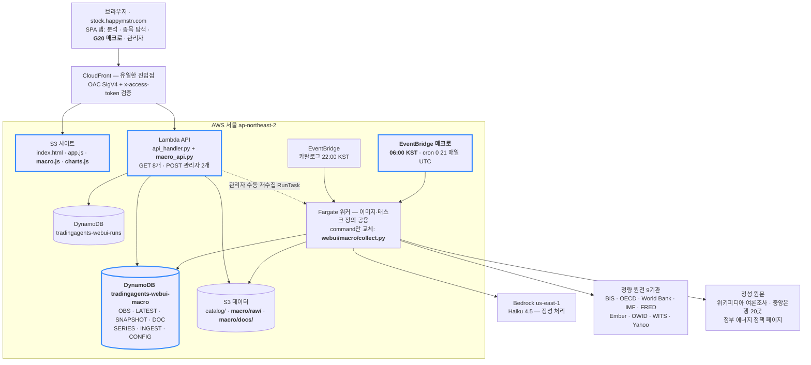
```mermaid
flowchart TB
    UI["브라우저 · stock.happymstn.com<br/>SPA 탭: 분석 · 종목 탐색 · <b>G20 매크로</b> · 관리자"]
    CF["CloudFront — 유일한 진입점<br/>OAC SigV4 + x-access-token 검증"]
    subgraph SEOUL["AWS 서울 ap-northeast-2"]
        S3W["S3 사이트<br/>index.html · app.js · <b>macro.js</b> · <b>charts.js</b>"]
        LMB["Lambda API<br/>api_handler.py + <b>macro_api.py</b><br/>GET 8개 · POST 관리자 2개"]
        DDB[("DynamoDB<br/>tradingagents-webui-runs")]
        MAC[("<b>DynamoDB tradingagents-webui-macro</b><br/>OBS · LATEST · SNAPSHOT · DOC<br/>SERIES · INGEST · CONFIG")]
        S3D[("S3 데이터<br/>catalog/ · <b>macro/raw/</b> · <b>macro/docs/</b>")]
        EBC["EventBridge<br/>카탈로그 22:00 KST"]
        EBM["<b>EventBridge 매크로</b><br/><b>06:00 KST</b> · cron 0 21 매일 UTC"]
        ECS["Fargate 워커 — 이미지·태스크 정의 공용<br/>command만 교체: <b>webui/macro/collect.py</b>"]
    end
    BR["Bedrock us-east-1<br/>Haiku 4.5 — 정성 처리"]
    EXTQ["정량 원천 9기관<br/>BIS · OECD · World Bank · IMF · FRED<br/>Ember · OWID · WITS · Yahoo"]
    EXTL["정성 원문<br/>위키피디아 여론조사 · 중앙은행 20곳<br/>정부 에너지 정책 페이지"]

    UI --> CF
    CF --> S3W
    CF --> LMB
    LMB --> DDB
    LMB --> MAC
    LMB --> S3D
    LMB -. "관리자 수동 재수집 RunTask" .-> ECS
    EBC --> ECS
    EBM --> ECS
    ECS --> EXTQ
    ECS --> EXTL
    ECS --> BR
    ECS --> MAC
    ECS --> S3D

    style MAC stroke:#388bfd,stroke-width:3px
    style EBM stroke:#388bfd,stroke-width:3px
    style LMB stroke:#388bfd,stroke-width:3px
    style S3W stroke:#388bfd,stroke-width:3px
```

- **리전**: 시스템 전체 서울(`ap-northeast-2`). **Bedrock만 us-east-1**(기존 분석 워커와 동일 규칙).
- **추가된 인프라 리소스는 4종뿐**입니다 — `MacroTable`(DynamoDB, PITR + `DeletionPolicy: Retain`),
  `MacroScheduleRule`(EventBridge, `State`는 파라미터 `MacroScheduleEnabled`로 on/off),
  IAM 권한 2곳(워커·API), 워커/Lambda 환경변수. EventBridge 실행 역할은 카탈로그 배치의 `CatalogScheduleRole`을
  공유합니다(권한이 "이 클러스터에서 이 태스크 정의를 RunTask" 단위라 명령만 달라도 유효).
- 스택 파라미터는 총 15개이고 그중 매크로용이 5개입니다(`FredApiKey`·`EmberApiKey` NoEcho, `MacroLlmModel`,
  `MacroLlmDailyTokenBudget`, `MacroScheduleEnabled` — `aws cloudformation validate-template` 실측).

---

## 3. 모듈 지도

화살표 = **의존(임포트) 방향**. `webui/macro/`는 `schema.py`를 공통 타입으로 두고,
"수집만 하는 소스 모듈"과 "우선순위·파생·저장을 판단하는 오케스트레이터"를 분리했습니다.

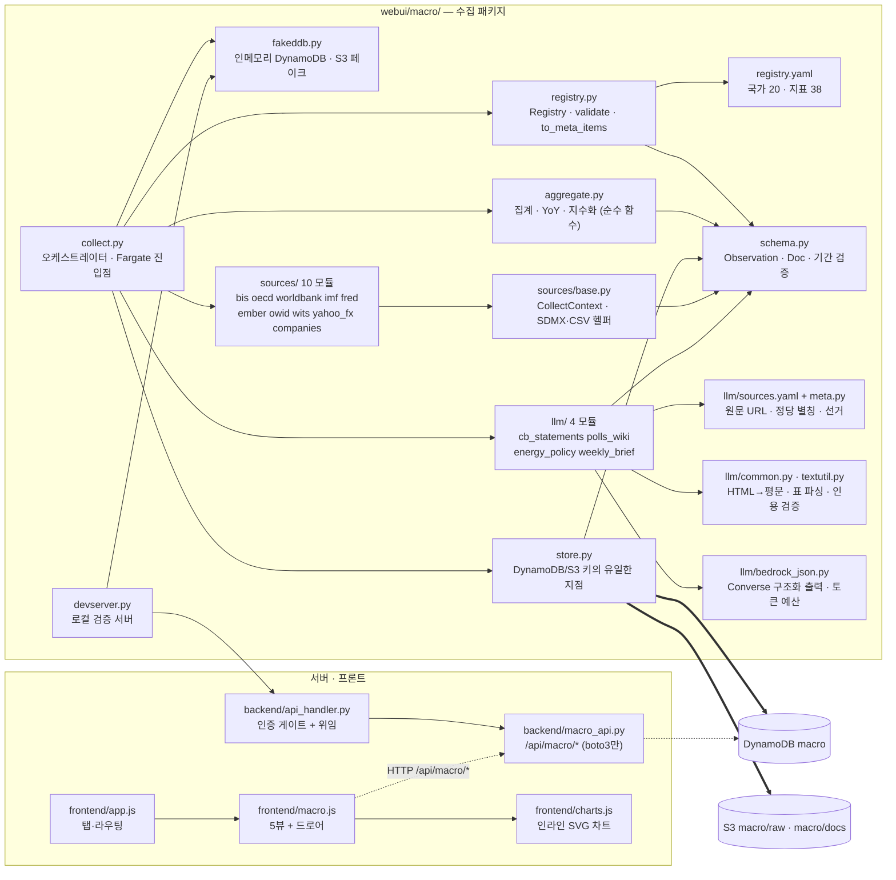
```mermaid
flowchart LR
    subgraph PKG["webui/macro/ — 수집 패키지"]
        REGY["registry.yaml<br/>국가 20 · 지표 38"]
        SCH["schema.py<br/>Observation · Doc · 기간 검증"]
        REG["registry.py<br/>Registry · validate · to_meta_items"]
        AGG["aggregate.py<br/>집계 · YoY · 지수화 (순수 함수)"]
        STO["store.py<br/>DynamoDB/S3 키의 유일한 지점"]
        FAKE["fakeddb.py<br/>인메모리 DynamoDB · S3 페이크"]
        SBASE["sources/base.py<br/>CollectContext · SDMX·CSV 헬퍼"]
        SRC["sources/ 10 모듈<br/>bis oecd worldbank imf fred<br/>ember owid wits yahoo_fx companies"]
        LMETA["llm/sources.yaml + meta.py<br/>원문 URL · 정당 별칭 · 선거"]
        LUTIL["llm/common.py · textutil.py<br/>HTML→평문 · 표 파싱 · 인용 검증"]
        LBED["llm/bedrock_json.py<br/>Converse 구조화 출력 · 토큰 예산"]
        LSRC["llm/ 4 모듈<br/>cb_statements polls_wiki<br/>energy_policy weekly_brief"]
        COL["collect.py<br/>오케스트레이터 · Fargate 진입점"]
        DEV["devserver.py<br/>로컬 검증 서버"]
    end
    subgraph SRV["서버 · 프론트"]
        AH["backend/api_handler.py<br/>인증 게이트 + 위임"]
        API["backend/macro_api.py<br/>/api/macro/* (boto3만)"]
        APP["frontend/app.js<br/>탭·라우팅"]
        MJS["frontend/macro.js<br/>5뷰 + 드로어"]
        CJS["frontend/charts.js<br/>인라인 SVG 차트"]
    end
    MAC[("DynamoDB macro")]
    S3D[("S3 macro/raw · macro/docs")]

    REG --> REGY
    REG --> SCH
    AGG --> SCH
    STO --> SCH
    SBASE --> SCH
    SRC --> SBASE
    LSRC --> SCH
    LSRC --> LMETA
    LSRC --> LUTIL
    LSRC --> LBED
    COL --> REG
    COL --> AGG
    COL --> STO
    COL --> SRC
    COL --> LSRC
    COL --> FAKE
    DEV --> FAKE
    DEV --> AH
    AH --> API
    APP --> MJS
    MJS --> CJS
    STO ==> MAC
    STO ==> S3D
    API -.-> MAC
    MJS -. "HTTP /api/macro/*" .-> API
```

### 파일별 역할·줄 수 (`wc -l` 실측, 2026-09-20)

| 파일 | 줄 | 역할 | 테스트 |
|---|---|---|---|
| `webui/macro/schema.py` | 171 | `Observation`·`Doc`·`Country`·`Indicator` dataclass, 기간·플래그 검증, float→Decimal | (전 파일에서 간접 사용) |
| `webui/macro/registry.yaml` | 1,137 | 지표 사전 — 국가 20개(소스별 코드) + 지표 38개(단위·빈도·집계·소스 우선순위·`coverage_note`) | `test_macro_registry.py` |
| `webui/macro/registry.py` | 606 | YAML 로더, CONTRACT 위반 일괄 검증, 소스별 대상 국가(유로 참조 규칙), `SERIES#/META` 항목 생성 | `test_macro_registry.py` |
| `webui/macro/aggregate.py` | 525 | D→M/Q/Y 집계·YoY·`index100`·통화가치 지수·연료 의존도·poll_of_polls — **전부 순수 함수** | `test_macro_aggregate.py` |
| `webui/macro/store.py` | 823 | DynamoDB 단일 테이블 + S3 쓰기/읽기. 키 문자열이 존재하는 유일한 지점, 개정 이력·락 | `test_macro_store.py` |
| `webui/macro/fakeddb.py` | 884 | boto3 호출 규약만 흉내 낸 인메모리 테이블·S3(조건부 쓰기 실패·float 거부까지 재현) | `test_macro_store.py` 외 |
| `webui/macro/collect.py` | 1,559 | 진입점. 락 → 소스 루프(케이던스) → 우선순위 병합·폴백 → 파생·집계 → LLM → LATEST/SNAPSHOT → INGEST | `test_macro_collect.py` |
| `webui/macro/devserver.py` | 362 | dry-run 덤프 위에서 **실제 Lambda 핸들러 + 실제 프론트**를 로컬에 띄우는 검증 서버 | (수동 검증용) |
| `webui/macro/sources/base.py` | 344 | `CollectContext`(HTTP·원본 저장·오류 기록), SDMX CSV·기간·실수 파싱 헬퍼, 국가 반복(유로 제외) | `test_macro_sources_a.py` |
| `webui/macro/sources/bis.py` | 381 | BIS SDMX v2 — 정책금리(D) · 대미환율(M, 기말) · 주택가격지수(Q) | `test_macro_sources_a.py` |
| `webui/macro/sources/oecd.py` | 474 | OECD SDMX — CPI·근원 CPI·PPI. 물가 데이터플로 3개를 **국가별로 하나 고정** | `test_macro_sources_a.py` |
| `webui/macro/sources/worldbank.py` | 241 | World Bank Indicators — 연간 구조·재정·군사·무역 13종(국가 `;` 묶음 1요청) | `test_macro_sources_a.py` |
| `webui/macro/sources/imf.py` | 325 | IMF 신 포털 SDMX 3.0 MFS — 광의통화 잔액(월, 자국통화) | `test_macro_sources_a.py` |
| `webui/macro/sources/fred.py` | 221 | FRED — 미국 폴백(정책금리·CPI·PPI·M2·주택가격·DXY) | `test_macro_sources_a.py` |
| `webui/macro/sources/ember.py` | 466 | Ember 발전 믹스 — API(키) → 무키 공개 CSV → OWID 3단 경로 | `test_macro_sources_b.py` |
| `webui/macro/sources/owid.py` | 378 | OWID 에너지 CSV — 연료별 해외의존도 파생 + 발전 믹스 폴백 헬퍼 | `test_macro_sources_b.py` |
| `webui/macro/sources/wits.py` | 370 | WITS — 상위 수출 품목군(HS 챕터 구간 16개) 복합값 | `test_macro_sources_b.py` |
| `webui/macro/sources/yahoo_fx.py` | 273 | Yahoo chart API(+yfinance 폴백) — 일별 환율 19통화 + DXY | `test_macro_sources_b.py` |
| `webui/macro/sources/companies.py` | 491 | 시총 상위 기업 — 카탈로그(KR/JP/US/CN) + yfinance(14개국), 보조통화(GBp·ZAc) 보정 | `test_macro_sources_b.py` |
| `webui/macro/llm/sources.yaml` | 764 | 정성 메타 — 중앙은행 20곳 결정문 URL·위키 여론조사 문서·정당 별칭·선거 일정·에너지 정책 URL(전부 접속 실측) | `test_macro_llm.py` |
| `webui/macro/llm/meta.py` | 71 | `sources.yaml` 로더(경로별 캐시) | `test_macro_llm.py` |
| `webui/macro/llm/common.py` | 215 | `ctx` 안전 접근(덕 타이핑), 원문 가져오기, **인용 검증 관문** | `test_macro_llm.py` |
| `webui/macro/llm/textutil.py` | 734 | 표준 라이브러리만 쓰는 HTML→평문·표 격자화(rowspan 펼침)·날짜 범위 파싱·`sha12` | `test_macro_llm.py` |
| `webui/macro/llm/bedrock_json.py` | 358 | Bedrock Converse `toolConfig` 강제 구조화 출력, 예산 초과 시 `BudgetExceeded`, 스로틀 백오프 | `test_macro_llm.py` |
| `webui/macro/llm/cb_statements.py` | 591 | 중앙은행 결정문 → `cb_stance` 문서·관측치(기조 점수 −2~+2) | `test_macro_llm.py` |
| `webui/macro/llm/polls_wiki.py` | 821 | 위키 여론조사 표 → `poll`/`election` 문서 + `party_support` 관측치(**규칙 파싱 1차, LLM 보조**) | `test_macro_llm.py` |
| `webui/macro/llm/energy_policy.py` | 184 | 에너지 정책 원문 → `energy_policy` 문서(원문 sha1 변경 감지) | `test_macro_llm.py` |
| `webui/macro/llm/weekly_brief.py` | 223 | 주간 G20 브리프(`iso=G20`) — 근거 문서 화이트리스트 검증 | `test_macro_llm.py` |
| `webui/backend/macro_api.py` | 1,207 | `/api/macro/*` 8 + `/api/admin/macro/*` 2. **boto3만** 의존(키 규칙 재선언), 5분 메타 캐시 | `test_macro_api.py` |
| `webui/frontend/macro.js` | 1,612 | 5뷰 + 관측치 드로어, 5분 응답 캐시, 안전 URL·CSV, 관리자 승인/반려 | (헤드리스 브라우저 수동 검증) |
| `webui/frontend/charts.js` | 762 | 인라인 SVG 차트 프리미티브 — 라인·소형다중·히트맵·발산막대·누적막대·스파크라인 + 표/CSV | (동일) |
| `scripts/macro_smoke.py` | 236 | 소스별 라이브 스모크(실 API 1회 호출) | (수동) |
| `webui/infra/template.yaml` | 691 | 기존 스택 + `MacroTable`·`MacroScheduleRule`·IAM·파라미터 5개 | `validate-template` |

**규모 합계**(`cat … | wc -l` 실측): 신규 코드 15,957줄 · 레지스트리/메타 YAML 1,901줄 ·
테스트 6,138줄 · 계약·운영·제안 문서 979줄 · 목업 HTML 944줄.

---

## 4. 데이터 흐름

### (a) 일일 수집 — EventBridge → `collect.py`

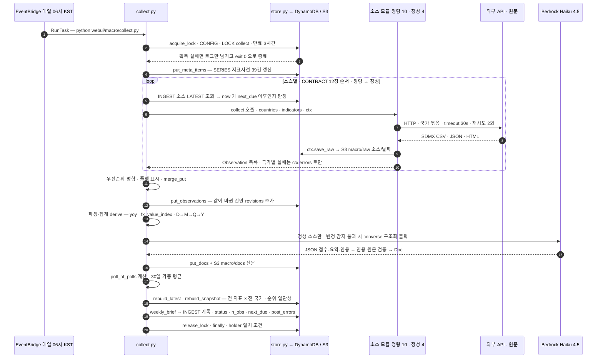
```mermaid
sequenceDiagram
    autonumber
    participant EB as EventBridge 매일 06시 KST
    participant C as collect.py
    participant S as store.py → DynamoDB / S3
    participant M as 소스 모듈 정량 10 · 정성 4
    participant X as 외부 API · 원문
    participant L as Bedrock Haiku 4.5
    EB->>C: RunTask — python webui/macro/collect.py
    C->>S: acquire_lock · CONFIG · LOCK collect · 만료 3시간
    S-->>C: 획득 실패면 로그만 남기고 exit 0 으로 종료
    C->>S: put_meta_items — SERIES 지표사전 39건 갱신
    loop 소스별 · CONTRACT 12장 순서 · 정량 → 정성
        C->>S: INGEST 소스 LATEST 조회 → now 가 next_due 이후인지 판정
        C->>M: collect 호출 · countries · indicators · ctx
        M->>X: HTTP · 국가 묶음 · timeout 30s · 재시도 2회
        X-->>M: SDMX CSV · JSON · HTML
        M->>S: ctx.save_raw → S3 macro/raw 소스/날짜
        M-->>C: Observation 목록 · 국가별 실패는 ctx.errors 로만
    end
    C->>C: 우선순위 병합 · 폴백 표시 · merge_put
    C->>S: put_observations — 값이 바뀐 건만 revisions 추가
    C->>C: 파생·집계 derive — yoy · fx_value_index · D→M→Q→Y
    C->>L: 정성 소스만 · 변경 감지 통과 시 converse 구조화 출력
    L-->>C: JSON 점수·요약·인용 → 인용 원문 검증 → Doc
    C->>S: put_docs + S3 macro/docs 전문
    C->>C: poll_of_polls 계산 · 30일 가중 평균
    C->>S: rebuild_latest · rebuild_snapshot — 전 지표 × 전 국가 · 순위 일관성
    C->>S: weekly_brief → INGEST 기록 · status · n_obs · next_due · post_errors
    C->>S: release_lock · finally · holder 일치 조건
```

- 후처리 6단계(`merge_put` → `derive` → `poll_of_polls` → `rebuild` → `weekly_brief` → `log_ingest`)는
  `collect.py`의 `_stage()`로 **단계별 try/except 격리**됩니다. 한 단계가 죽어도 다음 단계(특히 LATEST 재생성·
  INGEST 기록)는 실행되고, 실패는 INGEST 요약의 `post_errors`에 남습니다.
- 종료 코드: 실행한 소스가 **전부** `failed`면 1, 아니면 0(부분 실패는 `status: partial`).

### (b) 화면 조회 — 어떤 뷰가 어떤 키를 몇 번 읽는가

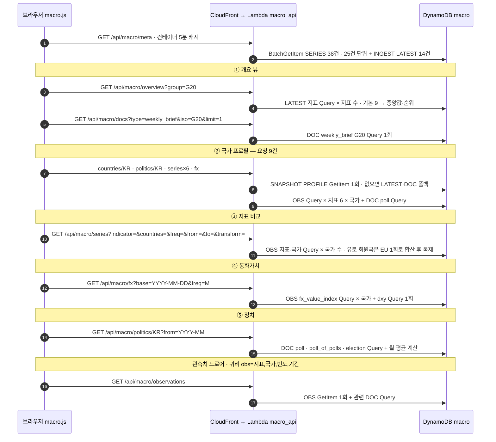
```mermaid
sequenceDiagram
    autonumber
    participant B as 브라우저 macro.js
    participant A as CloudFront → Lambda macro_api
    participant D as DynamoDB macro
    B->>A: GET /api/macro/meta · 컨테이너 5분 캐시
    A->>D: BatchGetItem SERIES 38건 · 25건 단위 + INGEST LATEST 14건
    Note over B,D: ① 개요 뷰
    B->>A: GET /api/macro/overview?group=G20
    A->>D: LATEST 지표 Query × 지표 수 · 기본 9 → 중앙값·순위
    B->>A: GET /api/macro/docs?type=weekly_brief&iso=G20&limit=1
    A->>D: DOC weekly_brief G20 Query 1회
    Note over B,D: ② 국가 프로필 — 요청 9건
    B->>A: countries/KR · politics/KR · series×6 · fx
    A->>D: SNAPSHOT PROFILE GetItem 1회 · 없으면 LATEST·DOC 폴백
    A->>D: OBS Query × 지표 6 × 국가 + DOC poll Query
    Note over B,D: ③ 지표 비교
    B->>A: GET /api/macro/series?indicator=&countries=&freq=&from=&to=&transform=
    A->>D: OBS 지표·국가 Query × 국가 수 · 유로 회원국은 EU 1회로 합산 후 복제
    Note over B,D: ④ 통화가치
    B->>A: GET /api/macro/fx?base=YYYY-MM-DD&freq=M
    A->>D: OBS fx_value_index Query × 국가 + dxy Query 1회
    Note over B,D: ⑤ 정치
    B->>A: GET /api/macro/politics/KR?from=YYYY-MM
    A->>D: DOC poll · poll_of_polls · election Query + 월 평균 계산
    Note over B,D: 관측치 드로어 · 쿼리 obs=지표,국가,빈도,기간
    B->>A: GET /api/macro/observations
    A->>D: OBS GetItem 1회 + 관련 DOC Query
```

- **GSI 없음.** 모든 화면이 pk를 지정한 Query 또는 GetItem으로 끝납니다(`macro_api.py` 상단 주석 기준).
- 국가 프로필은 SNAPSHOT **GetItem 1회**로 최신값·문서 묶음을 받고, 차트용 시계열만 `/series`를 추가로 부릅니다.
- 유로 회원국(DE/FR/IT)의 `policy_rate`·`m2_*`·`fx_*`는 **회원국 OBS 항목이 없습니다** →
  API가 `EU` 값을 복제하고 `euro_area_shared` 플래그를 붙이며, 드로어는 `iso=EU`로 조회합니다.

---

## 5. 데이터 모델

### 5.1 DynamoDB 키 (테이블 `tradingagents-webui-macro`, PK `pk` + SK `sk`, 온디맨드)

| pk | sk | 주요 속성 | 용도 · 읽기 패턴 |
|---|---|---|---|
| `SERIES#<지표>` | `META` | registry 항목 + `updated_at` | 지표 사전. `SERIES#__countries__`는 국가 사전 |
| `OBS#<지표>#<국가>` | `<빈도>#<기간>` | 관측치 전 필드 + `revisions`(최대 10) | 시계열 Query(`begins_with` + between) |
| `LATEST#<지표>` | `<국가>` | `value, period, freq, prev_*, change, rank, n, flags, source` | 개요 히트맵 — 지표당 Query 1회 |
| `SNAPSHOT#<국가>` | `PROFILE` | `latest{지표:…}`, `docs{cb_stance, energy_policy, election, polls}` | 국가 프로필 GetItem 1회 |
| `DOC#<타입>#<국가>` | `<날짜>#<12자 hex id>` | 문서 스키마(CONTRACT 5장) | 정성 문서 최신순 Query |
| `INGEST#<소스>` | `<실행시각 ISO8601>` / `LATEST` | `status, n_obs, n_docs, errors, countries_*` / + `next_due` | 수집 로그 · 케이던스 판단 |
| `CONFIG` | `MACRO` | `llm_daily_token_budget, llm_tokens_used_today, llm_tokens_date` | LLM 1일 예산 |
| `CONFIG` | `LOCK#collect` | `holder, acquired_at, expires_at(+3시간)` | 수집기 동시 실행 방지 락 |

빈도·기간 표기: `D 2026-09-19` · `W 2026-09-14`(조사 종료일) · `M 2026-08` · `Q 2026-Q2` · `Y 2025` · `E 2026-09-18`.
숫자는 `Decimal(str(round(v, 6)))`로 저장하고(DynamoDB는 float 금지) API가 응답 시 float로 되돌립니다.

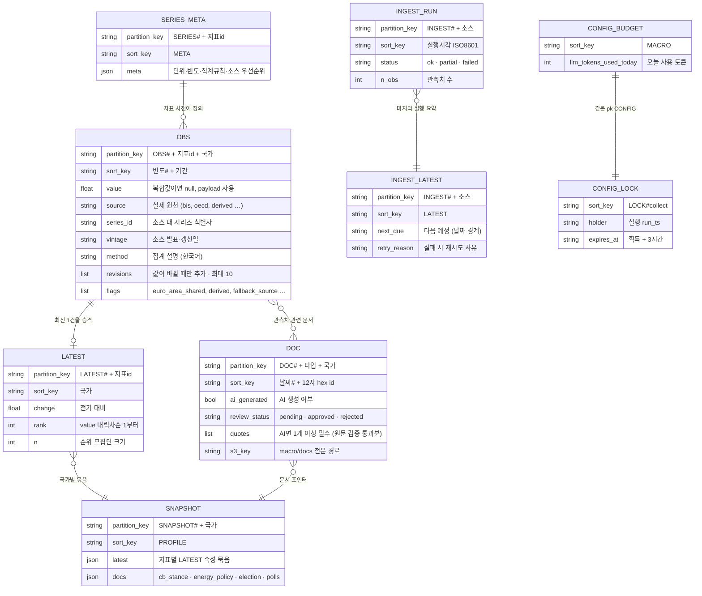
```mermaid
erDiagram
    SERIES_META ||--o{ OBS : "지표 사전이 정의"
    OBS ||--o| LATEST : "최신 1건을 승격"
    LATEST }o--|| SNAPSHOT : "국가별 묶음"
    DOC }o--|| SNAPSHOT : "문서 포인터"
    OBS }o--o{ DOC : "관측치 관련 문서"
    INGEST_RUN }o--|| INGEST_LATEST : "마지막 실행 요약"
    CONFIG_BUDGET ||--|| CONFIG_LOCK : "같은 pk CONFIG"

    SERIES_META {
        string partition_key "SERIES# + 지표id"
        string sort_key "META"
        json meta "단위·빈도·집계규칙·소스 우선순위"
    }
    OBS {
        string partition_key "OBS# + 지표id + 국가"
        string sort_key "빈도# + 기간"
        float value "복합값이면 null, payload 사용"
        string source "실제 원천 (bis, oecd, derived …)"
        string series_id "소스 내 시리즈 식별자"
        string vintage "소스 발표·갱신일"
        string method "집계 설명 (한국어)"
        list revisions "값이 바뀔 때만 추가 · 최대 10"
        list flags "euro_area_shared, derived, fallback_source …"
    }
    LATEST {
        string partition_key "LATEST# + 지표id"
        string sort_key "국가"
        float change "전기 대비"
        int rank "value 내림차순 1부터"
        int n "순위 모집단 크기"
    }
    SNAPSHOT {
        string partition_key "SNAPSHOT# + 국가"
        string sort_key "PROFILE"
        json latest "지표별 LATEST 속성 묶음"
        json docs "cb_stance · energy_policy · election · polls"
    }
    DOC {
        string partition_key "DOC# + 타입 + 국가"
        string sort_key "날짜# + 12자 hex id"
        bool ai_generated "AI 생성 여부"
        string review_status "pending · approved · rejected"
        list quotes "AI면 1개 이상 필수 (원문 검증 통과분)"
        string s3_key "macro/docs 전문 경로"
    }
    INGEST_RUN {
        string partition_key "INGEST# + 소스"
        string sort_key "실행시각 ISO8601"
        string status "ok · partial · failed"
        int n_obs "관측치 수"
    }
    INGEST_LATEST {
        string partition_key "INGEST# + 소스"
        string sort_key "LATEST"
        string next_due "다음 예정 (날짜 경계)"
        string retry_reason "실패 시 재시도 사유"
    }
    CONFIG_BUDGET {
        string sort_key "MACRO"
        int llm_tokens_used_today "오늘 사용 토큰"
    }
    CONFIG_LOCK {
        string sort_key "LOCK#collect"
        string holder "실행 run_ts"
        string expires_at "획득 + 3시간"
    }
```

### 5.2 관측치 1건 실물 (dry-run 덤프 `OBS#policy_rate#KR` / `M#2026-08`)

```json
{
  "pk": "OBS#policy_rate#KR",
  "sk": "M#2026-08",
  "indicator": "policy_rate",
  "iso": "KR",
  "freq": "M",
  "period": "2026-08",
  "value": 3,
  "unit": "%",
  "source": "bis",
  "series_id": "WS_CBPOL/1.0/D.KR",
  "source_url": "https://data.bis.org/topics/CBPOL/data",
  "method": "월말 기준값 (원천: 일별)",
  "vintage": "2026-09-20",
  "retrieved_at": "2026-09-20T06:11:45+00:00",
  "flags": [],
  "revisions": [],
  "updated_at": "2026-09-20T06:12:26+00:00"
}
```

읽는 법: **일별 BIS 정책금리를 월말 기준값으로 집계한 관측치**입니다. `method`가 집계 방식을,
`series_id`+`source_url`이 재현 경로를, `vintage`가 "소스가 이 값을 발표한 날"을 남깁니다.
`value`가 뒤에 개정되면 이전 값이 `revisions`에 쌓이므로(최대 10) 화면에서 개정 이력을 볼 수 있습니다.

---

## 6. 집계 · 파생 · 폴백 규칙

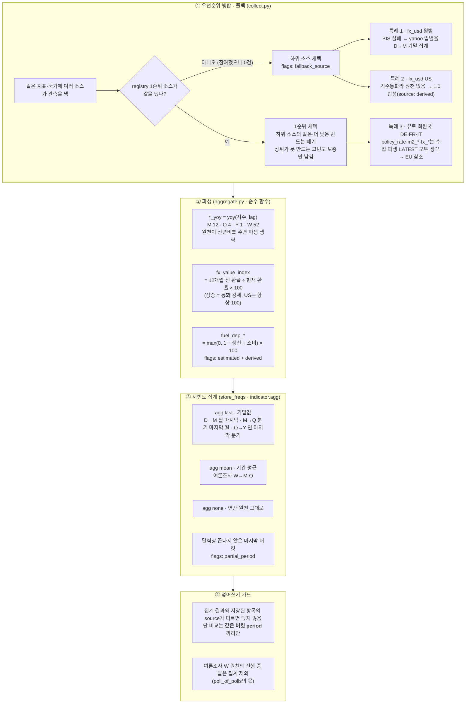
```mermaid
flowchart TB
    subgraph M1["① 우선순위 병합 · 폴백 (collect.py)"]
        A1["같은 지표·국가에 여러 소스가 관측을 냄"] --> A2{"registry 1순위 소스가<br/>값을 냈나?"}
        A2 -->|"예"| A3["1순위 채택<br/>하위 소스의 같은·더 낮은 빈도는 폐기<br/>상위가 못 만드는 고빈도 보충만 남김"]
        A2 -->|"아니오 (참여했으나 0건)"| A4["하위 소스 채택<br/>flags: fallback_source"]
        A4 --> A5["특례 1 · fx_usd 월별<br/>BIS 실패 → yahoo 일별을 D→M 기말 집계"]
        A4 --> A6["특례 2 · fx_usd US<br/>기준통화라 원천 없음 → 1.0 합성(source: derived)"]
        A3 --> A7["특례 3 · 유로 회원국 DE·FR·IT<br/>policy_rate·m2_*·fx_*는 수집·파생·LATEST 모두 생략 → EU 참조"]
    end
    subgraph M2["② 파생 (aggregate.py · 순수 함수)"]
        B1["*_yoy = yoy(지수, lag)<br/>M 12 · Q 4 · Y 1 · W 52<br/>원천이 전년비를 주면 파생 생략"]
        B2["fx_value_index<br/>= 12개월 전 환율 ÷ 현재 환율 × 100<br/>(상승 = 통화 강세, US는 항상 100)"]
        B3["fuel_dep_*<br/>= max(0, 1 − 생산 ÷ 소비) × 100<br/>flags: estimated + derived"]
    end
    subgraph M3["③ 저빈도 집계 (store_freqs · indicator.agg)"]
        C1["agg last · 기말값<br/>D→M 월 마지막 · M→Q 분기 마지막 월 · Q→Y 연 마지막 분기"]
        C2["agg mean · 기간 평균<br/>여론조사 W→M·Q"]
        C3["agg none · 연간 원천 그대로"]
        C4["달력상 끝나지 않은 마지막 버킷<br/>flags: partial_period"]
    end
    subgraph M4["④ 덮어쓰기 가드"]
        D1["집계 결과와 저장된 항목의 source가 다르면 덮지 않음<br/>단 비교는 <b>같은 버킷 period</b> 끼리만"]
        D2["여론조사 W 원천의 진행 중 달은 집계 제외<br/>(poll_of_polls의 몫)"]
    end
    M1 --> M2 --> M3 --> M4
```

증분 실행(`--since`)이면 파생·집계는 **이번 실행이 건드린 (지표, 국가)만** 다시 계산하고,
조회 창은 `since − 시차`(yoy 12M/4Q/1Y, `fx_value_index` 12M, 집계는 target 버킷 시작)로 좁힙니다.

### 케이던스 · 재시도 · 락 판정

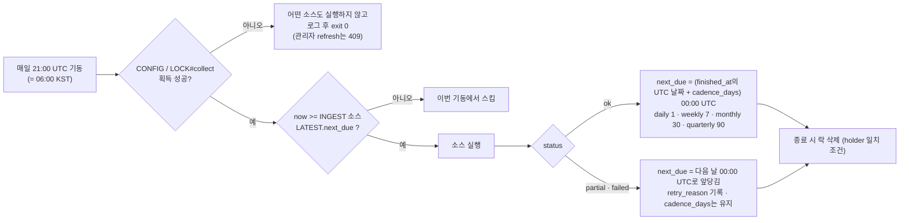
```mermaid
flowchart LR
    S0["매일 21:00 UTC 기동<br/>(= 06:00 KST)"] --> L1{"CONFIG / LOCK#collect<br/>획득 성공?"}
    L1 -->|"아니오"| LX["어떤 소스도 실행하지 않고<br/>로그 후 exit 0<br/>(관리자 refresh는 409)"]
    L1 -->|"예"| S1{"now >= INGEST 소스<br/>LATEST.next_due ?"}
    S1 -->|"아니오"| SK["이번 기동에서 스킵"]
    S1 -->|"예"| RUN["소스 실행"]
    RUN --> ST{"status"}
    ST -->|"ok"| N1["next_due = (finished_at의 UTC 날짜 + cadence_days) 00:00 UTC<br/>daily 1 · weekly 7 · monthly 30 · quarterly 90"]
    ST -->|"partial · failed"| N2["next_due = 다음 날 00:00 UTC로 앞당김<br/>retry_reason 기록 · cadence_days는 유지"]
    N1 --> FIN["종료 시 락 삭제 (holder 일치 조건)"]
    N2 --> FIN
```

`next_due`를 **시각이 아니라 날짜 경계**로 잡는 것이 핵심입니다. 고정 시각(21:00 UTC) 기동에서
"종료 시각 + 24h"로 계산하면 매일 조금씩 밀려 일간 소스가 격일로 실행되기 때문입니다.

---

## 7. 지표 × 소스 × 커버리지 매트릭스

`registry.yaml`을 파싱해 생성했습니다. **커버리지·빈 국가는 `coverage_note`(2026-09-20 소스 실측 메모)에서 추출**한
값이고, `dry-run OBS`는 6개국 dry-run 덤프(`/tmp/macro_dump3.json`)의 지표별 관측치 항목 수입니다
(6개국 = KR·US·JP·EU·DE·BR이므로 20개국 운영 수집과 직접 비교하지 마세요).

<!-- 생성: registry.yaml + /tmp/macro_dump3.json 파싱 (2026-09-20) -->
| # | 지표 id | 이름 | 분류 | 단위 | 원천 빈도 | 저장 빈도 | 집계 | 1차 소스 | 폴백 소스 | 커버리지 | 빈 국가 | dry-run OBS |
|---|---|---|---|---|---|---|---|---|---|---|---|---|
| 1 | `policy_rate` | 정책금리 | 통화 | `%` | D | D/M/Q/Y | last | bis | fred(US)·M | 16/20 | AR | 27,632 |
| 2 | `fx_usd` | 환율(현지통화/USD) | 환율 | `lcu_per_usd` | D | D/M/Q/Y | last | bis·M | yahoo·D, fred·D | 20/20 | — | 11,553 |
| 3 | `fx_value_index` | 통화가치 지수 | 환율 | `index` | D | D/M/Q/Y | last | derived | — | 20/20 | — | 1,068 |
| 4 | `m2_level` | 광의통화(M2) 잔액 | 통화 | `lcu_bn` | M | M/Q/Y | last | imf | fred(US)·M | 12/20 | EU·CN·GB·IN·SA | 776 |
| 5 | `m2_yoy` | 광의통화 전년비 | 통화 | `%` | M | M/Q/Y | last | derived | worldbank·Y | 12/20 | — | 761 |
| 6 | `cpi_index` | 소비자물가지수 | 통화 | `index` | M | M/Q/Y | last | oecd | oecd, oecd, fred(US)·M | 18/20 | AR·RU | 1,600 |
| 7 | `cpi_yoy` | 소비자물가 전년비 | 통화 | `%` | M | M/Q/Y | last | oecd | derived, worldbank·Y | 19/20 | RU | 1,600 |
| 8 | `core_cpi_yoy` | 근원 소비자물가 전년비 | 통화 | `%` | M | M/Q/Y | last | oecd | oecd | 11/20 | — | 1,321 |
| 9 | `ppi_index` | 생산자물가지수 | 통화 | `index` | M | M/Q/Y | last | fred(US)·M | oecd | 미측정 (최신값은 US만) | KR·JP·CN·IN | 612 |
| 10 | `ppi_yoy` | 생산자물가 전년비 | 통화 | `%` | M | M/Q/Y | last | derived | oecd | 미측정 (최신값은 US만) | — | 612 |
| 11 | `house_price_index` | 주택가격지수(명목) | 시장 | `index` | Q | Q/Y | last | bis | fred(US)·M | 18/20 | AR·SA | 490 |
| 12 | `house_price_yoy` | 주택가격 전년비 | 시장 | `%` | Q | Q/Y | last | derived | — | 18/20 | AR·SA | 460 |
| 13 | `gdp_usd` | 명목 GDP(USD) | 구조 | `usd` | Y | Y | none | worldbank | — | 20/20 | — | 216 |
| 14 | `gdp_growth` | 실질 GDP 성장률 | 구조 | `%` | Y | Y | none | worldbank | — | 20/20 | — | 216 |
| 15 | `gni_usd` | 국민총소득(USD) | 구조 | `usd` | Y | Y | none | worldbank | — | 20/20 | — | 216 |
| 16 | `gni_pc` | 1인당 GNI(USD) | 구조 | `usd` | Y | Y | none | worldbank | — | 20/20 | — | 216 |
| 17 | `gov_expense_gdp` | 정부지출/GDP | 재정 | `pct_gdp` | Y | Y | none | worldbank | — | 18/20 | CN·ID | 178 |
| 18 | `gov_revenue_gdp` | 정부수입/GDP | 재정 | `pct_gdp` | Y | Y | none | worldbank | — | 18/20 | ID·JP | 158 |
| 19 | `gov_debt_gdp` | 정부부채/GDP | 재정 | `pct_gdp` | Y | Y | none | worldbank | imf | 11/20 | AR·CN·DE·EU·FR·ID·IT·JP·SA | 72 |
| 20 | `mil_gdp` | 국방비/GDP | 재정 | `pct_gdp` | Y | Y | none | worldbank | — | 20/20 | — | 210 |
| 21 | `mil_expenditure_share` | 국방비/정부지출 | 재정 | `pct_share` | Y | Y | none | worldbank | — | 19/20 | TR | 182 |
| 22 | `mil_usd` | 국방비(USD) | 재정 | `usd` | Y | Y | none | worldbank | — | 20/20 | — | 210 |
| 23 | `va_agri` | 농림어업 부가가치 비중 | 구조 | `pct_gdp` | Y | Y | none | worldbank | — | 20/20 | — | 198 |
| 24 | `va_industry` | 산업 부가가치 비중 | 구조 | `pct_gdp` | Y | Y | none | worldbank | — | 20/20 | — | 198 |
| 25 | `va_manuf` | 제조업 부가가치 비중 | 구조 | `pct_gdp` | Y | Y | none | worldbank | — | 20/20 | — | 198 |
| 26 | `va_services` | 서비스업 부가가치 비중 | 구조 | `pct_gdp` | Y | Y | none | worldbank | — | 20/20 | — | 198 |
| 27 | `exports_gdp` | 수출/GDP | 구조 | `pct_gdp` | Y | Y | none | worldbank | — | 20/20 | — | 214 |
| 28 | `exports_top_hs2` | 상위 수출품목(HS2) | 구조 | `pct_share` | Y | Y | none | wits | — | 19/20 | EU | 5 |
| 29 | `elec_mix` | 발전 믹스 | 에너지 | `pct_share` | M | M/Y | none | ember | — | 20/20 | — | 369 |
| 30 | `energy_import_dep` | 에너지 수입의존도 | 에너지 | `pct_share` | Y | Y | none | worldbank | — | 20/20 | — | 204 |
| 31 | `fuel_dep_oil` | 원유 해외의존도 | 에너지 | `pct_share` | Y | Y | none | derived | — | 19/20 | EU | 300 |
| 32 | `fuel_dep_gas` | 천연가스 해외의존도 | 에너지 | `pct_share` | Y | Y | none | derived | — | 19/20 | EU | 279 |
| 33 | `fuel_dep_coal` | 석탄 해외의존도 | 에너지 | `pct_share` | Y | Y | none | derived | — | 19/20 | EU | 300 |
| 34 | `party_support` | 집권당 지지율 | 정치 | `%` | W | W/M/Q | mean | wiki_polls | — | 미측정 (17개국 대상) | CN·SA·EU 해당없음 | 0 |
| 35 | `gov_approval` | 정부 지지율 | 정치 | `%` | W | W/M/Q | mean | wiki_polls | — | 미측정 (17개국 대상) | CN·SA·EU 해당없음 | 0 |
| 36 | `cb_stance` | 중앙은행 기조 | 통화 | `score` | E | E/M/Q | last | cb_statements | — | 미측정 (원문 확보 8/20) | GB·MX·TR·SA·ZA·IN·BR·ID | 0 |
| 37 | `top_companies` | 시총 상위 기업 | 시장 | `usd_bn` | Q | Q/Y | none | companies(KR/JP/US/CN) | companies | 18/20 | EU·RU | 0 |
| 38 | `dxy` | 달러지수 | 환율 | `index` | D | D/M/Q/Y | last | fred(US)·D | yahoo(US)·D | 국가 단위 아님(iso=US 1건) | — | 2,686 |

읽는 법 / 주의:

- **분류 분포**: 구조 10 · 통화 9 · 재정 6 · 에너지 5 · 환율 3 · 시장 3 · 정치 2 = 38.
- `elec_mix`·`exports_top_hs2`·`top_companies`는 **복합값**이라 `value`가 아니라 `payload.items[]`(항상 `label`+`value`)에 저장됩니다.
- "빈 국가"는 `coverage_note`에 "없음/미수록/미제공/미구현"으로 적힌 국가입니다.
  `ppi_index`의 `KR·JP·CN·IN`은 **OECD KEI 자체에 없는 국가**이고, 나머지 국가도 원천이 2023-02에서 정지해
  최신값은 US(FRED)만 있습니다 → 그래서 커버리지는 숫자로 세지 않고 "미측정"으로 둡니다.
- `m2_level`은 IMF 11/20 + FRED US 1개국 = **12/20**이며 CA(2008-12)·RU(2021-11)는 정지 상태입니다.
- `party_support`·`gov_approval`·`cb_stance`는 LLM 소스 담당이라 정량 실측 커버리지가 확정되지 않았습니다(9장 실측 한계 참고).
  dry-run OBS가 0인 것은 이 실행이 `--no-llm`(정량만)이었기 때문이지 결함이 아닙니다.

---

## 8. 화면 구조

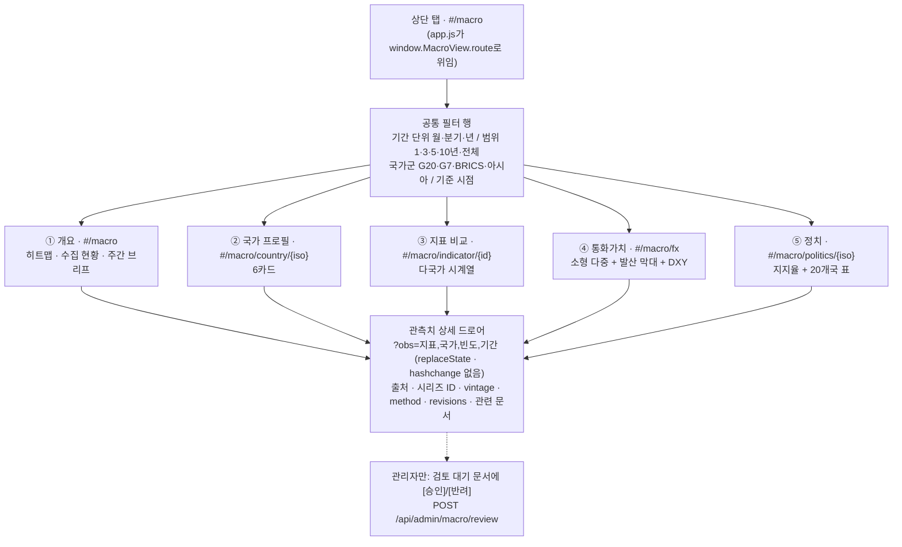
```mermaid
flowchart TB
    TAB["상단 탭 · #/macro<br/>(app.js가 window.MacroView.route로 위임)"] --> FIL
    FIL["공통 필터 행<br/>기간 단위 월·분기·년 / 범위 1·3·5·10년·전체<br/>국가군 G20·G7·BRICS·아시아 / 기준 시점"]
    FIL --> V1["① 개요 · #/macro<br/>히트맵 · 수집 현황 · 주간 브리프"]
    FIL --> V2["② 국가 프로필 · #/macro/country/{iso}<br/>6카드"]
    FIL --> V3["③ 지표 비교 · #/macro/indicator/{id}<br/>다국가 시계열"]
    FIL --> V4["④ 통화가치 · #/macro/fx<br/>소형 다중 + 발산 막대 + DXY"]
    FIL --> V5["⑤ 정치 · #/macro/politics/{iso}<br/>지지율 + 20개국 표"]
    V1 --> DR
    V2 --> DR
    V3 --> DR
    V4 --> DR
    V5 --> DR
    DR["관측치 상세 드로어<br/>?obs=지표,국가,빈도,기간 (replaceState · hashchange 없음)<br/>출처 · 시리즈 ID · vintage · method · revisions · 관련 문서"]
    DR -.-> ADM["관리자만: 검토 대기 문서에 [승인]/[반려]<br/>POST /api/admin/macro/review"]
```

### 뷰별 카드 · 차트 · API

| 뷰 | 카드 | 차트 | 호출하는 API |
|---|---|---|---|
| ① 개요 | 국가×지표 히트맵 / 수집 현황 / 주간 G20 브리프 | 히트맵 표(중앙값 기준 색·순위 툴팁·CSV) | `meta`(캐시) · `overview?group=` · `docs?type=weekly_brief&iso=G20&limit=1` |
| ② 국가 프로필 | 정치 / 통화정책 / 재정·규모 / 경제구조 / 에너지 / 시장경제 | 라인(정당 지지율·정책금리·국방비), 스파크라인(M2·통화가치), 누적 막대(산업 비중·발전 믹스), 가로 막대(수출 품목·연료 의존도), 표(여론조사·시총 상위), 3패널 라인(PPI·CPI·집값, 같은 축) | `countries/{iso}` · `politics/{iso}` · `series`(policy_rate, m2_yoy, mil_expenditure_share, ppi_yoy, cpi_yoy, house_price_yoy) · `fx` — **요청 9건** |
| ③ 지표 비교 | 단일 차트 카드 | 라인(강조 모드 · `level`/`yoy`/`index100` 전환 · 표 보기 · CSV) | `series?indicator=&countries=&freq=&from=&to=&transform=&base=` |
| ④ 통화가치 | 통화가치 지수 / 기간 변화율 / DXY | 소형 다중 패널 · 발산 막대 · 단독 라인(이중 축 금지) | `fx?base=&freq=&group=` |
| ⑤ 정치 | G20 정당 지지율·집권당 / 정당 지지율 상세 | 소형 다중(최대 4당 + 기타) · 20개국 표(집권당·지지율·선거일) | `overview?indicators=party_support,gov_approval` · `countries/{iso}` · `politics/{iso}?from=` |
| 드로어 | 관측치 상세 | — (값·개정 이력 표) | `observations?indicator=&iso=&freq=&period=` |

### 실데이터 렌더링 스크린샷

아래는 **로컬 검증 서버**(`webui/macro/devserver.py`)에 6개국(KR·US·JP·EU·DE·BR) dry-run 결과
55,508건을 올리고 **실제 프론트 파일**을 헤드리스 Chrome으로 렌더링한 화면입니다(2026-09-20).
정성(LLM) 소스는 이 실행에 포함되지 않아 정당 지지율·중앙은행 기조 카드는 비어 있습니다.

| 개요 (리뷰 수정 후 최종) |
|---|
| 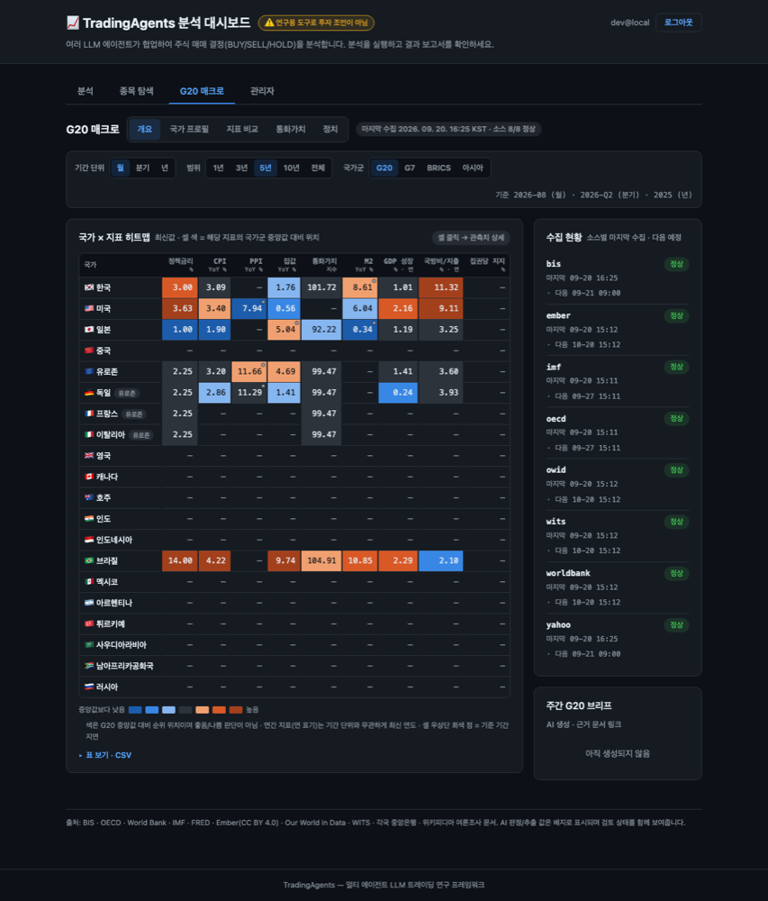 |
| 로컬 검증 서버, 6개국 실데이터 dry-run, 2026-09-20 — 히트맵 20개국 × 9지표, 값이 없는 셀은 `—`, 우측 수집 현황 8/8 정상 |

| 개요 | 국가 프로필 (한국) | 지표 비교 |
|---|---|---|
| 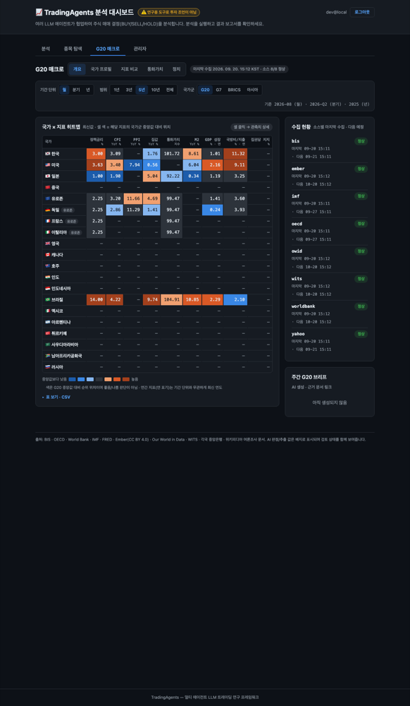 | 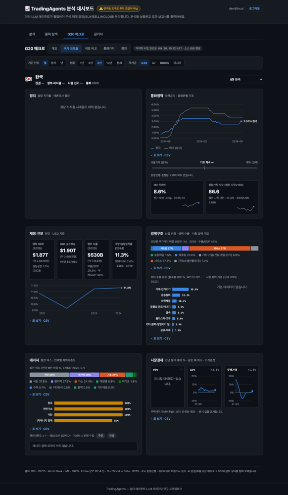 | 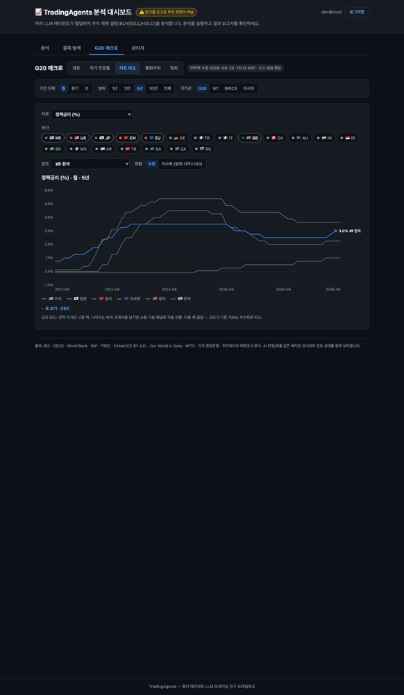 |
| 로컬 검증 서버, 6개국 실데이터 dry-run, 2026-09-20 | 로컬 검증 서버, 6개국 실데이터 dry-run, 2026-09-20 | 로컬 검증 서버, 6개국 실데이터 dry-run, 2026-09-20 |

| 통화가치 | 정치 |
|---|---|
| 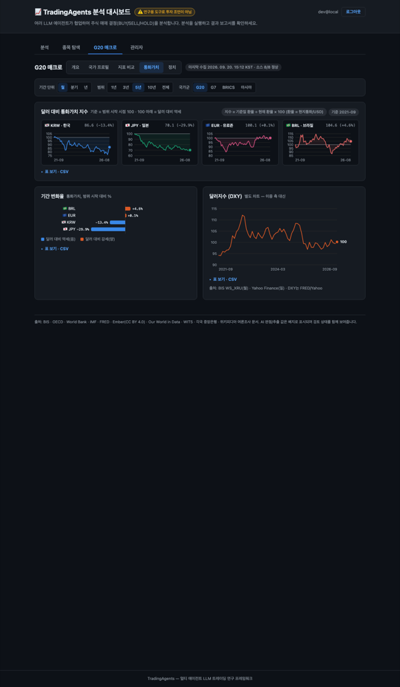 | 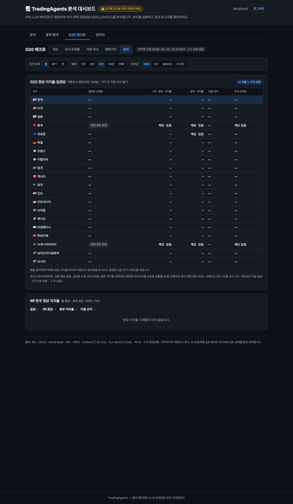 |
| 로컬 검증 서버, 6개국 실데이터 dry-run, 2026-09-20 | 로컬 검증 서버, 6개국 실데이터 dry-run, 2026-09-20 (정성 소스 미실행이라 지지율 비어 있음) |

정성 문서·검토 버튼·수집 실패 배지는 실데이터 dry-run에 없어서
**검증 하네스**(`webui/mockups/macro-dev-harness.html`, 합성 데이터로 CONTRACT 9장 응답을 흉내 내는 로컬 도구)로 확인했습니다.

| 관리자 검토 버튼 (독일 국가 프로필) | 수집 실패·지연 배지 (개요) |
|---|---|
| 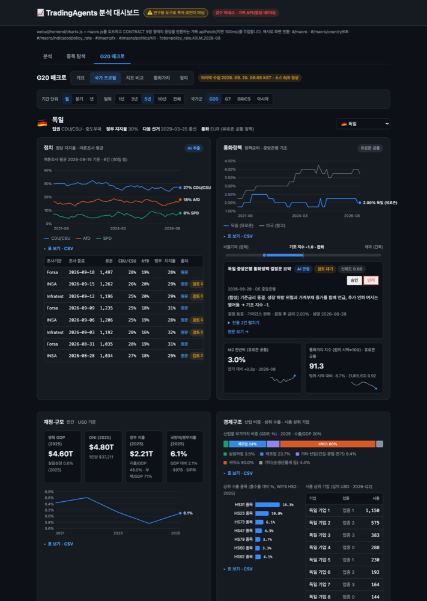 | 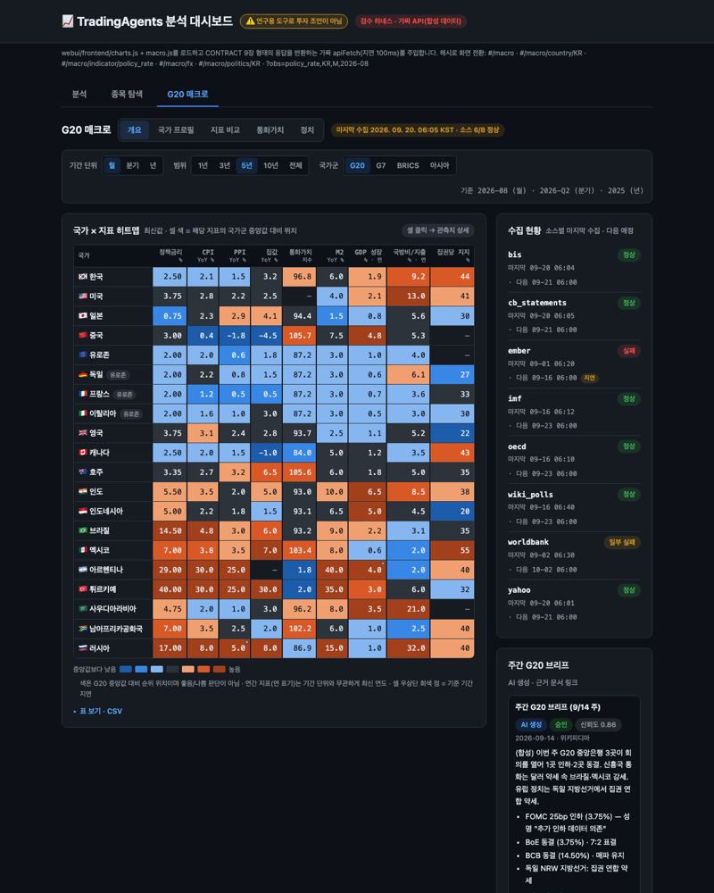 |
| 검증 하네스(합성 데이터), 2026-09-20 — `cb_stance` 문서에 `AI 판정`·`검토 대기`·신뢰도 배지 + [승인]/[반려] | 검증 하네스(합성 데이터), 2026-09-20 — `ember` 실패 + `지연` 배지, `worldbank` 일부 실패 |

### 목업 ↔ 실데이터 비교

목업(설계 확정용, 합성 데이터)과 실제 프론트 렌더링이 같은 정보 구조로 구현됐는지 확인한 결과입니다.

| 뷰 | 목업 (`g20-macro-mockup.html`) | 실데이터 (검증 서버) | 차이 |
|---|---|---|---|
| 개요 | 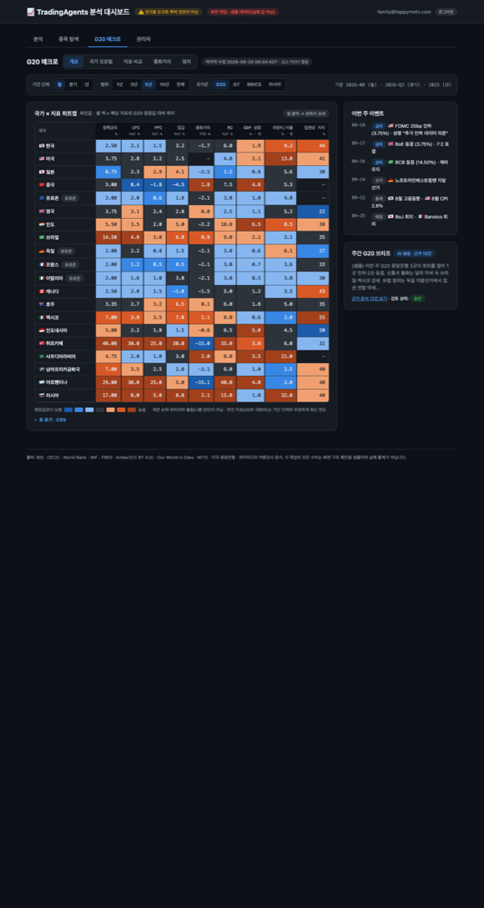 |  | 구조 동일. 실데이터는 6개국만 값이 있어 나머지 `—`, 우측에 **수집 현황 카드**가 실제 INGEST로 채워짐 |
| 국가 프로필 | 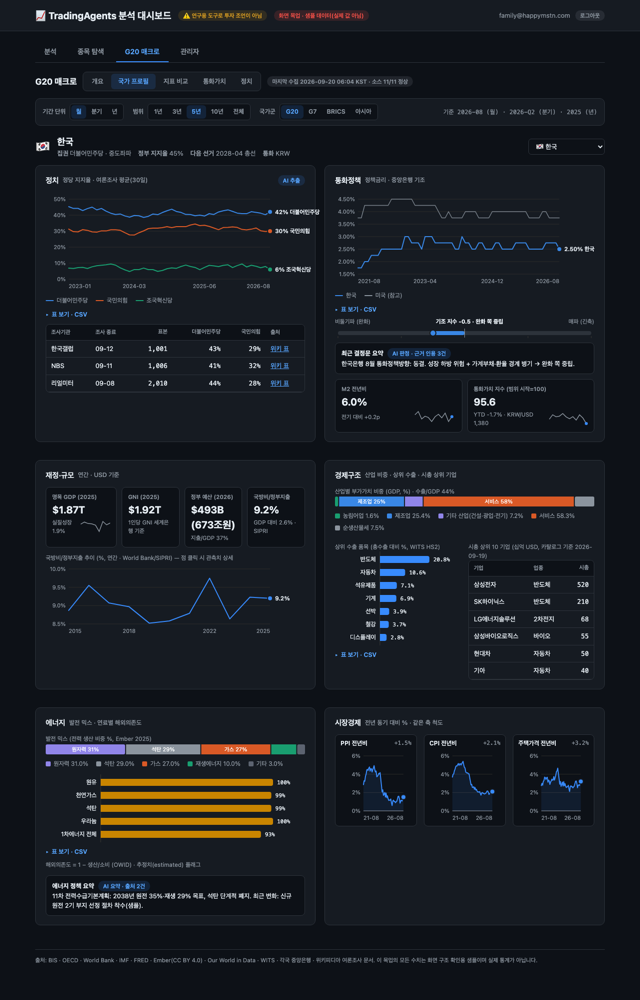 |  | 6카드 구성 동일. 정치·중앙은행 기조 카드는 정성 소스 미실행으로 빈 상태 안내 문구 표시 |
| 지표 비교 | 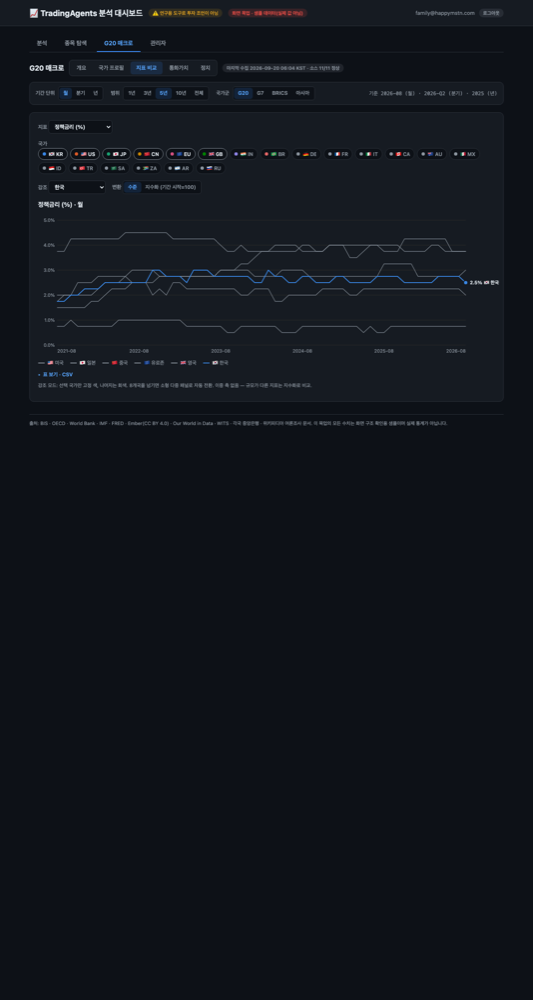 |  | 동일(강조 모드·표 보기·CSV) |
| 통화가치 | 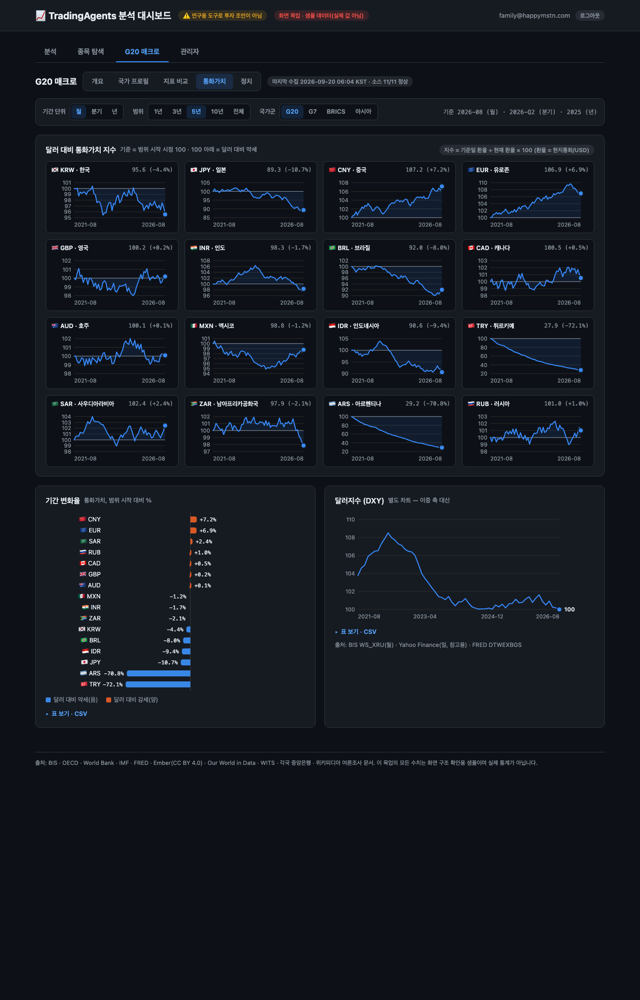 |  | 동일. 실데이터는 값이 있는 통화만 패널에 그려짐 |
| 정치 | 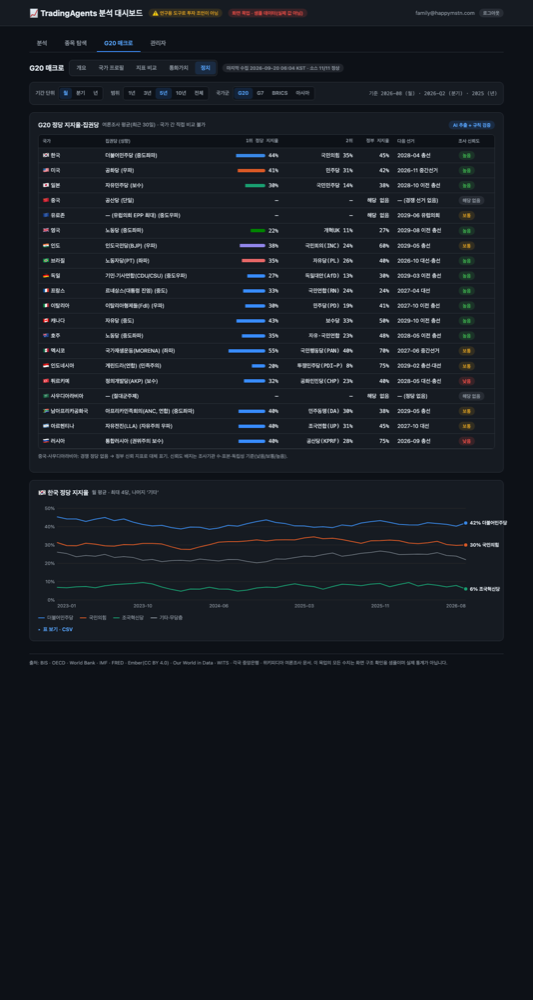 |  | 표·소형 다중 구조 동일, 데이터는 비어 있음 |
| 드로어 | 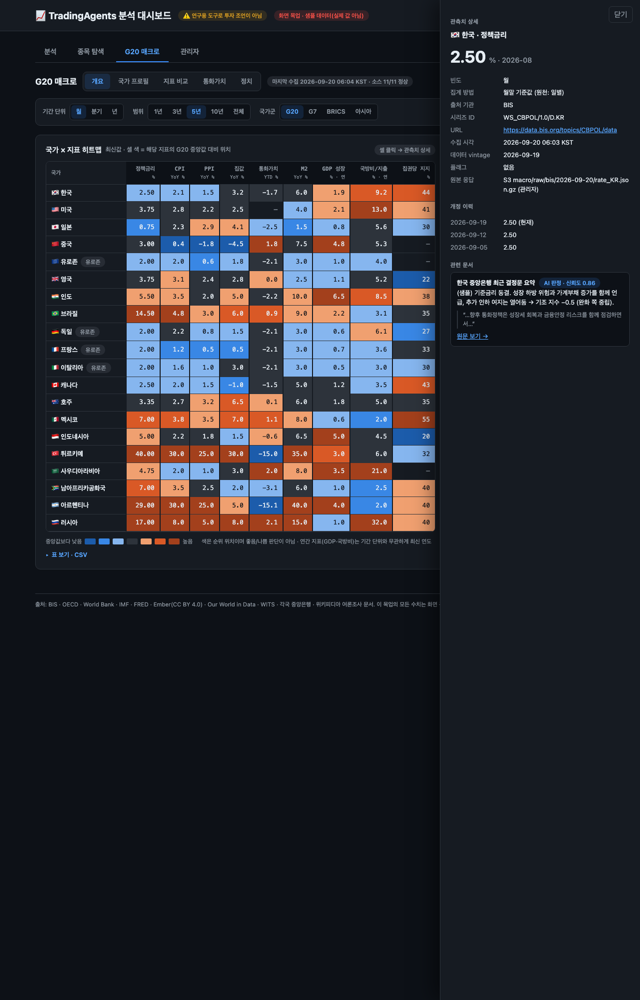 | (개요 화면에서 셀 클릭 시 동작 확인) | 실데이터 드로어 단독 스크린샷은 **미측정** |

---

## 9. 정성(AI) 파이프라인

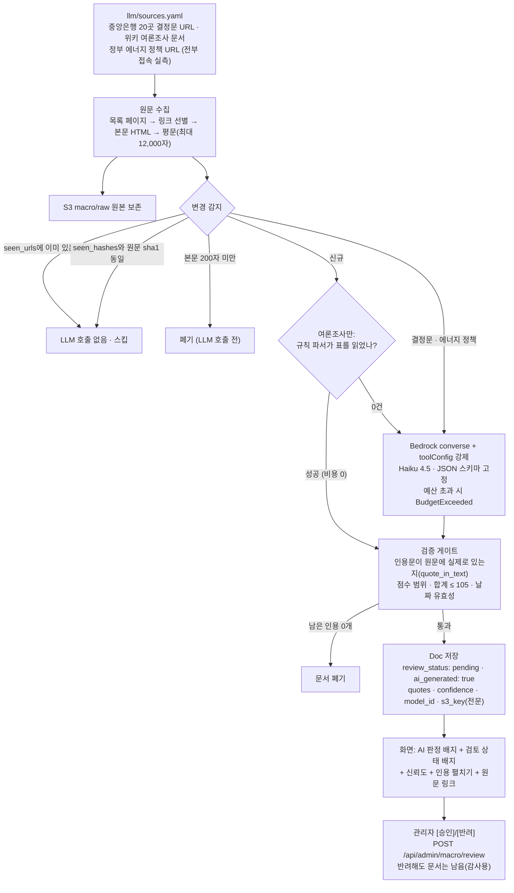
```mermaid
flowchart TB
    Y["llm/sources.yaml<br/>중앙은행 20곳 결정문 URL · 위키 여론조사 문서<br/>정부 에너지 정책 URL (전부 접속 실측)"] --> F["원문 수집<br/>목록 페이지 → 링크 선별 → 본문 HTML → 평문(최대 12,000자)"]
    F --> RAW["S3 macro/raw 원본 보존"]
    F --> CH{"변경 감지"}
    CH -->|"seen_urls에 이미 있는 성명"| SKIP["LLM 호출 없음 · 스킵"]
    CH -->|"seen_hashes와 원문 sha1 동일"| SKIP
    CH -->|"본문 200자 미만"| DROP["폐기 (LLM 호출 전)"]
    CH -->|"신규"| RULE{"여론조사만:<br/>규칙 파서가 표를 읽었나?"}
    RULE -->|"성공 (비용 0)"| VAL
    RULE -->|"0건"| LLM
    CH -->|"결정문 · 에너지 정책"| LLM
    LLM["Bedrock converse + toolConfig 강제<br/>Haiku 4.5 · JSON 스키마 고정<br/>예산 초과 시 BudgetExceeded"]
    LLM --> VAL["검증 게이트<br/>인용문이 원문에 실제로 있는지(quote_in_text)<br/>점수 범위 · 합계 ≤ 105 · 날짜 유효성"]
    VAL -->|"남은 인용 0개"| DROP2["문서 폐기"]
    VAL -->|"통과"| DOC["Doc 저장<br/>review_status: pending · ai_generated: true<br/>quotes · confidence · model_id · s3_key(전문)"]
    DOC --> UI["화면: AI 판정 배지 + 검토 상태 배지<br/>+ 신뢰도 + 인용 펼치기 + 원문 링크"]
    UI --> ADM["관리자 [승인]/[반려]<br/>POST /api/admin/macro/review<br/>반려해도 문서는 남음(감사용)"]
```

### 안전장치

| 위험 | 장치 | 구현 위치 |
|---|---|---|
| 비용 폭주 | 하루 토큰 상한(`MACRO_LLM_DAILY_TOKEN_BUDGET`, 기본 200만) — `CONFIG/MACRO`에 누적, 초과 시 그날 LLM 단계만 건너뜀(정량은 계속) | `llm/bedrock_json.py` `budget_check` · `BudgetExceeded` |
| 불필요한 호출 | **변경 감지** — 성명 URL(`seen_urls`)·원문 sha1(`seen_hashes`)이 이전 회차와 같으면 호출 안 함 | `cb_statements.py`, `energy_policy.py` |
| 환각(없는 수치) | 구조화 출력 강제(`toolChoice`) + **인용문 원문 존재 검증**, 남은 인용 0개면 문서 폐기 | `bedrock_json.py`, `common.keep_valid_quotes` |
| 환각(없는 근거 문서) | 주간 브리프의 `evidence`는 입력으로 준 `doc_key`/`url`과 **일치하는 것만** 남김. `quotes`는 LLM이 아니라 코드가 근거 문서 요약에서 생성 | `weekly_brief.py` |
| 스키마 이탈 | `required` 키·기본 타입 자체 검증(jsonschema 의존 없음). 의미 검증은 각 소스 모듈 | `bedrock_json.validate_against_schema` |
| 프롬프트 인젭션 | 원문을 **평문으로만** 넣고 도구 출력 스키마를 고정(자유 텍스트 파싱 경로 없음), 출력은 점수·열거형·인용으로 제한, 링크는 프론트에서 `http(s)`·프로토콜 상대·같은 출처만 `<a href>`로 렌더(그 외는 텍스트) | `bedrock_json.py`, `macro.js` `SAFE_URL_RE` |
| 수식 인젭션(CSV) | CSV 문자열 셀이 `= + - @ 탭 CR`로 시작하면 `'` 접두(숫자 셀은 그대로) | `charts.js` `csvCell()` |
| 잘못된 판정 노출 | 검토 전에도 노출하되 `ai_generated`·`review_status`·신뢰도·인용·원문 링크를 항상 동반, 관리자가 사후 승인·반려 | `schema.Doc`, `macro.js`, `POST /api/admin/macro/review` |
| 네트워크 의존 실패 | 국가별 실패 격리(`ctx.record_error`) → `INGEST#<source>.errors`. 링크를 못 찾으면 **LLM을 호출하지 않고** 오류만 기록 | `llm/common.py`, `collect.py` |

### 실측으로 확인한 한계 (`llm/sources.yaml` 상단 주석)

**중앙은행 결정문 — 20개국 중 본문 확보 8개국** (2026-09-20, LLM 미사용 링크 선별 기준)

| 결과 | 국가 | 비고 |
|---|---|---|
| 본문 확보(8) | US · EU · JP · KR · CN · AR · AU · CA | JP는 이후 회차가 PDF만 제공, RU는 결정문을 잡지만 URL에 날짜가 없어 최신 회차 보장 안 됨 |
| 링크 없음(5) | GB · MX · TR · SA · ZA | 목록이 JS로 렌더링되고 RSS도 결정문 단위가 아님 → `record_error`만 남기고 LLM 미호출 |
| 링크는 잡히나 본문 빈 상태(3) | IN · BR · ID | prid 페이지·Angular 셸·JS 렌더링. 본문 200자 미만은 LLM 전에 폐기되므로 비용·오류 문서 발생 없음 |
| 유로 회원국(3) | DE · FR · IT | `refer: EU` — 자체 문서 없이 ECB 문서를 참조("유로존 공통" 배지) |

**위키피디아 여론조사 — 규칙 파서 실측 추출 건수** (표 최대 2개 × 40행)

| 국가 | 건수 | 국가 | 건수 | 국가 | 건수 |
|---|---|---|---|---|---|
| KR | 80 | IT | 46 | AR | 17 |
| GB | 79 | JP | 45 | US | 6 (집계기관 행) |
| FR | 69 | CA | 39 | ID | 2 |
| RU | 61 | DE | 38 | ZA | 1 |
| BR | 61 | MX | 26 | **IN** | **0** |
| | | AU | 24 | **TR** | **0** |

`IN=0`은 위키 표가 정당 지지율이 아니라 **연합별 예상 의석수**라 합계 검증에 걸리는 것이고,
`TR=0`은 사용 가능한 영문 위키 문서가 없어서입니다(둘 다 구조적 한계, 파서 버그가 아님).
CN·SA(경쟁 정당 없음)·EU(정부 지지율 대상 아님)는 `not_applicable` 문서로 표기합니다.

---

## 10. 구축 과정 (멀티에이전트)

제안서·동작 목업 → 사용자 결정 5가지 → **데이터 계약(CONTRACT.md) 고정** → 멀티에이전트 병렬 구현 →
통합 후속 → 읽기 전용 코드 리뷰 → 리뷰 지적 수정 → 코디네이터 최종 검증 순으로 진행했습니다.
계약을 먼저 고정한 것이 핵심입니다 — 키·스키마·응답 형식이 문서로 먼저 정해져 있어
서로의 코드를 보지 않고도 병렬 작업이 가능했습니다.

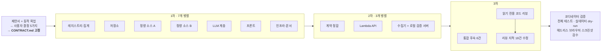
```mermaid
flowchart LR
    P0["제안서 + 동작 목업<br/>→ 사용자 결정 5가지<br/>→ <b>CONTRACT.md 고정</b>"]
    subgraph W1["1차 · 7개 병렬"]
        A1["레지스트리·집계"]
        A2["저장소"]
        A3["정량 소스 A"]
        A4["정량 소스 B"]
        A5["LLM 계층"]
        A6["프론트"]
        A7["인프라·문서"]
    end
    subgraph W2["2차 · 3개 병렬"]
        B1["계약 정합"]
        B2["Lambda API"]
        B3["수집기 + 로컬 검증 서버"]
    end
    subgraph W3["3차"]
        C1["통합 후속 6건"]
        C2["읽기 전용 코드 리뷰"]
        C3["리뷰 지적 18건 수정"]
    end
    V["코디네이터 검증<br/>전체 테스트 · 실데이터 dry-run<br/>헤드리스 브라우저 스크린샷 검수"]
    P0 --> W1 --> W2 --> W3 --> V
    C2 --> C3
```

### 에이전트별 산출물

| 차수 | 에이전트 | 주요 산출물 | 모델 |
|---|---|---|---|
| 1 | 레지스트리·집계 | `registry.yaml`, `registry.py`, `aggregate.py`, `schema.py`, `test_macro_registry/aggregate.py` | 미기록 |
| 1 | 저장소 | `store.py`, `fakeddb.py`, `test_macro_store.py` | 미기록 |
| 1 | 정량 소스 A | `sources/base.py`, `bis.py`, `oecd.py`, `worldbank.py`, `imf.py`, `fred.py`, `test_macro_sources_a.py` | 미기록 |
| 1 | 정량 소스 B | `sources/ember.py`, `owid.py`, `wits.py`, `yahoo_fx.py`, `companies.py`, `test_macro_sources_b.py` | 미기록 |
| 1 | LLM 계층 | `llm/*`(9파일) + `llm/sources.yaml`, `test_macro_llm.py` | 미기록 |
| 1 | 프론트 | `frontend/macro.js`, `charts.js`, `index.html`·`app.js` 탭 연결 | Fable |
| 1 | 인프라·문서 | `infra/template.yaml`(MacroTable·MacroScheduleRule·IAM·파라미터), `deploy.sh`, `macro/README.md`, `아키텍처.md` 5장 | 미기록 |
| 2 | 계약 정합 | CONTRACT 9.1절(프론트 의존 규칙 9개) 신설, 모듈 간 단위·키 불일치 정리 | 미기록 |
| 2 | Lambda API | `backend/macro_api.py`, `api_handler.py` 위임, `test_macro_api.py` | 미기록 |
| 2 | 수집기·검증 서버 | `collect.py`, `devserver.py`, `mockups/macro-dev-harness.html`, `test_macro_collect.py` | Fable |
| 3 | 통합 후속 6건 | 계약·구현 간 잔여 불일치 정리(단위·플래그·응답 키) | 미기록 |
| 3 | 읽기 전용 코드 리뷰 | 결함 목록(수정 권한 없음) | 미기록 |
| 3 | 리뷰 지적 18건 수정 | 아래 결함 표 + 회귀 테스트 | Fable |
| — | 코디네이터 | 전체 테스트·lint·템플릿 검증, 실데이터 dry-run, 스크린샷 검수, 문서 통합 | — |

> 모델 표기: 프론트·수집기·리뷰 수정 담당만 기록에 남아 있어(Fable) 나머지는 **미기록**으로 둡니다.

### 코드 리뷰에서 확정된 결함과 수정

리뷰 지적 18건 중 **계약·문서·코드 주석에 흔적이 남은 항목**입니다
(18건 전체의 개별 목록은 저장소에 남아 있지 않아 **미기록**).

| # | 결함 | 증상 | 수정 | 근거 위치 |
|---|---|---|---|---|
| 1 | 케이던스를 **종료 시각** 기준으로 계산 | 고정 21:00 UTC 기동에서 일간 소스가 매일 조금씩 밀려 **격일 실행** | `next_due = (finished_at의 UTC 날짜 + cadence_days) 00:00 UTC` — 날짜 경계 판정 | CONTRACT 12장 |
| 2 | 실패한 소스의 재시도 부재 | `failed`/`partial`이어도 정규 케이던스까지 대기 | `next_due`를 다음 날 00:00 UTC로 앞당기고 `retry_reason` 기록, 성공 시 정상 복귀 | CONTRACT 12장 |
| 3 | 저빈도 집계 가드가 **최신 항목**과 source 비교 | poll_of_polls가 만든 이번 달 `derived` M 때문에 지난달 W→M 집계가 영구 스킵 | 비교를 **같은 버킷(period)** 끼리로 한정 + 진행 중 달의 W 원천은 집계 제외 | CONTRACT 12장 |
| 4 | API 기간 상한 미강제 | `from` 생략 시 전 이력 조회 가능 → 응답 폭주 | `from` 생략 시 `(to 또는 현재) − 30년`(D는 10년) 강제, 국가당 4,000점 초과 400, `/fx` `base`도 동일 규칙 | CONTRACT 9장, `macro_api.py` `_check_span` |
| 5 | 수동 재수집 동시 실행 | 스케줄 실행 중 관리자 재수집이 겹쳐 중복 쓰기 | `CONFIG / LOCK#collect` 조건부 put(3시간 만료), 획득 실패 시 exit 0 / `refresh`는 **409** | CONTRACT 4·12장, `collect.py` `acquire_lock` |
| 6 | 외부 링크 스킴 미검증 | `javascript:`·`data:` URL이 `<a href>`로 렌더될 수 있음 | `SAFE_URL_RE`로 `http(s)`·프로토콜 상대·같은 출처 경로만 링크, 그 외 텍스트 | `macro.js:33`, CONTRACT 11장 |
| 7 | 미사용 IAM 액션 | 워커·API 역할에 쓰지 않는 권한 | 실제 호출만 남기고 정리(API는 `macro/docs/*` 읽기만, `macro/raw/*` 미노출) | `template.yaml` IAM 블록 |
| 8 | 프론트 가정이 계약에 없음 | `series`의 `from`·`to` 동시 지원, `overview.indicators` 객체 배열, `docs`에 `pk`/`sk` 등 | CONTRACT **9.1절 신설**(프론트 의존 규칙 9개)로 정식 고정 | CONTRACT 9.1 |
| 9 | 후처리 단계 실패가 전체를 중단 | 파생 실패 시 LATEST 재생성·INGEST 기록까지 누락 | `_stage()`로 단계별 격리 + `post_errors` 기록 | `collect.py:606` |
| 10 | 페이크 테이블 성능 | 55k 항목·4.5k 쿼리에 221초 | pk별 sk 인덱스(bisect 유지)로 **4초 미만** | `fakeddb.py` 상단 주석 |
| 11 | `meta` 요청마다 52건 조회 | 요청당 SERIES 38 + INGEST 14 | Lambda 컨테이너 **5분 캐시** + BatchGetItem(25건 단위, 실패 시 get_item 폴백) | `macro_api.py` 상단 주석 |
| 12 | 미국 통화가치 지수 누락 | `fx_usd` US는 어떤 소스도 내지 않아 순위에서 빠짐 | 다른 국가 월별 범위로 `value 1.0` 합성(`series_id: USD_BASE`, `derived`) → US = 100 | CONTRACT 12장 폴백 체인 |

---

## 11. 검증 결과

전부 2026-09-20에 이 문서 작성 시점으로 **재측정**한 값입니다.

| 항목 | 명령 | 결과 |
|---|---|---|
| 전체 테스트 | `pytest tests -q`(환경 의존 1건 deselect) | **1,467 passed** · 1 skipped(`DEEPSEEK_API_KEY` 없음) · 1 deselected · 69 subtests · 136.5초 |
| 매크로 테스트 | `pytest tests/test_macro_*.py -q` | **409 passed** · 21.1초 (변경이력의 349는 리뷰 수정 회귀 테스트 추가 전 집계) |
| 린트 | `ruff check webui/macro webui/backend` | All checks passed |
| JS 문법 | `node --check webui/frontend/*.js` | app.js · charts.js · config.js · macro.js **4/4 OK** |
| CFN 템플릿 | `aws cloudformation validate-template` | 통과 · 파라미터 15개(매크로 5개: `FredApiKey`·`EmberApiKey`·`MacroLlmModel`·`MacroLlmDailyTokenBudget`·`MacroScheduleEnabled`) |
| 제외된 1건 | `test_bedrock_provider::test_construction_when_extra_installed` | 셸 `AWS_REGION` 환경 의존 · 매크로 작업과 무관(기존 실패) |

### 매크로 테스트 분포 (`--collect-only` 실측)

| 파일 | 테스트 | 줄 |
|---|---|---|
| `tests/test_macro_llm.py` | 149 | 1,444 |
| `tests/test_macro_sources_b.py` | 55 | 820 |
| `tests/test_macro_sources_a.py` | 53 | 712 |
| `tests/test_macro_api.py` | 43 | 988 |
| `tests/test_macro_collect.py` | 41 | 802 |
| `tests/test_macro_aggregate.py` | 25 | 390 |
| `tests/test_macro_store.py` | 23 | 694 |
| `tests/test_macro_registry.py` | 20 | 288 |
| **합계** | **409** | **6,138** |

픽스처는 `tests/fixtures/macro/` 19개(실제 API 응답 축소본 — BIS·OECD 3종·IMF·World Bank·WITS XML·Yahoo 3종·Ember 2종·OWID·FRED·카탈로그 + `llm/`).

### 실 API 실데이터 dry-run (6개국 · `--no-llm`)

`webui/macro/collect.py --dry-run` 결과를 덤프(27.8 MB)한 것을 집계했습니다.
대상 국가 6개: **KR · US · JP · EU · DE · BR**.

| 소스 | 실행 | 상태 | 이 소스가 만든 OBS 항목 수 | 마지막 실행 `n_obs` | `next_due` |
|---|---|---|---|---|---|
| `bis` | ✅ | ok | 29,258 | 185 | 다음 날 00:00 UTC (daily) |
| `yahoo` | ✅ | ok | 13,096 | 266 | 다음 날 00:00 UTC (daily) |
| `oecd` | ✅ | ok | 5,745 | 4,046 | +7일 (weekly) |
| `worldbank` | ✅ | ok | 3,120 | 3,120 | +30일 (monthly) |
| `derived`(파생·집계) | — | — | 2,260 | — | — |
| `owid` | ✅ | ok | 879 | 879 | +30일 |
| `imf` | ✅ | ok | 776 | 546 | +7일 |
| `ember` | ✅ | ok | 369 | 369 | +30일 |
| `wits` | ✅ | ok | 5 | 5 | +30일 |
| `fred` | ❌ | — | 0 | — | `FRED_API_KEY` 없음 → 경고 1줄 후 스킵 |
| `companies` | ❌ | — | 0 | — | 이 dry-run에 포함하지 않음 |
| `cb_statements`·`wiki_polls`·`energy_policy`·`weekly_brief` | ❌ | — | 0 | — | `--no-llm` |

- **테이블 항목 55,764건** = OBS 55,508 · LATEST 177 · SERIES 39(지표 38 + 국가 사전) · SNAPSHOT 20 · INGEST 20.
- 빈도 분포: D 39,185 · M 7,956 · Y 5,017 · Q 3,350. 지표 34종에 값이 들어옴(정성 4종·`top_companies` 제외).
- 원본 응답은 dry-run이라 S3가 아니라 로컬 `./.macro_raw/`에 47개 파일(16 MB)로 저장됐습니다.
- 국가별 항목 수: BR 11,482 · EU 11,453 · US 11,234 · KR 9,775 · JP 9,426 · DE 2,138
  (DE가 적은 이유 = 유로 공통 지표를 회원국별로 만들지 않음).

### 로컬 검증 서버 엔드포인트 (`devserver.py --load` + 실제 `api_handler.py`)

| 엔드포인트 | HTTP | 본문 |
|---|---|---|
| `GET /api/macro/meta` | 200 | `ok,countries,indicators,ingest` |
| `GET /api/macro/overview?group=G20` | 200 | `ok,group,asof,indicators,rows,median` |
| `GET /api/macro/countries/KR` | 200 | `ok,country,latest,docs,profile_source` |
| `GET /api/macro/series?indicator=policy_rate&countries=KR,US&freq=M&from=&to=` | 200 | `ok,indicator,freq,from,to,transform,series` |
| `GET /api/macro/observations?indicator=policy_rate&iso=KR&freq=M&period=2026-08` | 200 | `ok,observation,resolved_iso,related_docs` |
| `GET /api/macro/docs?type=weekly_brief&iso=G20&limit=1` | 200 | `ok,type,iso,docs` |
| `GET /api/macro/politics/KR?from=2021-09` | 200 | `ok,iso,from,election,poll_of_polls,polls` |
| `GET /api/macro/fx?base=2025-01-01&freq=M&group=G20` | 200 | `ok,base,base_used,freq,group,series` |

**8/8 엔드포인트 200 + `ok: true`**, 응답 본문에 `error` 키 없음(CONTRACT 9.1절 규칙 9 충족).
관리자 POST 2개(`refresh`·`review`)는 `test_macro_api.py`에서 검증하고 로컬 서버에서는 호출하지 않았습니다.

---

## 12. 알려진 공백 · 후속 (Phase 3)

### 아직 하지 않은 일 (사용자 결정·승인 필요)

| 항목 | 상태 | 다음 동작 |
|---|---|---|
| **배포** | 하지 않음 | `webui/infra/deploy.sh`(워커 이미지 재빌드 포함). 첫 실행은 `--since 2015-01-01` 부트스트랩 1회 권장(미국 통화가치 지수 등 12개월 전 기준값 필요) |
| **커밋** | 하지 않음 | 8월 카탈로그 작업의 기존 미커밋 변경(`api_handler.py`·`app.js`·`index.html`·`style.css`·`catalog`·`tests`)과 같은 워킹트리에 있음 — 분리 커밋 여부는 사용자 판단 |
| Parquet/Athena 내보내기 | Phase 3 | `macro/export/` 경로만 비워 둠 |
| API 키를 SSM SecureString으로 이동 | Phase 3 | 태스크 정의에 ARN만 남기고 실행 시 복호화. 워커 역할에 `ssm:GetParameters`·`kms:Decrypt` 추가 필요 ([README.md](README.md) 3장) |
| 뉴스 분석가에 매크로 스냅샷 주입 | Phase 3 | 제안서 4.8절 — `vintage ≤ 분석일` 스냅샷을 분석 컨텍스트로 |

### 데이터 공백 — 원인과 대안 소스

| 공백 | 원인(실측) | 대안 |
|---|---|---|
| `policy_rate` **AR** | BIS `WS_CBPOL`에 아르헨티나 없음 | BCRA 사이트·API 직접 연동 |
| `house_price_*` **AR·SA** | BIS `WS_SPP` 미수록(JP는 1분기 지연) | 국가통계 기관 |
| `ppi_*` **KR·JP·CN·IN + 전 국가 최신값** | OECD에 PPI 전용 데이터플로가 없고, KEI `MEASURE=PP`는 원천이 **2023-02에서 정지**(38개국, 이 4개국 미포함) | FRED(US, 구현됨) · Eurostat(EU) · 한국은행 ECOS(KR) |
| `m2_level` **US·EU·CN·GB·IN·SA** | IMF MFS `BM_MAI.XDC.M` 전수 조회 0행(US는 FRED `M2SL` 폴백으로 해결) | ECB Data Portal(EU) · 각국 중앙은행 통계 |
| `m2_level` **CA·RU 정지** | 원천 최신값이 CA 2008-12 · RU 2021-11 | 동일 |
| `gov_debt_gdp` **9개국** | World Bank `GC.DOD.TOTL.GD.ZS`에 AR·CN·DE·EU·FR·ID·IT·JP·SA 없음 | IMF Fiscal Monitor(FM) 데이터플로 |
| `cb_stance` **GB·MX·TR·SA·ZA** | 결정문 목록이 JS 렌더링이고 RSS도 결정문 단위가 아님 | 헤드리스 렌더링 또는 기관 전용 API |
| `cb_stance` **IN·BR·ID** | 링크는 잡히나 본문이 JS·Angular 셸이라 200자 미만 | 동일 |
| `party_support` **IN** | 위키 표가 정당 지지율이 아니라 연합별 예상 의석수 | 인도 여론조사 집계 사이트 |
| `party_support` **TR** | 사용 가능한 영문 위키 여론조사 문서 없음 | 터키어 위키·현지 집계 기관 |
| `top_companies` **RU** | Yahoo가 MOEX 시세를 제공하지 않음 | MOEX 공개 데이터 |
| `top_companies` **EU** | 단일 거래소가 없음(DE/FR/IT가 대표) | 설계상 의도 |
| `elec_mix` Ember **API 인증** | 키가 없어 헤더 `X-API-Key` 경로의 인증 성공을 실증하지 못함(무키 공개 CSV가 기본 경로) | `EMBER_API_KEY` 발급 후 재확인 |
| `exports_top_hs2` **HS2 상세** | WITS `tradestats-trade`의 product 차원은 HS 챕터 97개가 아니라 **구간 16개**(`84-85` 등) | UN Comtrade 등 챕터 단위 소스 |

---

## 13. 문서 지도

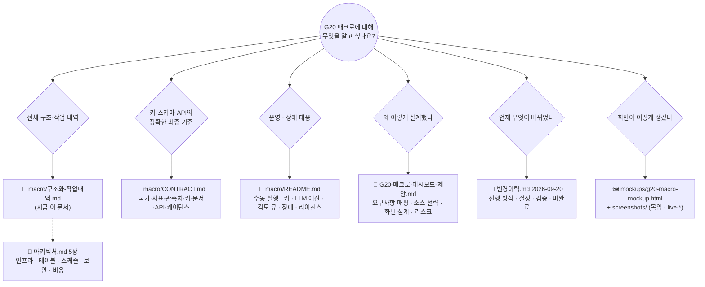
```mermaid
flowchart TD
    Q(("G20 매크로에 대해<br/>무엇을 알고 싶나요?")) --> A{"전체 구조·작업 내역"}
    Q --> B{"키·스키마·API의<br/>정확한 최종 기준"}
    Q --> C{"운영 · 장애 대응"}
    Q --> D{"왜 이렇게 설계했나"}
    Q --> E{"언제 무엇이 바뀌었나"}
    Q --> F{"화면이 어떻게 생겼나"}
    A --> DA["📄 macro/구조와-작업내역.md<br/>(지금 이 문서)"]
    B --> DB["📄 macro/CONTRACT.md<br/>국가·지표·관측치·키·문서·API·케이던스"]
    C --> DC["📄 macro/README.md<br/>수동 실행 · 키 · LLM 예산 · 검토 큐 · 장애 · 라이선스"]
    D --> DD["📄 G20-매크로-대시보드-제안.md<br/>요구사항 매핑 · 소스 전략 · 화면 설계 · 리스크"]
    E --> DE["📄 변경이력.md 2026-09-20<br/>진행 방식 · 결정 · 검증 · 미완료"]
    F --> DF["🖼 mockups/g20-macro-mockup.html<br/>+ screenshots/ (목업 · live-*)"]
    DA -.-> DG["📄 아키텍처.md 5장<br/>인프라 · 테이블 · 스케줄 · 보안 · 비용"]
```

| 문서 | 무엇이 있나 |
|---|---|
| [CONTRACT.md](CONTRACT.md) | **단일 기준.** 국가 20개, 지표 38개, 관측치·문서 스키마, DynamoDB 키, 집계 규칙, 소스 인터페이스, S3 레이아웃, API 10개(+9.1 프론트 의존 규칙), 환경변수, 프론트 계약, 케이던스·폴백 체인 |
| [README.md](README.md) | 운영 가이드 — dry-run·수동 RunTask·스케줄 on/off, API 키, LLM 예산, 검토 큐, 장애 대응 표, 데이터 라이선스 표기 의무 |
| [../G20-매크로-대시보드-제안.md](../G20-매크로-대시보드-제안.md) | 설계 배경 — 현황 진단, 요구사항→지표 매핑, 소스 전략, 아키텍처 초안, 화면 와이어프레임, 비용, 리스크, 결정 사항, 부록(지표 초안·소스 URL) |
| [../아키텍처.md](../아키텍처.md) (5장) | 웹 UI 전체 아키텍처 속의 매크로 — 구성도·테이블 키 요약·스케줄·API·화면·보안·비용 |
| [../변경이력.md](../변경이력.md) (2026-09-20) | 시간순 기록 — 요청, 결정 5가지, 진행 방식, 변경 파일 목록, 검증, 미완료·후속, 이유 |
| [../mockups/g20-macro-mockup.html](../mockups/g20-macro-mockup.html) | 동작하는 화면 목업(설계 확정용, 합성 데이터) |
| [../mockups/macro-dev-harness.html](../mockups/macro-dev-harness.html) | 검증 하네스 — 실제 `macro.js`·`charts.js`를 합성 API 응답으로 구동(검토 버튼·실패 배지 확인용) |
| [../../프로젝트-한눈에-보기.md](../../프로젝트-한눈에-보기.md) | 프로젝트 전체를 그림으로 — 4장에 G20 매크로 한 줄 |
