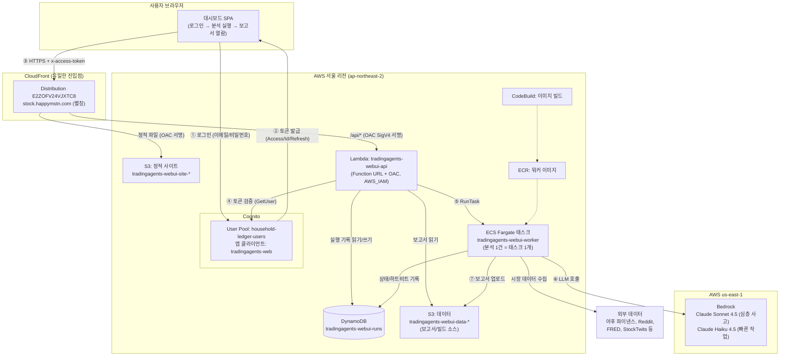
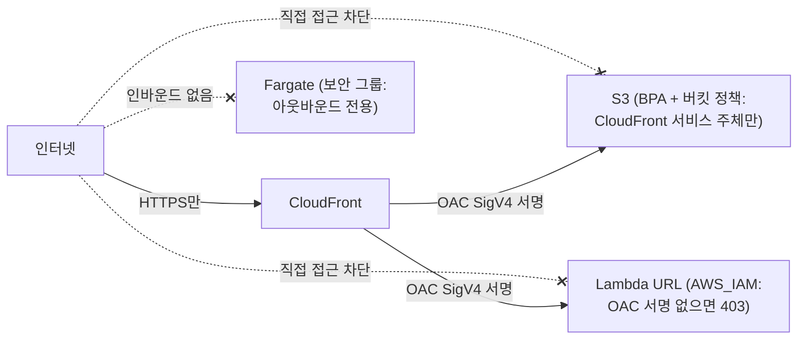
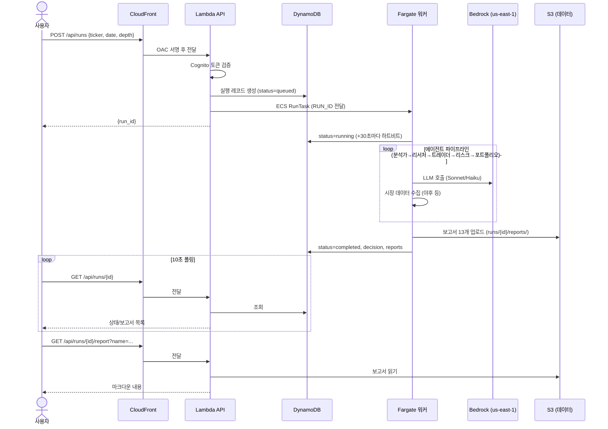

# TradingAgents 웹 UI — 아키텍처 및 사용 가이드

> AWS 서울 리전에 배포된 TradingAgents 분석 대시보드의 구조, 데이터 구성,
> 사용법을 설명하는 문서입니다. 변경 이력은 [변경이력.md](변경이력.md) 참고.

- **접속 URL**: https://stock.happymstn.com
- **로그인**: Cognito 가족 계정 (가계부 ledger.happymstn.com과 동일한 이메일/비밀번호)
- **배포 명령**: `webui/infra/deploy.sh` (프론트/API만 갱신 시 `--skip-image`)

---

## 1. 전체 아키텍처



### 리전 배치 원칙

| 구분 | 리전 | 이유 |
|---|---|---|
| CloudFront, S3, Lambda, DynamoDB, ECS, ECR, CodeBuild, Cognito | **서울(ap-northeast-2)** | 모든 시스템 리소스는 서울에서 지원됨 |
| Bedrock (Claude 모델) | **us-east-1** | LLM 호출만 버지니아 — 워커 컨테이너의 `AWS_REGION=us-east-1` 환경변수로 지정 |

### 보안 모델 (외부 비노출)



- **CloudFront가 유일한 진입점**: S3와 Lambda는 OAC(Origin Access Control) 서명이 있는 CloudFront 요청만 수락. 오리진 URL을 알아내도 직접 호출하면 403.
- **API는 Cognito 토큰 필수**: 모든 `/api/*` 요청은 `x-access-token` 헤더의 액세스 토큰을 Lambda가 Cognito `GetUser`로 검증 (client_id·token_use 클레임 확인 + 5분 캐시). 없거나 무효면 401.
- **워커는 인바운드 제로**: 보안 그룹에 인바운드 규칙이 없고, 아웃바운드(데이터 수집·Bedrock 호출)만 허용.
- **동시 실행 제한 (기본 10건)**: 비용 폭주 방지 (Lambda가 실행 생성 시 검사). CloudFormation 파라미터 `MaxActiveRuns`로 조정 — `MAX_ACTIVE_RUNS=20 webui/infra/deploy.sh --skip-image`처럼 배포 시 환경변수로 지정.
- ⚠️ 토큰은 `Authorization` 헤더가 아닌 `x-access-token`으로 전달 — `Authorization`은 OAC SigV4 서명과 충돌함.

---

## 2. 분석 실행 흐름 (시퀀스)



---

## 3. 데이터 구성

### DynamoDB: `tradingagents-webui-runs` (온디맨드 과금)

실행 1건 = 항목 1개. 파티션 키 `run_id`(12자리 hex).

| 속성 | 타입 | 설명 | 예시 |
|---|---|---|---|
| `run_id` | S (PK) | 실행 ID | `00fc8efaddb5` |
| `ticker` | S | 종목 코드 (정규화됨) | `SPY`, `005930.KS` |
| `analysis_date` | S | 분석 기준일 | `2026-07-30` |
| `depth` | N | 토론 라운드 수 (1/3/5) | `1` |
| `status` | S | `queued` → `running` → `completed`/`failed` | |
| `decision` | S | 최종 결정 (완료 시) | `Underweight` |
| `error` | S | 실패 사유 (실패 시, 1000자 제한) | |
| `reports` | L | 보고서 파일 상대경로 목록 (완료 시) | `["complete_report.md", ...]` |
| `created_at` / `updated_at` / `started_at` / `finished_at` | S | ISO 8601 UTC 타임스탬프 | |

`updated_at`은 워커가 30초마다 갱신(하트비트) — UI의 "실행중" 신뢰성 판단에 사용 가능.

### S3 데이터 버킷: `tradingagents-webui-data-199177488202`

```
runs/{run_id}/reports/          ← 분석 보고서 (마크다운, 한국어)
├── complete_report.md          ← 전체 통합 보고서
├── 1_analysts/{market,sentiment,news,fundamentals}.md
├── 2_research/{bull,bear,manager}.md
├── 3_trading/trader.md
├── 4_risk/{aggressive,conservative,neutral}.md
└── 5_portfolio/decision.md     ← 최종 결정

source/source.zip               ← CodeBuild용 저장소 스냅샷 (배포 시 갱신)
```

### S3 사이트 버킷: `tradingagents-webui-site-199177488202`

`webui/frontend/`의 정적 파일 (index.html, app.js, config.js, style.css, vendor/).
모든 객체에 `Cache-Control: no-cache` — 브라우저가 매번 재검증하므로 배포 직후 구버전이 남지 않음.

### 종목 카탈로그 (`catalog/` prefix)

- `catalog/{US|KR|JP}.json.gz` + `catalog/meta.json` — 한·일·미 상장 종목 목록
  (티커/종목명/시장/업종/최근 종가). 소스: NASDAQ Trader, KRX KIND, JPX 상장일람.
- **평일 22:00 KST**에 EventBridge가 Fargate 배치(`webui/catalog/build_catalog.py`)를
  실행해 자동 갱신. 수동 갱신: 로컬에서 `DATA_BUCKET=... python webui/catalog/build_catalog.py`.
- 웹 UI "종목 탐색" 탭과 `GET /api/catalog`(검색·업종·정렬·페이지네이션)가 사용.
- 분석 시작 시 티커를 카탈로그와 대조해 오타를 차단하고 후보를 제안
  (암호화폐 `-USD`·선물 `=F`·외환 `=X`·지수 `^`는 패턴 통과, 카탈로그 미생성 시 검증 생략).

### Cognito (인증)

- **User Pool**: `household-ledger-users` (`ap-northeast-2_beRiSnPMY`) — 가계부·rtms와 **공유**. 사용자 추가/비밀번호 재설정은 이 풀에서 하면 모든 앱에 적용.
- **앱 클라이언트**: `tradingagents-web` (`11ikj0bqsifr90tf4b37h4t14p`, 시크릿 없음, USER_PASSWORD_AUTH). 액세스 토큰 1시간, 리프레시 토큰 30일.
- API는 이 클라이언트로 발급된 액세스 토큰만 수락 (다른 앱 토큰 재사용 불가).

---

## 4. 사용법

### 웹 UI

1. https://stock.happymstn.com 접속 → 가족 계정으로 로그인
2. **새 분석 시작**: 종목 코드(`AAPL`, `005930.KS`, `BTC-USD`), 분석 날짜(오늘 이전), 분석 깊이 선택 → "분석 시작"
   - 깊이별 예상: 얕게 ≈ 10분, 중간 ≈ 20~30분, 깊게 ≈ 30~60분 (LLM 비용도 비례 증가)
3. **실행 목록**: 10초마다 자동 갱신. 실행중이면 경과 시간 표시
4. **상세 화면**: 완료되면 보고서 탭(전체 보고서/시장 분석/강세론/약세론/최종 결정 등)에서 열람
5. 로그인은 30일간 유지(자동 갱신), 헤더의 "로그아웃"으로 종료

### API 직접 호출 (스크립트용)

```bash
# 1. 토큰 발급
TOKEN=$(aws cognito-idp initiate-auth --region ap-northeast-2 \
  --auth-flow USER_PASSWORD_AUTH --client-id 11ikj0bqsifr90tf4b37h4t14p \
  --auth-parameters USERNAME=<이메일>,PASSWORD=<비밀번호> \
  --query 'AuthenticationResult.AccessToken' --output text)

# 2. 분석 시작 (POST는 본문 SHA-256 해시 헤더 필수 — OAC 요구사항)
BODY='{"ticker":"AAPL","analysis_date":"2026-07-31","depth":1}'
HASH=$(printf '%s' "$BODY" | shasum -a 256 | cut -d' ' -f1)
curl -s -X POST https://stock.happymstn.com/api/runs \
  -H "x-access-token: $TOKEN" -H "content-type: application/json" \
  -H "x-amz-content-sha256: $HASH" -d "$BODY"

# 3. 상태 조회 / 보고서
curl -s -H "x-access-token: $TOKEN" https://stock.happymstn.com/api/runs
curl -s -H "x-access-token: $TOKEN" "https://stock.happymstn.com/api/runs/<run_id>/report?name=complete_report.md"
```

### 배포/운영

| 작업 | 명령 |
|---|---|
| 전체 배포 (인프라+이미지+API+프론트) | `webui/infra/deploy.sh` |
| 프론트/API만 갱신 | `webui/infra/deploy.sh --skip-image` |
| 워커 로그 확인 | `aws logs tail /ecs/tradingagents-webui-worker --region ap-northeast-2 --follow` |
| API 로그 확인 | `aws logs tail /aws/lambda/tradingagents-webui-api --region ap-northeast-2` |
| Bedrock 모델 교체 | CloudFormation 파라미터 `BedrockDeepModel`/`BedrockQuickModel` |

### 비용 구조

- **상시 비용 ≈ 0**: 서버리스 구성 (Lambda·DynamoDB·S3 사용량 과금, CloudFront 소량)
- **분석 1건당**: Fargate(1vCPU/4GB × 실행 시간, 얕게 기준 ~10분 ≈ 수십 원) + Bedrock 토큰 (깊이·종목에 따라 수백 원~수천 원)
- 동시 실행 제한(기본 10건, `MaxActiveRuns` 파라미터)으로 상한 보호 — 10건을 동시에 돌리면 시간당 비용도 10배가 됨에 유의

📄 **AWS 서비스 목록·월 예상 비용·비용 추적(태그) 상세: [README.md](README.md)**

---

## 5. 구성 요소별 소스 위치

| 구성 요소 | 경로 |
|---|---|
| 프론트엔드 SPA | `webui/frontend/` (index.html, app.js, config.js, style.css) |
| Lambda API | `webui/backend/api_handler.py` |
| Fargate 워커 | `webui/worker/worker.py`, `webui/worker/Dockerfile` |
| 인프라 (CloudFormation) | `webui/infra/template.yaml` |
| 배포 스크립트 | `webui/infra/deploy.sh` |
| 이미지 빌드 명세 | `webui/infra/buildspec.yml` |
