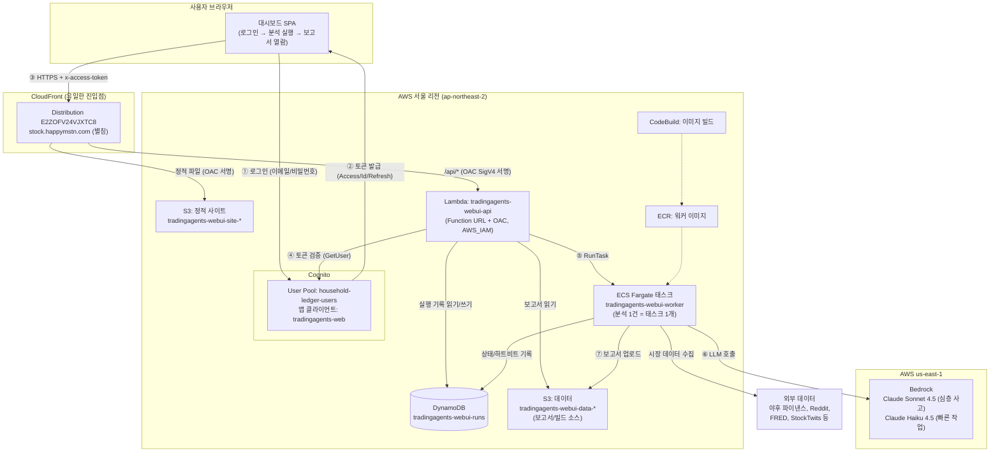
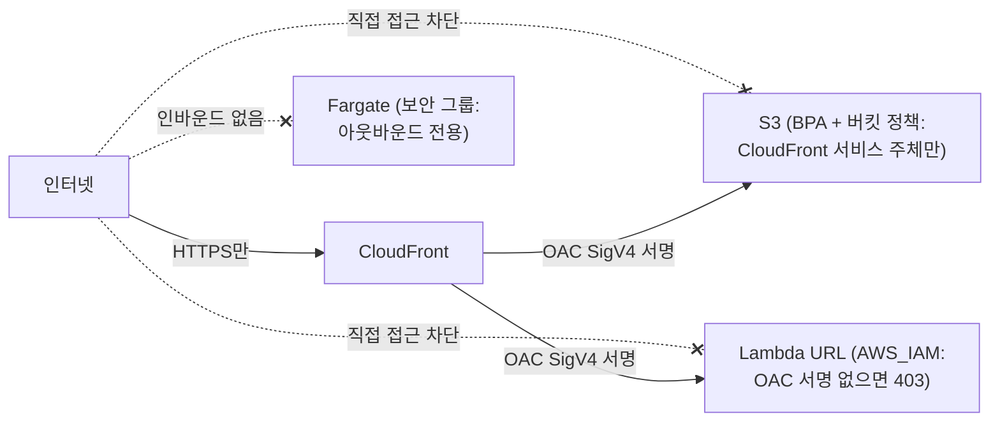
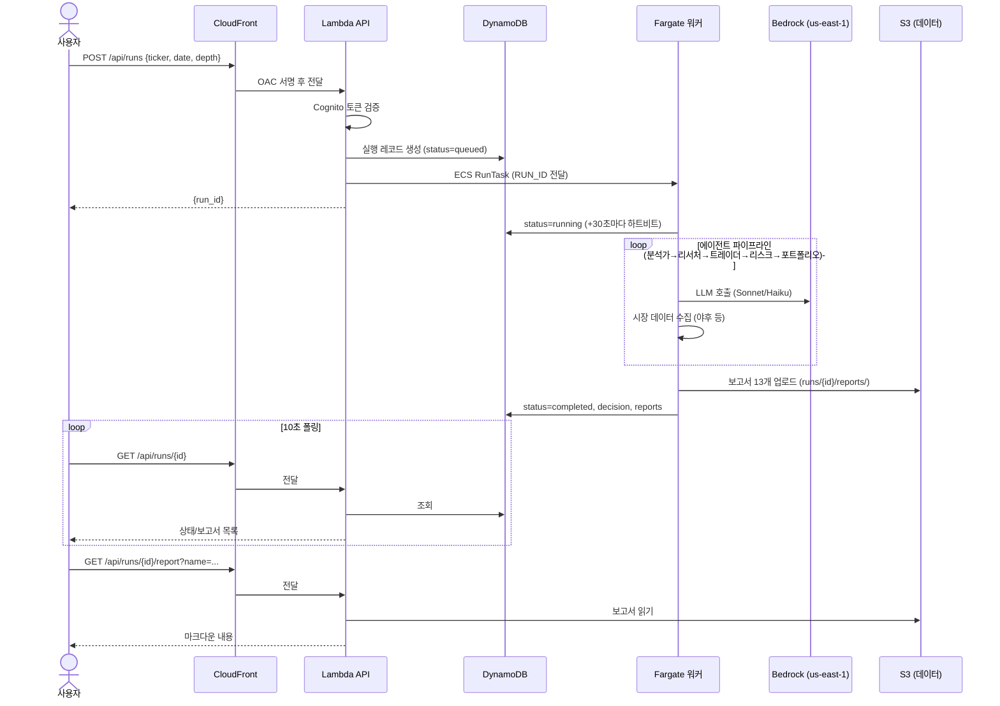
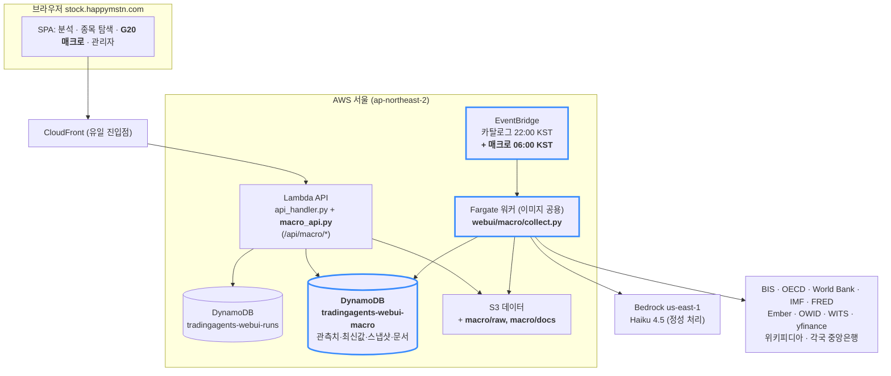

# TradingAgents 웹 UI — 아키텍처 및 사용 가이드

> AWS 서울 리전에 배포된 TradingAgents 분석 대시보드의 구조, 데이터 구성,
> 사용법을 설명하는 문서입니다. 변경 이력은 [변경이력.md](변경이력.md) 참고.

- **접속 URL**: https://stock.happymstn.com
- **로그인**: Cognito 가족 계정 (가계부 ledger.happymstn.com과 동일한 이메일/비밀번호)
- **배포 명령**: `webui/infra/deploy.sh` (프론트/API만 갱신 시 `--skip-image`)
- **화면**: 분석 `#/` · 종목 탐색 `#/catalog` · **G20 매크로 `#/macro`**([5장](#5-g20-매크로-데이터)) · 관리자 `#/admin`

---

## 1. 전체 아키텍처



### 리전 배치 원칙

| 구분 | 리전 | 이유 |
|---|---|---|
| CloudFront, S3, Lambda, DynamoDB, ECS, ECR, CodeBuild, Cognito | **서울(ap-northeast-2)** | 모든 시스템 리소스는 서울에서 지원됨 |
| Bedrock (Claude 모델) | **us-east-1** | LLM 호출만 버지니아 — 워커 컨테이너의 `AWS_REGION=us-east-1` 환경변수로 지정 |

### 보안 모델 (외부 비노출)



- **CloudFront가 유일한 진입점**: S3와 Lambda는 OAC(Origin Access Control) 서명이 있는 CloudFront 요청만 수락. 오리진 URL을 알아내도 직접 호출하면 403.
- **API는 Cognito 토큰 필수**: 모든 `/api/*` 요청은 `x-access-token` 헤더의 액세스 토큰을 Lambda가 Cognito `GetUser`로 검증 (client_id·token_use 클레임 확인 + 5분 캐시). 없거나 무효면 401.
- **워커는 인바운드 제로**: 보안 그룹에 인바운드 규칙이 없고, 아웃바운드(데이터 수집·Bedrock 호출)만 허용.
- **동시 실행 제한 (기본 10건)**: 비용 폭주 방지 (Lambda가 실행 생성 시 검사). CloudFormation 파라미터 `MaxActiveRuns`로 조정 — `MAX_ACTIVE_RUNS=20 webui/infra/deploy.sh --skip-image`처럼 배포 시 환경변수로 지정.
- ⚠️ 토큰은 `Authorization` 헤더가 아닌 `x-access-token`으로 전달 — `Authorization`은 OAC SigV4 서명과 충돌함.

---

## 2. 분석 실행 흐름 (시퀀스)



---

## 3. 데이터 구성

### DynamoDB: `tradingagents-webui-runs` (온디맨드 과금)

실행 1건 = 항목 1개. 파티션 키 `run_id`(12자리 hex).

| 속성 | 타입 | 설명 | 예시 |
|---|---|---|---|
| `run_id` | S (PK) | 실행 ID | `00fc8efaddb5` |
| `ticker` | S | 종목 코드 (정규화됨) | `SPY`, `005930.KS` |
| `analysis_date` | S | 분석 기준일 | `2026-07-30` |
| `depth` | N | 토론 라운드 수 (1/3/5) | `1` |
| `status` | S | `queued` → `running` → `completed`/`failed` | |
| `decision` | S | 최종 결정 (완료 시) | `Underweight` |
| `error` | S | 실패 사유 (실패 시, 1000자 제한) | |
| `reports` | L | 보고서 파일 상대경로 목록 (완료 시) | `["complete_report.md", ...]` |
| `created_at` / `updated_at` / `started_at` / `finished_at` | S | ISO 8601 UTC 타임스탬프 | |

`updated_at`은 워커가 30초마다 갱신(하트비트) — UI의 "실행중" 신뢰성 판단에 사용 가능.

### S3 데이터 버킷: `tradingagents-webui-data-199177488202`

```
runs/{run_id}/reports/          ← 분석 보고서 (마크다운, 한국어)
├── complete_report.md          ← 전체 통합 보고서
├── 1_analysts/{market,sentiment,news,fundamentals}.md
├── 2_research/{bull,bear,manager}.md
├── 3_trading/trader.md
├── 4_risk/{aggressive,conservative,neutral}.md
└── 5_portfolio/decision.md     ← 최종 결정

source/source.zip               ← CodeBuild용 저장소 스냅샷 (배포 시 갱신)
```

### S3 사이트 버킷: `tradingagents-webui-site-199177488202`

`webui/frontend/`의 정적 파일 (index.html, app.js, config.js, style.css, vendor/).
모든 객체에 `Cache-Control: no-cache` — 브라우저가 매번 재검증하므로 배포 직후 구버전이 남지 않음.

### 종목 카탈로그 (`catalog/` prefix)

- `catalog/{US|KR|JP|CN}.json.gz` + `catalog/meta.json` — 한·일·미·중 상장 종목 목록
  (티커/종목명/시장/업종/최근 종가). 소스: NASDAQ Trader, KRX KIND, JPX 상장일람,
  SSE·SZSE 상장사 목록(중국 A주, 야후 접미사 .SS/.SZ).
- **평일 22:00 KST**에 EventBridge가 Fargate 배치(`webui/catalog/build_catalog.py`)를
  실행해 자동 갱신. 수동 갱신: 로컬에서 `DATA_BUCKET=... python webui/catalog/build_catalog.py`.
- 웹 UI "종목 탐색" 탭과 `GET /api/catalog`(검색·업종·정렬·페이지네이션)가 사용.
- 분석 시작 시 티커를 카탈로그와 대조해 오타를 차단하고 후보를 제안
  (암호화폐 `-USD`·선물 `=F`·외환 `=X`·지수 `^`는 패턴 통과, 카탈로그 미생성 시 검증 생략).

### G20 매크로 데이터 (`macro/` prefix + 별도 DynamoDB 테이블)

20개국 매크로 관측치·정성 문서는 전용 테이블 `tradingagents-webui-macro`와 S3 `macro/*`에
적재됩니다. 키 설계·수집 스케줄·API·화면은 [5장](#5-g20-매크로-데이터) 참고.

### Cognito (인증)

- **User Pool**: `household-ledger-users` (`ap-northeast-2_beRiSnPMY`) — 가계부·rtms와 **공유**. 사용자 추가/비밀번호 재설정은 이 풀에서 하면 모든 앱에 적용.
- **앱 클라이언트**: `tradingagents-web` (`11ikj0bqsifr90tf4b37h4t14p`, 시크릿 없음, USER_PASSWORD_AUTH). 액세스 토큰 1시간, 리프레시 토큰 30일.
- API는 이 클라이언트로 발급된 액세스 토큰만 수락 (다른 앱 토큰 재사용 불가).

---

## 4. 사용법

### 웹 UI

1. https://stock.happymstn.com 접속 → 가족 계정으로 로그인
2. **새 분석 시작**: 종목 코드(`AAPL`, `005930.KS`, `BTC-USD`), 분석 날짜(오늘 이전), 분석 깊이 선택 → "분석 시작"
   - 깊이별 예상: 얕게 ≈ 10분, 중간 ≈ 20~30분, 깊게 ≈ 30~60분 (LLM 비용도 비례 증가)
3. **실행 목록**: 10초마다 자동 갱신. 실행중이면 경과 시간 표시
4. **상세 화면**: 완료되면 보고서 탭(전체 보고서/시장 분석/강세론/약세론/최종 결정 등)에서 열람
5. 로그인은 30일간 유지(자동 갱신), 헤더의 "로그아웃"으로 종료

### API 직접 호출 (스크립트용)

```bash
# 1. 토큰 발급
TOKEN=$(aws cognito-idp initiate-auth --region ap-northeast-2 \
  --auth-flow USER_PASSWORD_AUTH --client-id 11ikj0bqsifr90tf4b37h4t14p \
  --auth-parameters USERNAME=<이메일>,PASSWORD=<비밀번호> \
  --query 'AuthenticationResult.AccessToken' --output text)

# 2. 분석 시작 (POST는 본문 SHA-256 해시 헤더 필수 — OAC 요구사항)
BODY='{"ticker":"AAPL","analysis_date":"2026-07-31","depth":1}'
HASH=$(printf '%s' "$BODY" | shasum -a 256 | cut -d' ' -f1)
curl -s -X POST https://stock.happymstn.com/api/runs \
  -H "x-access-token: $TOKEN" -H "content-type: application/json" \
  -H "x-amz-content-sha256: $HASH" -d "$BODY"

# 3. 상태 조회 / 보고서
curl -s -H "x-access-token: $TOKEN" https://stock.happymstn.com/api/runs
curl -s -H "x-access-token: $TOKEN" "https://stock.happymstn.com/api/runs/<run_id>/report?name=complete_report.md"
```

### 배포/운영

| 작업 | 명령 |
|---|---|
| 전체 배포 (인프라+이미지+API+프론트) | `webui/infra/deploy.sh` |
| 프론트/API만 갱신 | `webui/infra/deploy.sh --skip-image` |
| 워커 로그 확인 | `aws logs tail /ecs/tradingagents-webui-worker --region ap-northeast-2 --follow` |
| API 로그 확인 | `aws logs tail /aws/lambda/tradingagents-webui-api --region ap-northeast-2` |
| Bedrock 모델 교체 | CloudFormation 파라미터 `BedrockDeepModel`/`BedrockQuickModel` |
| 매크로 수동 수집 | [macro/README.md](macro/README.md) 2장의 `aws ecs run-task` 명령 (또는 관리자 탭의 "수동 재수집") |
| 매크로 스케줄 끄기/켜기 | `MACRO_SCHEDULE_ENABLED=DISABLED webui/infra/deploy.sh --skip-image` |
| 매크로 수집 현황 확인 | `GET /api/macro/meta`의 `ingest` 또는 `INGEST#<소스>` 항목 조회 |

### 비용 구조

- **상시 비용 ≈ 0**: 서버리스 구성 (Lambda·DynamoDB·S3 사용량 과금, CloudFront 소량)
- **분석 1건당**: Fargate(1vCPU/4GB × 실행 시간, 얕게 기준 ~10분 ≈ 수십 원) + Bedrock 토큰 (깊이·종목에 따라 수백 원~수천 원)
- 동시 실행 제한(기본 10건, `MaxActiveRuns` 파라미터)으로 상한 보호 — 10건을 동시에 돌리면 시간당 비용도 10배가 됨에 유의

📄 **AWS 서비스 목록·월 예상 비용·비용 추적(태그) 상세: [README.md](README.md)**

---

## 5. G20 매크로 데이터

상세 구조·작업내역: [macro/구조와-작업내역.md](macro/구조와-작업내역.md)

G20 20개국(19개국 + 유로존)의 **정치·통화정책·경제구조·재정·시장** 데이터를 매일 모아
대시보드로 보여주는 기능입니다. 기존 스택에 **DynamoDB 테이블 1개 + EventBridge 규칙 1개**만
추가하고, 워커 이미지·클러스터·CloudFront·인증은 모두 분석 기능과 공유합니다.

- 접속: `#/macro` (개요 · 국가 프로필 · 지표 비교 · 통화가치 · 정치)
- 키·스키마·API 형식의 단일 기준: [macro/CONTRACT.md](macro/CONTRACT.md)
- 배치 운영(수동 실행·장애 대응·라이선스 표기): [macro/README.md](macro/README.md)
- 설계 배경·화면 설계: [G20-매크로-대시보드-제안.md](G20-매크로-대시보드-제안.md)

### 5.1 구성도 (굵은 테두리 = 이번에 추가된 리소스)



추가된 리소스는 이것뿐입니다 — `MacroTable`(DynamoDB), `MacroScheduleRule`(EventBridge),
IAM 권한 2곳(워커·API), 워커/Lambda 환경변수. **태스크 정의·클러스터·이미지·보안그룹은
기존 것을 그대로 재사용**하고 EventBridge 실행 역할도 카탈로그 배치의 `CatalogScheduleRole`을
공유합니다(권한이 "이 클러스터에서 이 태스크 정의를 RunTask" 단위라 명령만 달라도 유효).

### 5.2 DynamoDB: `tradingagents-webui-macro` (온디맨드, 단일 테이블)

PK `pk` + SK `sk`. GSI 없이 접두사로 용도를 나눠, 모든 화면이 **Query 또는 GetItem 1회**로 끝납니다.
상세는 CONTRACT 4장, 아래는 요약입니다.

| pk | sk | 용도 |
|---|---|---|
| `SERIES#<지표>` | `META` | 지표 사전(단위·빈도·집계규칙·소스 우선순위) |
| `OBS#<지표>#<국가>` | `<빈도>#<기간>` (`M#2026-08`, `Q#2026-Q2`, `Y#2025`, `D#2026-09-19`) | 시계열 + 개정 이력(`revisions`, 최대 10) |
| `LATEST#<지표>` | `<국가>` | 개요 히트맵(최신값·전기 대비·G20 내 순위) |
| `SNAPSHOT#<국가>` | `PROFILE` | 국가 프로필 1회 Get용 최신값 묶음 + 문서 포인터 |
| `DOC#<타입>#<국가>` | `<날짜>#<id>` | 정성 문서(`cb_stance`, `poll`, `poll_of_polls`, `election`, `energy_policy`, `weekly_brief`) |
| `INGEST#<소스>` | `<실행시각>` / `LATEST` | 수집 로그(성공·건수·오류) / 마지막 결과 + `next_due` |
| `CONFIG` | `MACRO` | LLM 1일 토큰 예산과 사용량 |

- 데이터 보호: **PITR 활성**(35일) + `DeletionPolicy: Retain` — 30년치 재수집에 수 시간이 걸리므로
  스택을 지우거나 테이블이 교체되는 변경이 와도 데이터는 남깁니다.
- 규모: 20개국 × 약 45지표 × 3빈도 × 최대 30년 ≈ 50만 항목 미만, 수백 MB.
- 숫자는 `Decimal`로 저장(DynamoDB는 float 금지), API가 응답 시 float로 변환합니다.

**S3 `tradingagents-webui-data-*`**

```
macro/raw/<소스>/<YYYY-MM-DD>/<이름>.json.gz   ← API 원본 응답 (감사·재처리·변경 감지)
macro/docs/<타입>/<국가>/<날짜>_<id>.md        ← 정성 문서 전문(인용 포함)
macro/export/                                 ← Parquet 내보내기 (Phase 3, 현재 비어 있음)
```

### 5.3 수집 스케줄

**EventBridge `tradingagents-webui-macro-daily`가 매일 06:00 KST(= 21:00 UTC 전날)에 1회** 워커를
띄우고(`python webui/macro/collect.py`), 소스별 실제 갱신 주기는 수집기가 `INGEST#<소스>`의
`next_due`를 보고 판단합니다. 아침 6시인 이유는 미국 장 마감과 유럽 발표가 모두 끝나 하루치
데이터가 완결되는 시점이기 때문입니다.

| 소스 | 케이던스 | 소스 | 케이던스 |
|---|---|---|---|
| yahoo(환율·DXY) | 매일 | oecd(CPI·PPI), imf(M2), fred(미국 폴백) | 주 1회 |
| bis(정책금리·환율·집값) | 매일(변경 감지) | ember, owid, worldbank, wits, companies | 월~분기 1회 |
| cb_statements(LLM) | 매일 확인, 신규 문서만 LLM | polls_wiki·energy_policy·weekly_brief(LLM) | 주 1회 |

실행 순서: 정량 소스 → 파생(YoY·지수화·연료 의존도) → LLM 소스 → poll-of-polls 계산 →
LATEST/SNAPSHOT 재생성 → INGEST 기록. **소스별 실패 격리**로 한 소스가 죽어도 나머지는 진행합니다.
1회 실행은 5~15분(LLM 포함 시 최대 30분) 예상.

- 스케줄 on/off: 스택 파라미터 `MacroScheduleEnabled`(`MACRO_SCHEDULE_ENABLED=DISABLED webui/infra/deploy.sh --skip-image`)
- 수동 실행 명령: [macro/README.md](macro/README.md) 2장

### 5.4 API (`/api/macro/*` — 기존 인증 게이트 통과 후 `macro_api.py`로 위임)

| 메서드 · 경로 | 응답 |
|---|---|
| `GET /api/macro/meta` | 국가·지표 사전 + 소스별 마지막 수집 상태 |
| `GET /api/macro/overview?group=G20&indicators=...` | 국가×지표 히트맵 (최신값·변화·순위·중위값) |
| `GET /api/macro/countries/{iso}` | 국가 프로필 스냅샷 + 정성 문서 묶음 |
| `GET /api/macro/series?indicator=&countries=&freq=&from=&to=&transform=level\|yoy\|index100&base=` | 다국가 시계열(지수화·전년비는 서버 계산) |
| `GET /api/macro/observations?indicator=&iso=&freq=&period=` | 관측치 상세(출처·시리즈 ID·vintage·집계 방법·개정 이력·관련 문서) |
| `GET /api/macro/docs?type=&iso=&limit=` | 정성 문서 목록(최신순) |
| `GET /api/macro/politics/{iso}?from=` | 선거 일정·poll-of-polls·여론조사 원본·정당별 지지율 시계열 |
| `GET /api/macro/fx?base=&freq=&group=` | 통화가치 지수(기준일=100) + 기간 변화율 + DXY |
| `POST /api/admin/macro/refresh` | 수동 재수집(RunTask, 카탈로그와 동일 방식) → `{task_arn}` |
| `POST /api/admin/macro/review` | AI 문서 승인/반려(`review_status` 갱신) |

쿼리 제한: 국가 최대 20개, 기간 최대 30년, `limit` 최대 100. 응답은 `{"ok": true, ...}` 또는
`{"error": "한국어 메시지"}`. 필드 정의는 CONTRACT 9장이 기준입니다.

### 5.5 화면 5개

| 화면 | 경로 | 내용 |
|---|---|---|
| **개요** | `#/macro` | 국가×지표 히트맵(기본 9지표) + 이번 주 이벤트 + 주간 브리프 |
| **국가 프로필** | `#/macro/country/KR` | 정치·통화정책·재정/규모·경제구조·에너지·시장경제 6카드 |
| **지표 비교** | `#/macro/indicator/policy_rate` | 다국가 시계열(강조 모드·지수화·전년비·표 보기·CSV) |
| **통화가치** | `#/macro/fx` | 19통화 소형 다중 패널(기준일=100) + 기간 변화율 발산 막대 |
| **정치** | `#/macro/politics/KR` | 정당 지지율 소형 다중 + 20개국 집권당·지지율·선거 일정 표 |

- 공통 필터 한 줄: 기간 단위(월/분기/년) · 범위(1·3·5·10년·전체) · 국가군(G20/G7/BRICS/아시아) · 기준 시점
- 어느 화면에서든 셀·점·표 행을 누르면 **관측치 상세 드로어**(`?obs=...`)가 열려 출처·수집 시각·개정 이력을 보여줍니다.
- 유로존 회원국(DE·FR·IT)의 금리·통화량·환율은 유로존(`EU`) 값을 참조하며 "유로존 공통" 배지가 붙습니다.
- AI가 만든 판정·요약은 검토 전에도 노출되지만 **`AI 판정` 배지 + 검토 상태 배지 + 원문 인용·링크**가 항상 따라붙습니다.
- 색은 방향의 선악을 뜻하지 않습니다(상승=빨강 관례 미사용) — 국가 식별색과 발산(파랑↔주황) 규칙만 사용.

### 5.6 보안·비용

- **보안은 기존과 동일한 게이트**를 그대로 통과합니다: CloudFront가 유일한 진입점,
  `/api/*`는 Lambda Function URL + OAC(SigV4), 모든 요청은 `x-access-token`의 Cognito 액세스
  토큰 검증. 매크로 전용 엔드포인트·공개 버킷·API 키 노출은 없습니다.
  `POST /api/admin/macro/*`는 관리자 경로와 같은 권한 검사를 씁니다.
- 워커 IAM은 `MacroTable`과 `macro/*`(+ 읽기 전용 `catalog/*`)로 제한, API IAM은 매크로 테이블
  읽기 + 검토/설정 쓰기와 `macro/docs/*` 읽기로 제한됩니다(원본 응답 `macro/raw/*`는 API에 노출하지 않음).
- 데이터 소스 라이선스(BIS·OECD·World Bank·IMF·Ember CC BY 4.0·OWID 등)는 **출처 표기 의무**가 있어
  화면 하단 출처 표기와 관측치 상세의 시리즈 ID·URL 노출로 충족합니다 — [macro/README.md](macro/README.md) 7장.
- 월 비용: 배치 Fargate ~$0.5 + DynamoDB ~$0.2 + Bedrock Haiku(정성) $3~6 ≈ **월 $4~7** 추가.
  LLM은 원문 변경 감지 시에만 호출하고 `MacroLlmDailyTokenBudget`(기본 200만 토큰/일)이 상한입니다.

---

## 6. 구성 요소별 소스 위치

| 구성 요소 | 경로 |
|---|---|
| 프론트엔드 SPA | `webui/frontend/` (index.html, app.js, config.js, style.css) |
| 프론트엔드 매크로 화면 | `webui/frontend/macro.js`, `webui/frontend/charts.js` |
| Lambda API | `webui/backend/api_handler.py`, `webui/backend/macro_api.py`(`/api/macro/*`) |
| Fargate 워커 | `webui/worker/worker.py`, `webui/worker/Dockerfile` |
| 종목 카탈로그 배치 | `webui/catalog/build_catalog.py`, `webui/catalog/parsers.py` |
| G20 매크로 수집기 | `webui/macro/` (collect.py, registry.yaml, sources/, llm/, store.py, aggregate.py) |
| 매크로 계약·운영 문서 | `webui/macro/CONTRACT.md`, `webui/macro/README.md` |
| 인프라 (CloudFormation) | `webui/infra/template.yaml` |
| 배포 스크립트 | `webui/infra/deploy.sh` |
| 이미지 빌드 명세 | `webui/infra/buildspec.yml` |
