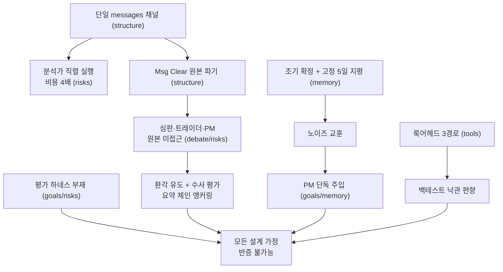

# TradingAgents 프레임워크 설계 분석 최종 보고서

**분석 대상**: /Users/nss/Documents/Claude/TradingAgents
**방법**: 6개 차원 병렬 분석 → 회의적 검증자의 코드 대조 교차검증 (CONFIRMED/PARTIAL만 채택, PARTIAL은 정정문 기준)

---

## 1. 핵심 결론 5줄 요약

1. **모든 설계 가정이 반증 불가능한 상태다.** "멀티 에이전트 토론이 단일 LLM보다 낫다", "반성 루프가 학습 효과를 낸다"는 프레임워크의 존재 이유를 검증할 백테스트·평가 하네스가 저장소에 전무하다(tests/ 57개 전부 배관 테스트). 이 부재가 아래 모든 문제의 수리 여부조차 측정 불가능하게 만드는 근본 병목이다.
2. **최종 매매 시그널이 조용히 무력화될 수 있다.** 구조화 출력 실패 시 fallback 자유 텍스트 + 기본 언어 Korean + 영어 단어만 인식하는 등급 파서의 결합으로, 실제 결정이 Sell이어도 시그널·메모리 태그가 기본값 "Hold"로 기록될 수 있다(조건부 발생, 경고 로그 한 줄 외 감지 수단 없음).
3. **학습 루프가 양끝에서 끊겨 있다.** 결정 다음날 재실행하면 5일 보유 의도가 1일 수익률(사실상 동전 던지기)로 영구 확정되어 노이즈에서 교훈을 뽑고, 그 교훈조차 논지가 이미 확정된 뒤의 포트폴리오 매니저 한 곳에만 주입된다.
4. **정보 깔때기가 거꾸로 설계됐다.** 판정자(리서치 매니저)·트레이더·PM은 원본 분석 보고서를 못 보면서 "보고서에 근거하라"는 이행 불가 지시를 받고(환각 유도), 정작 후속 단계인 리스크 토론자 3인은 원본 4종을 전부 받는다. 심판은 데이터도 루브릭도 없이 수사(rhetoric)만 평가한다.
5. **백테스트에 미래 정보가 유입된다.** 펀더멘털 스냅샷·내부자 거래·StockTwits/Reddit 감성이 curr_date를 무시하고, 재무제표 필터는 공시일이 아닌 회계기간 종료일 기준이며 LLM이 인자를 생략하면 아예 꺼진다 — 룩어헤드가 낙관 편향을 체계적으로 만든다.

---

## 2. 차원별 상세 분석

### 2.1 기능 목표와 암묵적 가정 (goals)

**결론**: 시스템의 3대 가정(토론이 품질을 높인다 / 결과 기반 반성이 학습 효과를 낸다 / 단계별 종합이 증거를 보존한다)이 기본 설정에서 구조적으로 뒷받침되지 않으며, 이를 검증할 수단조차 없어 전부 "믿음" 상태로 남아 있다.

| 발견 | severity | 근거 |
|---|---|---|
| 반성 루프의 조기 확정 — 다음 거래일 재실행 시 5일 의도가 1일 수익률로 영구 확정되고(가격 바 2개면 통과), reflect_on_final_decision은 actual_days를 전달받지 않아 LLM은 몇 일치 수익률인지도 모른 채 방향성 정오를 판정 | high | trading_graph.py:289-302, 264-267 / memory.py:76-78 / reflection.py:36-44 |
| 기본 1라운드 토론은 단방향 1패스 반박 체인 — Bull 1회 → Bear 1회 즉시 종료, Bull은 재반박 기회 0회. Bull 첫 발언 프롬프트는 빈 `current_response`에 대한 예외 처리 없이 존재하지 않는 bear 논거 반박을 요구(Aggressive에는 폴백 문구 있음). 상호 검증(선발언자 재반박)은 미구현 | high | default_config.py:132-134 / conditional_logic.py:73-96 / bull_researcher.py:50-67 / aggressive_debator.py:59 |
| 평가·백테스트 하네스 전무 — 수익률 데이터는 수집되지만 소비처는 프롬프트 주입뿐, 적중률·누적 알파 집계 0건, 결정 품질 테스트 0건 | high | trading_graph.py:497-501 / memory.py:80-107 / README.md:60 |
| "과거 실수에서 배운다"는 메모리 주입이 PM 1곳만 적용 — 논지를 생성하는 분석가·리서처·트레이더는 교훈을 전혀 보지 못함 | medium | memory.py:5-8 / portfolio_manager.py:52-57 / agent_states.py:89 |
| 트레이더는 "분석가 보고서에 근거하라" 지시를 받지만 investment_plan 요약 하나만 입력받음 — 이행 불가 지시 | medium | trader.py:41, 51-73 / portfolio_manager.py:43-91 |
| "내부 토론은 영어로 유지" 주석과 구현이 정반대 — 기본값 Korean에서 모든 내부 토론이 한국어로 진행 | medium | default_config.py:125-129 / agent_utils.py:62-74 / bull_researcher.py:68 |

### 2.2 구조·상태 설계와 정보 흐름 (structure)

**결론**: 정보가 "원본 데이터 → 보고서 → 토론 → 요약 → 요약의 요약"으로 좁아지는 깔때기인데, 병목의 위치가 역할 중요도와 역전되어 있다. 원본 도구 데이터는 Msg Clear에서 전량 파기되어 하류 검증의 기준점 자체가 사라진다.

| 발견 | severity | 근거 |
|---|---|---|
| 트레이더는 4종 보고서 접근 불가, 반면 다음 단계 리스크 토론 3인은 원본 전부 수령 — 정보 배분 역전 | high | trader.py:41, 55-58, 63-73 / aggressive_debator.py:33-36 |
| 리서치 매니저는 토론 이력만 보고 판정 — bull/bear의 체리피킹을 원본 대조로 검증 불가, 양측이 누락한 신호는 investment_plan에 반영될 경로가 구조적으로 없고 이 왜곡이 트레이더·PM까지 전파 | high | research_manager.py:37, 50-70 / portfolio_manager.py:81 |
| Msg Clear가 원본 도구 데이터(검증된 스냅샷 포함)를 전량 파기 — 리서처 토론 이후 모든 에이전트는 '분석가의 해석'만 접근 | medium | agent_utils.py:199-220 / market_analyst.py:78 / setup.py:135-153 |
| past_context가 PM에만 주입 — 원본 구현(에이전트별 메모리)에서 후퇴 | medium | portfolio_manager.py:52-57 / trading_graph.py:448 / memory.py:80-107 |
| 분석가 4종이 문서상 '병렬'과 달리 직렬 실행 — 단일 messages 채널 공유가 원인이며, Msg Clear 우회책과 원본 파기를 강제하는 근본 요인 | medium | setup.py:129, 135-153 / conditional_logic.py:29-33 / agent_utils.py:203-207 |
| 스키마 위생: sender 죽은 필드(쓰기만 존재), 리스크 토론자의 "Company Fundamentals Report" 라벨이 crypto에서도 하드코딩(리서처는 분기함), 상태 3중 중복 저장 보일러플레이트 | low | agent_states.py:66 / trader.py:88-90 / aggressive_debator.py:58 / portfolio_manager.py:107-118 |

**차원 간 연결**: 이 정보 깔때기(2.2)는 토론 실효성(2.3)의 "심판이 사실 검증 불가" 문제와 환각 전파(2.6)의 직접 원인이며, 그 근본 원인(단일 messages 채널)은 비용 문제(직렬 실행 4배 지연)까지 동시에 만든다.

### 2.3 토론 설계의 실효성 (debate)

**결론**: 반박은 프롬프트 지시로만 존재하고 이를 강제·측정하는 구조가 없으며, 심판은 데이터(원본 보고서)도 루브릭도 없이 판정한다. 라운드를 늘려도 새 정보 유입은 0이고 순서 편향은 고정된다.

| 발견 | severity | 근거 |
|---|---|---|
| 심판이 원본 보고서 없이 토론 텍스트만으로 판정 + NO_EXTERNAL_TOOLS — 토론자가 지어낸 수치를 잡을 수 없어 '논거 평가'가 '수사 평가'로 퇴화. 논거 생산자만 원자료를 보고 판정자는 못 보는 비대칭 | high | research_manager.py:37, 50-70 / portfolio_manager.py:80-91 / structured.py:45-48 |
| 라운드 증가는 같은 근거의 재탕 — 토론자는 도구 없음(증거 풀 고정), 매 발언 4종 보고서 전문+누적 history 재주입(누적 토큰 O(라운드²)), 합의 감지·조기 종료 없음. 종료는 항상 Bear/Neutral 발언 직후라 최후 발언 편향이 라운드 수와 무관하게 고정 | high | conditional_logic.py:73-96 / setup.py:153 / bull_researcher.py:61-67 |
| 기본 1라운드에서 Aggressive는 자신에 대한 비판(Conservative/Neutral)에 응답할 기회가 구조적으로 0회 | medium | default_config.py:132-134 / conditional_logic.py:88-96 / setup.py:163 |
| 반박 준수 검증 메커니즘 부재 — 토론자 출력은 자유 텍스트, 상대 발언은 프롬프트 맨 끝 한 줄. 심판/PM은 구조화 출력을 쓰면서 토론자에는 미적용하는 비대칭 | medium | bull_researcher.py:56-71 / aggressive_debator.py:48 / research_manager.py:30 |
| 심판 프롬프트에 논거 품질 루브릭 없음 — '단호하라'는 지시만 존재. rationale 필드가 승리 논거 서술을 요청하긴 하나 기각 사유·구조화된 평가는 없고, 양측 토론자는 수렴 유인이 없는 무조건 옹호 역할 | medium | research_manager.py:50-70 / schemas.py:104-139 / bull_researcher.py:56, bear_researcher.py:57 |
| 리플렉션 교훈이 토론 참여자에게 미전달 — "Bull이 반복적으로 밸류에이션을 과소평가" 교훈이 있어도 다음 토론의 Bull 발언은 불변 | low | portfolio_manager.py:52-57 / trading_graph.py:448-454 / reflection.py:41 |

**차원 간 연결**: "토론이 품질을 높이는가"라는 질문은 2.1의 평가 하네스 부재 때문에 답할 수 없다 — 라운드 0/1/2 A/B 비교라는 가장 기초적인 실험조차 인프라가 없어 불가능하다.

### 2.4 메모리·학습 루프 (memory)

**결론**: 루프 자체는 배선되어 있으나(pending 해소 → 반성 생성 → 컨텍스트 주입), 입력(1일 수익률 노이즈), 검색(관련성 없는 최근순), 출력(PM 1곳)의 세 지점이 모두 부실해 학습이 아니라 프롬프트 오염에 가깝다.

| 발견 | severity | 근거 |
|---|---|---|
| 주입 지점이 파이프라인 최종 단계(PM) 1곳 — reflection은 "next similar analysis에 적용할 교훈"을 요구하지만 분석·토론·계획 단계에 닿지 않음. CHANGELOG상 의도적 축소(#572, 빈 메모리 환각 방지 트레이드오프)이나 학습 레버리지가 최소 지점에 걸림 | high | trading_graph.py:448 / propagation.py:48 / portfolio_manager.py:52-55 / reflection.py:41 |
| 조기 해소 — 다음 날 재실행 시 1거래일 수익률로 영구 확정, 재평가 경로 없음. 다음 날 장중 실행이면 미완성 장중 가격으로 확정되어 더 심각 | high | trading_graph.py:289-292, 310-354, 396 / memory.py:111-175 |
| 검색이 순수 최근순, 관련성 개념 0 — cross-ticker 3건은 '가장 최근 해소된 아무 종목', asset_type 필터조차 없어 crypto 교훈이 대형주 결정에 주입 가능. 원본의 임베딩 검색(FinancialSituationMemory)을 의도적으로 제거 | medium | memory.py:8, 80-95 / trading_graph.py:448 |
| 평가 지평 불일치 + 사후확증 반성 — 5일 고정 알파로 중장기 등급("gradually increase exposure")의 정오를 판정하고, 반성 입력은 결정문+수익률 숫자뿐이라 결과 부호에서 역산한 hindsight 서사를 강제. 단기 결과 추종 편향이 시스템에 되먹임 | medium | trading_graph.py:265, 333-343 / reflection.py:38-74 / portfolio_manager.py:74-78 |
| 같은 티커 과거 결정문 전문 5건이 매 실행 PM 프롬프트에 주입 — 교훈 핵심은 2-4문장 REFLECTION인데 그 앞에 수백~수천 토큰의 DECISION 원문이 붙어 신호 대 잡음비 저하 + 등급 앵커링(연속 Hold 관성). 로그는 무제한 성장(max_entries=None) | medium | memory.py:101-103, 298-307 / trading_graph.py:497-501 / default_config.py:92 |
| 한 번만 분석한 티커의 pending은 영구 미해소 — 같은 티커 재실행 시에만 해소, 일괄 해소 경로 없음. pending은 학습에도 못 쓰이고 로테이션도 안 되어 죽은 블록이 무한 누적 | medium | trading_graph.py:326, 396 / memory.py:84, 250-267, 63-74 |

**차원 간 연결**: 조기 확정(1일 노이즈) × 사후확증 반성 × PM 단독 주입의 3중 결합은 2.1의 "결과 기반 반성이 학습 효과를 낸다"는 가정을 세 겹으로 무너뜨린다 — 그리고 2.1의 평가 부재 때문에 이 오염의 실제 피해 규모조차 측정할 수 없다.

### 2.5 도구·데이터 설계 (tools)

**결론**: 룩어헤드 방지가 OHLCV·뉴스 경로에만 존재하고 펀더멘털·내부자·소셜 경로는 완전히 뚫려 있으며, 오류 격리 설계(폴백·센티널)는 벤더 구현이 예외를 삼켜 데드코드화된다.

| 발견 | severity | 근거 |
|---|---|---|
| get_fundamentals·get_insider_transactions는 두 벤더 모두 curr_date 무시 — yfinance는 "(not used for yfinance)"라 자인하며 오늘 시점 시총·PE·이평 반환, 내부자 거래는 날짜 필터 자체가 없어 미래 매매 내역 유입. OHLCV(Date<=curr_date)·뉴스(UTC 창)와 대조적 | high | y_finance.py:291, 296-333, 464-488 / alpha_vantage_fundamentals.py:50-59 / alpha_vantage_news.py:65-81 |
| StockTwits/Reddit 프리페치는 날짜 개념 없음 — '현재' 여론을 "{start_date} to {end_date}" 기간의 감성으로 제시하고 선행 지표로 읽으라고 지시. sentiment_report가 토론 입력이므로 오염이 최종 결정까지 전파 | high | sentiment_analyst.py:84-86, 172 / stocktwits.py:50-58 / reddit.py:202-206 |
| yfinance 벤더 함수 7곳이 예외를 "Error ..." 문자열로 정상 반환 — 라우터의 폴백·first_error·NO_DATA 센티널이 전부 예외 기반이라 통째로 우회되고, 원시 예외 메시지가 LLM 컨텍스트에 유입. #989 설계 의도와 정면 모순 | high | y_finance.py:355-356, 390-391 등 / yfinance_news.py:154-155, 243-244 / interface.py:209-259 |
| Alpha Vantage 경로 fail-open 3중 구멍 — 날짜 필터 실패 시 원본 그대로 반환, "Error Message" JSON 미감지, staleness 검사 부재. 벤더를 AV로 바꾸는 순간 안전장치 대부분 소실 | medium | alpha_vantage_common.py:111-120, 163-166 / alpha_vantage_stock.py:46-50 / y_finance.py:51-63 |
| 재무제표 필터가 공시일이 아닌 회계기간 종료일 기준 + curr_date가 옵션 — 실적 발표 전에 실적을 아는 백테스트가 되고, LLM이 인자 생략 시 필터가 아예 꺼짐 | medium | stockstats_utils.py:243-247 / alpha_vantage_fundamentals.py:35-40 / fundamental_data_tools.py:43, 85 |
| NO_DATA 센티널을 검사하는 코드가 저장소에 0곳 — 라우팅은 tool_calls 유무만 확인. 스냅샷 도구를 호출하면 데이터 부재 시 ValueError로 하드 크래시(langgraph 1.2.10 기본 동작), 호출을 건너뛰면 데이터 전무 종목도 텍스트 지시에만 기대어 BUY/SELL까지 도달 가능 | medium | interface.py:254-259 / conditional_logic.py:29-33 / market_analyst.py:78, 126-133 / market_data_validator.py:50-57 |

**차원 간 연결**: 룩어헤드 유입(2.5)은 2.1의 평가 부재와 결합해 특히 위험하다 — 백테스트 하네스를 만들더라도 데이터 계층의 미래 정보 유입을 먼저 막지 않으면 낙관 편향된 성과가 "시스템이 잘 작동한다"는 잘못된 확신을 준다. **데이터 수정이 평가 구축보다 선행해야 하는 이유다.**

### 2.6 취약점·비용 구조 (risks)

**결론**: 환각 방어는 프롬프트 지시 수준(시장 분석가의 스냅샷 지시, 감성 분석가의 데이터 접지)에 그치고 사후 수치 검증은 어디에도 없으며, 언어 설정과 파서의 충돌이라는 치명적 결합, 그리고 순차 실행·중복 재주입의 비용 낭비가 있다.

| 발견 | severity | 근거 |
|---|---|---|
| 사후 수치 검증 0곳 — 검증 스냅샷은 market 도구 노드에만 바인딩되고 그마저 프롬프트 지시. 감성 분석가는 별도의 데이터 접지형 완화 설계(프리페치+도구 금지+구조화 출력)가 있으나 생성 수치 검증은 아니어서, 뉴스/재무 보고서와 토론 중 발명된 수치가 무검증으로 최종 결정까지 전파 | high | trading_graph.py:203-241 / market_data_validator.py:128-136 / signal_processing.py:36-38 |
| 요약 체인 앵커링 — 최종 결정이 원본에서 3~4단계 떨어진 요약의 요약에 앵커링(2.2와 동일 구조의 리스크 관점) | high | research_manager.py:50-70 / trader.py:56-70 / portfolio_manager.py:80-91 |
| evals·백테스트 전무 — 유일한 피드백은 5일 수익률+자유서술 반성. 프롬프트를 수정해도 개선/회귀를 측정할 방법이 없음 | high | trading_graph.py:264-337 / reflection.py:35-44 |
| Korean + 영어 등급 파서 + fallback 결합 — 구조화 출력 실패 시 모델이 등급 단어까지 한국어로 번역하면 시그널·메모리 태그가 Hold로 고착(조건부: PM 프롬프트의 영어 Rating Scale 덕에 영어 단어가 남을 수도 있음). 2차 휴리스틱은 인용된 상대 주장의 등급 단어를 결정으로 오인 가능 | high | rating.py:29-57 / structured.py:91-98 / default_config.py:129 / memory.py:55-56 |
| 토론 구조 편향 4종 — 고정 발언 순서(최신성 편향), Aggressive가 트레이더 결정의 옹호자로 배치(Sell도 공격적으로 옹호), 시장 분석가의 3단계 BUY/HOLD/SELL 지시가 최상류에 결론을 박아 5단계 등급 체계와 충돌, 화자 라벨 문자열 결합(수정 시 조용한 오동작) | medium | setup.py:153-163 / aggressive_debator.py:48-52 / market_analyst.py:99-100 / bull_researcher.py:74 |
| 비용 낭비 — 분석가 직렬 실행(지연 ~4배), 토론 턴마다 4종 보고서 전문+직전 발언 이중 주입(history에 이미 포함), PM에 investment_plan과 그 재서술인 trader_plan 전문 중복. deep 모델 배분(판정 2노드만 deep)은 합리적 | medium | setup.py:94-103, 135-153 / bull_researcher.py:60-66 / portfolio_manager.py:80-86 |

---

## 3. 개선 로드맵

정렬 기준: 효과 대비 비용(위가 가장 우선). **원칙: 데이터 무결성(룩어헤드·시그널 파서) → 학습 신호 정화 → 평가 인프라 → 구조 개편** 순서 — 평가 하네스를 만들어도 데이터가 오염돼 있으면 잘못된 결론을 학습하기 때문이다.

### 단기 (1주 내)

| # | 개선 항목 | 왜 | 무엇을 | 검증 방법 |
|---|---|---|---|---|
| 1 | 등급 파서 Hold 고착 차단 | 최종 산출물(시그널)이 언어 설정×fallback 조합만으로 무의미해지는 가장 치명적 결합 | parse_rating에 한국어 등급 어휘(매수/비중확대/보유/비중축소/매도) 매핑 추가, fallback 프롬프트에 "마지막 줄에 Rating: <영어 등급>" 강제, 파싱 실패 시 Hold 대신 명시적 실패 로깅 | output_language=Korean + 구조화 출력 강제 실패 조건에서 Sell 결정이 Sell 시그널로 추출되는 통합 테스트 |
| 2 | 반성 조기 확정 가드 | 1일 노이즈로 확정된 교훈은 memory 주입이 오히려 해가 됨 | _fetch_returns에서 actual_days < holding_days이면 (None, None, None) 반환해 pending 유지, holding_days를 config로 노출 | 결정 다음날 실행하는 단위 테스트로 항목이 pending으로 남는지 확인, 기존 로그의 1d~4d 항목 비율로 오염 규모 측정 |
| 3 | 룩어헤드 차단(펀더멘털·내부자·소셜) | 백테스트 신뢰성의 근간 — 평가 하네스보다 선행 필수 | insider transactions에 transactionDate<=curr_date 필터, yfinance get_fundamentals에 과거 날짜 시 경고/차단, StockTwits/Reddit은 과거 trade_date에 자리표시자 대체 또는 created_at 창 필터, 재무제표 컷오프에 공시 지연(+45일) 적용, 툴 레이어에서 curr_date 필수화 | 1년 전 날짜로 파이프라인 실행 후 보고서에 현재 시총/최근 내부자 매매/창 밖 타임스탬프가 0건임을 assert하는 회귀 테스트 |
| 4 | yfinance 예외 삼킴 제거 | 폴백·센티널 로직이 예외 기반인데 구현이 예외를 문자열로 삼켜 데드코드화 | 벤더 함수 7곳의 광범위 except 제거, 예외를 라우터로 전파 | yf.Ticker 모킹으로 예외 발생 시 다음 벤더 폴백→센티널 생성을 확인하는 테스트 |
| 5 | 트레이더/심판 프롬프트-데이터 정합 | 존재하지 않는 자료에 근거하라는 지시는 환각의 직접 원인 | 트레이더·리서치 매니저·PM 프롬프트에 4종 보고서(최소한 핵심 수치 표) 추가, 불가하면 "analysts' reports" 문구 제거 | 최종 결정문의 인용 수치를 원본 보고서와 대조하는 스팟체크 10회 |
| 6 | AV 경로 fail-closed 전환 | 벤더 선택과 무관하게 안전장치가 동일해야 함 | 날짜 필터 실패 시 예외 처리, "Error Message" 키 검사→NoMarketDataError 매핑, AV OHLCV에 staleness 검사 적용 | 오류 JSON/미래 행 포함 CSV 모킹 테스트 |
| 7 | 토론 프롬프트 소규모 정합화 | 저비용으로 존재하지 않는 반박 유도·어휘 충돌 제거 | Bull 첫 발언용 빈 반박 대상 폴백 문구 추가(Aggressive와 동일), 시장 분석가의 3단계 FINAL TRANSACTION PROPOSAL 지시 제거, default_config.py:126의 죽은 주석 정정 | 첫 발언 프롬프트에 빈 문자열 반박 지시가 없는지 확인 + 기존 테스트 통과 |
| 8 | past_context 축약 + cross-ticker 필터 | 결정문 전문 5건 반복 주입은 토큰 낭비+등급 앵커링, 이종 자산 교훈은 노이즈 | 같은 티커 항목을 태그+REFLECTION+DECISION 요약으로 축약, asset_type 태그 저장 후 동일 자산군만 cross-ticker 후보, memory_log_max_entries 유한값 기본화 | 30일 연속 실행 시뮬레이션에서 past_context 토큰 수·직전 등급 반복률 전후 비교, 주식/크립토 혼합 로그 테스트 |

### 중기 (1개월 내)

| # | 개선 항목 | 왜 | 무엇을 | 검증 방법 |
|---|---|---|---|---|
| 1 | 평가·백테스트 하네스 구축 | 이것이 없으면 나머지 모든 개선의 효과를 측정할 수 없음 — 최대 레버리지 | 메모리 로그 확정 항목 집계 스코어보드(등급→방향 적중률·등급별 평균 알파), 과거 날짜 범위 일괄 실행 backtest 스크립트, 단일 LLM 베이스라인 실행 모드, 복수 보유기간(1/5/20일) 지원 | 30개 이상 티커×날짜 표본에서 전체 파이프라인 vs 단일 LLM vs 메모리 비활성 3조건 알파 분포 비교, 항상-Hold/랜덤 베이스라인 대비 통계 검정 |
| 2 | 학습 루프 주입 지점 확대 | 교훈이 논지 형성 단계에 닿아야 학습이 됨 — 현재는 사후 보정만 가능 | past_context를 리서치 매니저·트레이더(장기적으로 리서처)에 역할별 필터링해 주입, 반성 입력에 당시 investment_plan 요약 추가, 반성 프롬프트에 "5일은 단기 표본" 유보 문구 | 동일 종목 연속 백테스트에서 주입 확대 전/후 반복 오류율과 토론 발언의 과거 리스크 언급 빈도 비교(하네스 #1 활용) |
| 3 | 토론 구조 재설계 | 기본 설정에서 토론의 핵심 가치(비판에 대한 응답)가 부재하고 순서 편향이 고정 | 종료 조건을 2N+1/3N+1로 변경(비판받은 쪽 1회 응답 보장) 또는 기본 2라운드, 발언 순서 무작위화/설정화, 토론자에 rebuttals 구조화 스키마 적용, 심판 프롬프트에 평가 루브릭(미응답 주장 할인 등)과 ResearchPlan 평가 필드 추가, 수렴 시 조기 종료 | 라운드 0/1/2 A/B와 Bull/Bear 순서 교차 실행으로 판정 분포·상호 인용 비율 측정(하네스 #1 활용) |
| 4 | NO_DATA 결정론적 게이트 | 자금이 걸린 결정에 프롬프트 순응은 확률적 방어일 뿐 | ToolMessage에 NO_DATA 센티널 존재+유효 데이터 부재 시 보고서에 기계 판독 플래그, PM 직전에 플래그 존재 시 강제 HOLD/중단 분기, 스냅샷 ValueError 크래시 경로 정리 | 존재하지 않는 티커로 전체 그래프 실행 시 항상 HOLD/중단인지 통합 테스트 |
| 5 | 검증 스냅샷 보존 + 사후 수치 대조 | 하류 수치 인용 오류를 잡을 기준점이 현재 0개 | 검증 스냅샷을 별도 상태 필드로 보존해 토론·트레이더·PM에 주입, 보고서 완성 후 수치를 스냅샷과 대조하는 결정론적 검증 노드 추가 | 오염된 가격을 주입한 단위 테스트로 검증 노드가 불일치를 플래그하는지 확인 |
| 6 | 분석가 병렬화(채널 분리) | 직렬 실행 4배 지연 + Msg Clear 우회책 + 원본 파기가 전부 단일 채널에서 파생 | 분석가별 독립 메시지 채널(또는 서브그래프)로 분리해 START에서 4노드 fan-out, 토론 프롬프트의 current_response 이중 주입 제거 | 리팩터 전후 4종 보고서 내용 동등성 + 분석 단계 wall time·토큰 카운터 비교 |
| 7 | pending 일괄 해소 경로 | 한 번 분석한 티커의 결과가 영구 미확정이면 cross-ticker 교훈 풀이 빈약해짐 | 실행 시작 시 전 티커 pending 중 holding_days 경과 항목 일괄 해소 또는 resolve CLI 서브커맨드, 상장폐지 등은 unresolved 마킹 | 이종 티커 pending 혼합 로그로 1회 실행 후 전 티커 해소 통합 테스트 |

---

### 종합: 문제의 인과 사슬

가장 시급한 것은 개별 버그가 아니라 **측정 불가능성의 해소**다. 다만 측정 인프라(중기 #1)를 세우기 전에 데이터 무결성(단기 #1~#4)을 먼저 확보해야, 하네스가 오염된 데이터 위에서 잘못된 확신을 생산하는 것을 막을 수 있다.
