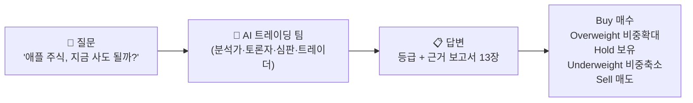
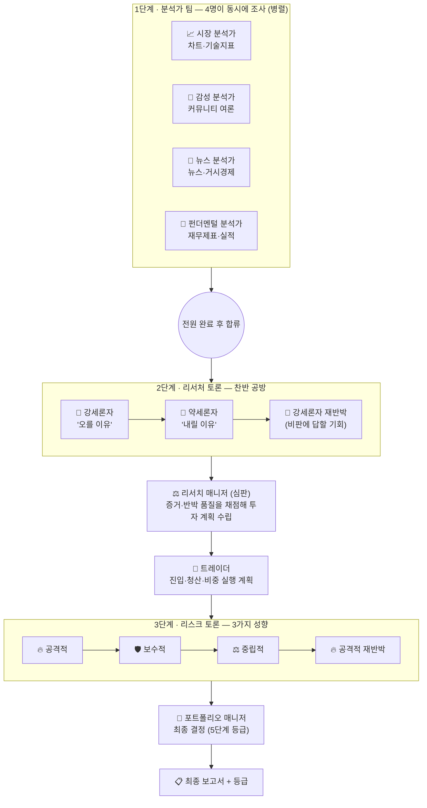
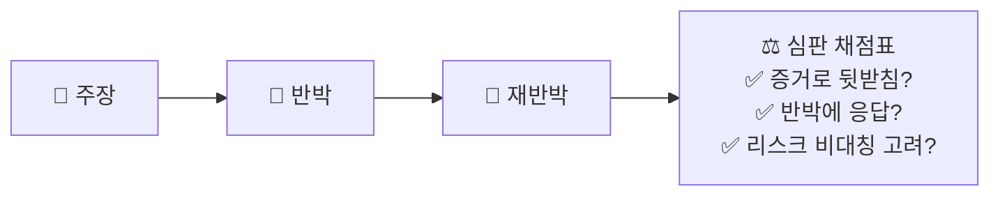
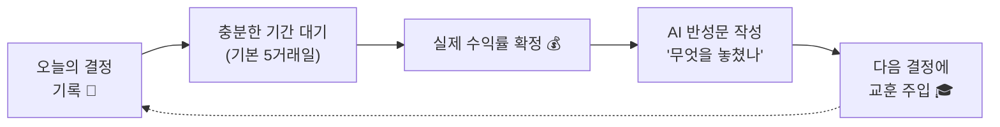
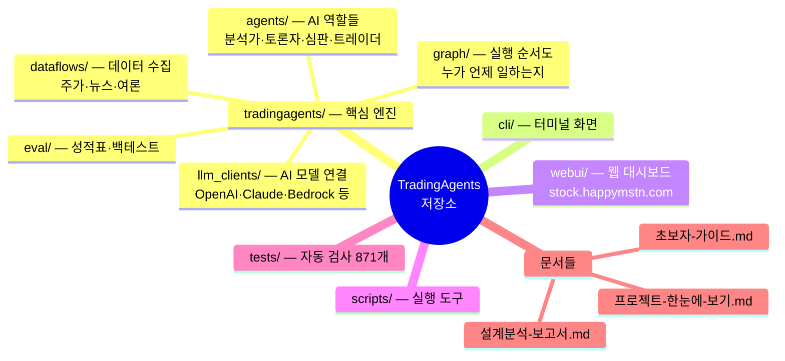
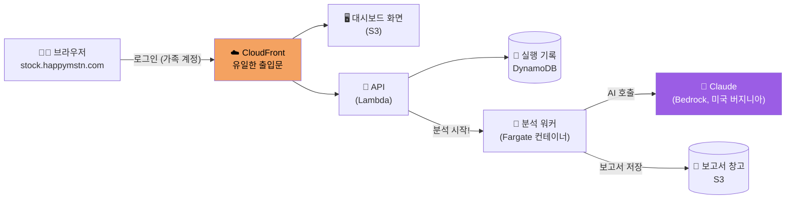
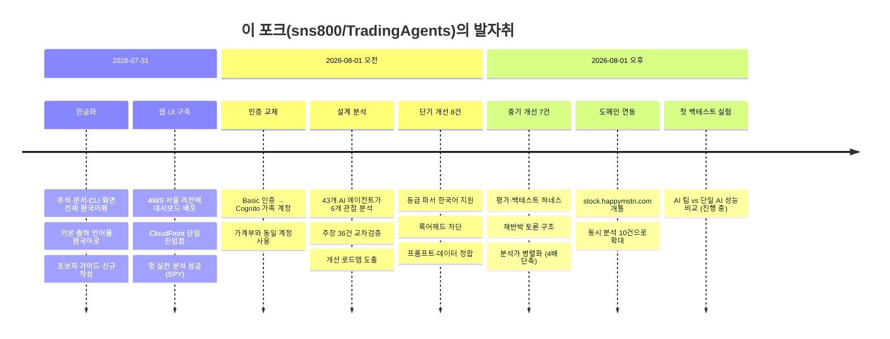
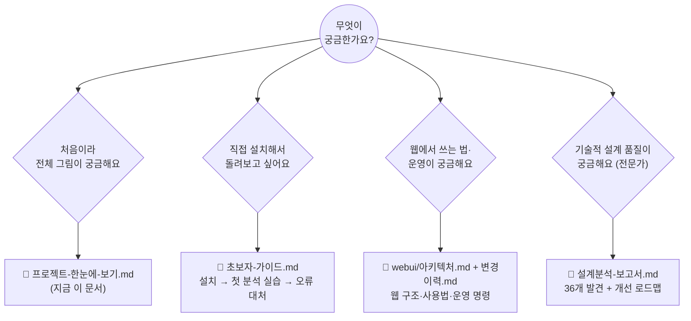

# 📊 TradingAgents 한눈에 보기

> **프로그래밍이나 투자를 잘 몰라도 이해할 수 있도록** 이 프로젝트의 구조·설계·이력을
> 그림 중심으로 정리한 문서입니다. 그림은 GitHub에서 자동으로 렌더링됩니다.
>
> 더 깊이 알고 싶을 때: [초보자 가이드](초보자-가이드.md) · [설계 분석 보고서](설계분석-보고서.md) · [웹 UI 아키텍처](webui/아키텍처.md) · [웹 UI 변경 이력](webui/변경이력.md)

---

## 1. 이 프로젝트는 무엇인가요?

**여러 개의 AI가 증권사 트레이딩 팀처럼 역할을 나눠 협업**해서, 특정 주식을
"살까 / 팔까 / 보유할까" 판단하는 연구용 시스템입니다. 사람 한 명(또는 AI 하나)이
모든 걸 판단하는 대신, 전문 분야가 다른 AI들이 **분석 → 토론 → 결정**의 단계를 거칩니다.

> ⚠️ **중요**: 연구·학습용 도구입니다. 실제 투자 조언이 아니며, 결과를 그대로
> 매매에 사용하는 것은 권장되지 않습니다.

---

## 2. AI 팀은 어떻게 일하나요? (핵심 설계)

회사 조직에 비유하면 이렇습니다: **4명의 애널리스트가 동시에 조사**하고,
**낙관론자와 비관론자가 논쟁**하고, **팀장이 판정**하고, **트레이더가 계획을 짜고**,
**위험관리 3인이 다시 논쟁**한 뒤, **최고책임자가 최종 결정**합니다.

### 설계의 핵심 아이디어 5가지

**① 토론은 '진짜 공방'이어야 한다** — 비판받은 쪽이 반드시 한 번 재반박한 뒤 끝나고,
심판은 "말솜씨"가 아니라 **증거가 있는가 / 상대의 최강 논거에 답했는가**를 채점표(루브릭)로 평가합니다.

**② 과거에서 배운다 (학습 루프)** — 결정과 그 후 실제 수익률을 기록해두고,
"당시 무엇을 잘못 판단했나"를 AI가 스스로 복기(반성)해서 다음 분석 때 교훈으로 참고합니다.

**③ 안전장치는 기계식으로** — 중요한 방어는 AI의 '판단'이 아니라 결정론적 코드가 담당합니다.

| 안전장치 | 하는 일 |
|---|---|
| 🚧 데이터 게이트 | 시장 데이터를 못 구하면 AI에게 묻지도 않고 무조건 "보유(Hold)" |
| 🔍 수치 감사 | 최종 보고서가 인용한 가격이 실제 데이터에 없으면 경고 표시 |
| ⏰ 룩어헤드 차단 | 과거 날짜로 분석할 때 "그 시점엔 알 수 없던 미래 정보"가 새어들지 않게 필터 |
| 🇰🇷 등급 파서 | 한국어 보고서("등급: 매도")에서도 등급을 정확히 추출 |

**④ 성능은 측정한다 (평가 하네스)** — "AI 팀이 정말 AI 하나보다 나은가?"를 믿음이 아니라
데이터로 확인할 수 있는 도구가 있습니다 (`scripts/backtest.py`, `scripts/scoreboard.py`).

**⑤ 두뇌는 두 종류** — 어려운 판단(심판·최종 결정)은 비싸고 똑똑한 모델,
단순 작업은 빠르고 싼 모델을 써서 비용과 품질의 균형을 맞춥니다.

---

## 3. 저장소 구조 — 어디에 무엇이 있나

| 폴더 | 역할 (비유) | 대표 파일 |
|---|---|---|
| `tradingagents/agents/` | 직원들의 업무 매뉴얼 | `analysts/market_analyst.py` 등 |
| `tradingagents/graph/` | 업무 흐름도·결재선 | `setup.py`, `trading_graph.py` |
| `tradingagents/dataflows/` | 자료 조사팀 | `y_finance.py`, `interface.py` |
| `tradingagents/eval/` | 인사평가팀 (성과 측정) | `scoreboard.py`, `backtest.py` |
| `cli/` | 사내 업무 화면 | `main.py` |
| `webui/` | 외부용 웹 서비스 | `frontend/`, `infra/` |
| `tests/` | 품질검사팀 | 871개 자동 테스트 |

---

## 4. 웹 서비스 구조 — 브라우저에서 쓰는 법

터미널 없이 **https://stock.happymstn.com** 에 접속해 가족 계정(가계부와 동일)으로
로그인하면 분석을 실행하고 보고서를 읽을 수 있습니다.

- 출입문은 CloudFront 하나뿐이고, 창고(S3)·API(Lambda)는 밖에서 직접 접근할 수 없습니다
- 분석 1건 = 컨테이너 1개가 떠서 일하고 사라지는 구조 (상시 서버 비용 ≈ 0)
- 동시에 최대 10건까지 분석 가능 (비용 폭주 방지 안전장치)
- 상세 구조·사용법: [webui/아키텍처.md](webui/아키텍처.md)

---

## 5. 프로젝트 이력 — 지금까지 걸어온 길

### 개선 전후 비교 — 무엇이 좋아졌나

| | 개선 전 😰 | 개선 후 😊 |
|---|---|---|
| 분석가 4명 | 한 명씩 순서대로 (느림) | **동시에** 일함 (분석 단계 최대 4배 단축) |
| 토론 | 비판받아도 답할 기회 없음 | 재반박 1회 보장 + 심판 채점표 |
| 심판·트레이더 | 원본 보고서를 못 보고 판정 | 원본 4종 + 검증된 수치 직접 확인 |
| 한국어 결정문 | 등급 인식 실패 → 무조건 "보유" | 한국어 등급 정확 인식 |
| 과거 날짜 분석 | 미래 정보가 몰래 새어듦 | 차단 또는 명시적 경고 |
| 학습 | 하루짜리 결과로 성급한 교훈 | 충분한 기간 후에만 복기 |
| 성능 검증 | 측정 수단 없음 ("믿음") | 백테스트·성적표 도구 완비 |
| 데이터 없을 때 | AI가 알아서 조심하길 기대 | 기계적으로 무조건 "보유" |

### 숫자로 보는 현재 상태

| 지표 | 값 |
|---|---|
| 자동 테스트 | **871개** (전부 통과, 푸시마다 CI 자동 실행) |
| 지원 데이터 | 주가·기술지표·재무제표·뉴스·Reddit·StockTwits·FRED 거시지표 |
| 분석 소요 시간 | 얕게 ~10분 · 깊게 30~60분 (웹/CLI 동일) |
| 접속 주소 | https://stock.happymstn.com |

---

## 6. 문서 지도 — 무엇을 읽어야 하나요?

